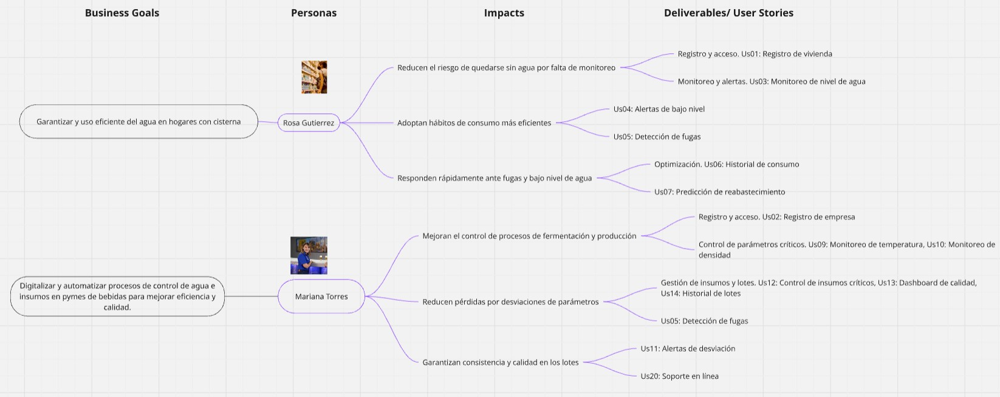
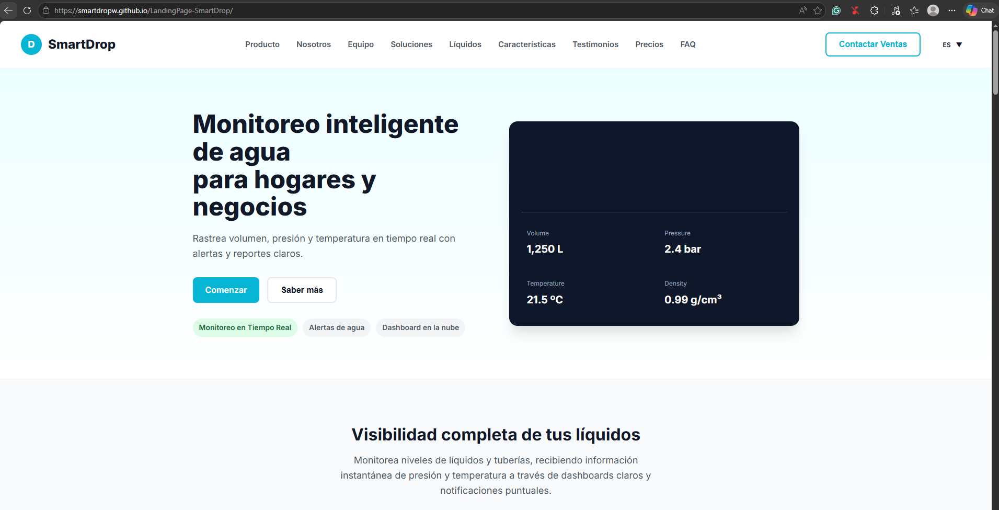
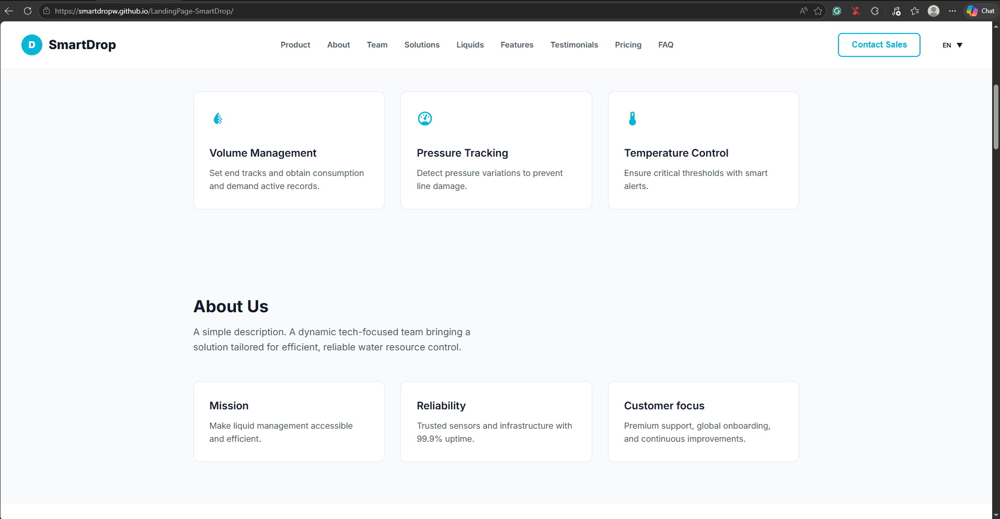
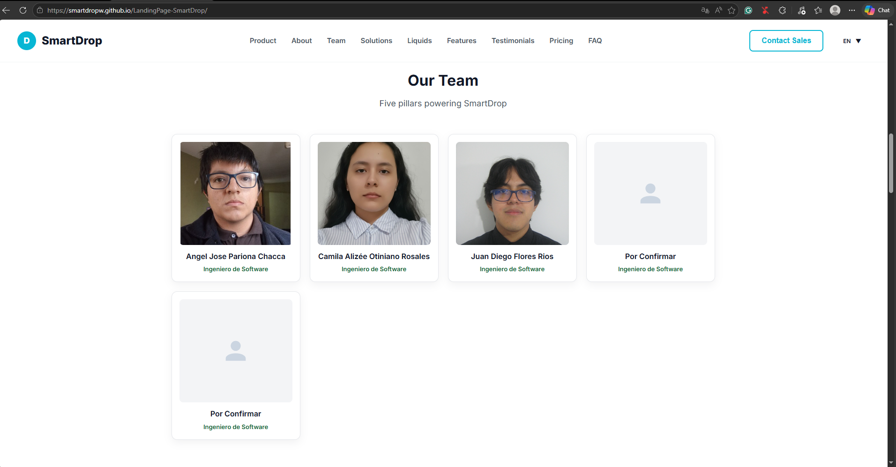
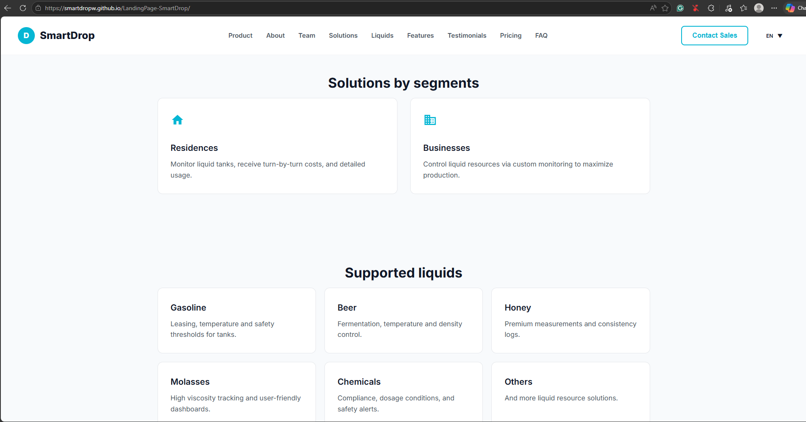
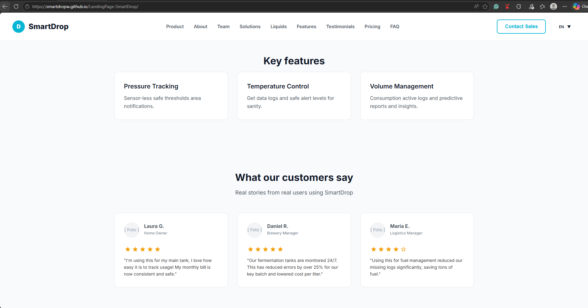
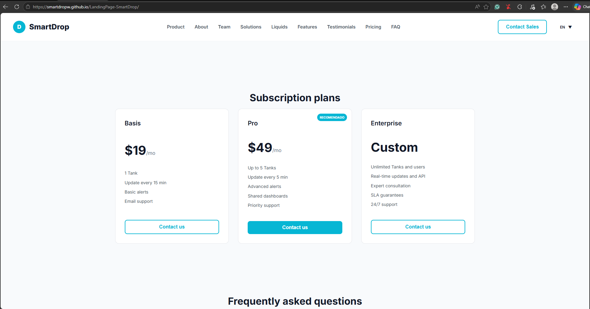
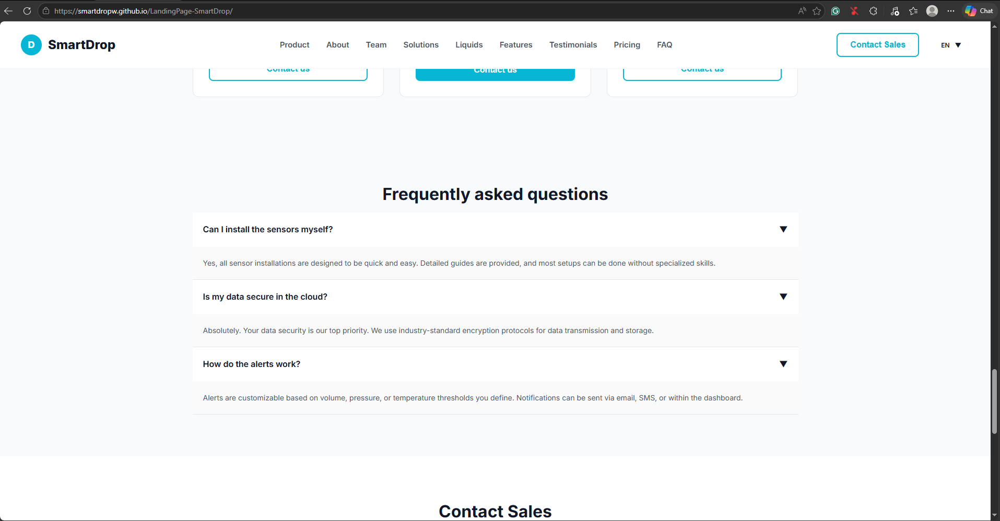
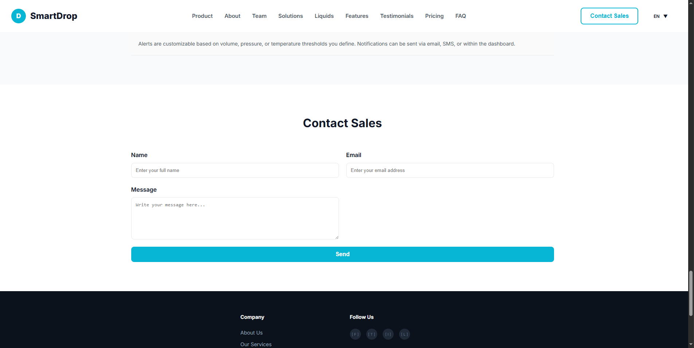
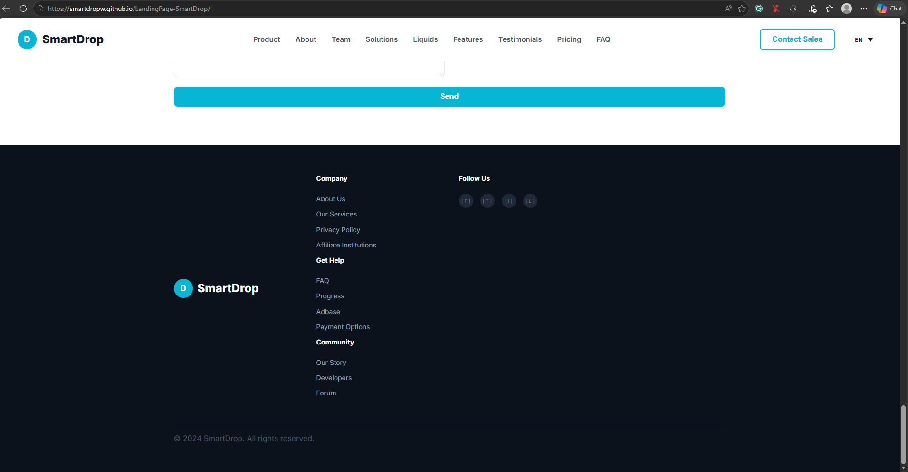

## Universidad Peruana de Ciencias Aplicadas

**Ingeniería de Software**

**Ciclo:** 2026-1

**Codigo del curso:** 1ASI0729

**Curso:** Desarrollo de Aplicaciones Open Source

**Sección:** 12010

**Profesor:** Ivan Robles Fernández

----

## Informe de Trabajo Final

**Startup:** SmartDrop

#### Relación de integrantes

| Nombre                       | Código     |
| ---------------------------- | ---------- |
|                              |            |
|                              |            |
|                              |            |
| Pariona Chacca, Angel Jose   | u202320613 |

 

### Marzo 2026
 

---
# Registro de Versiones

| Versión |   Fecha    |            Autor | Descripción de modificación |
| :---: |:----------:|:--------------:| ----- |
| tb1 |            |           |              |
|  |            |         |            |
|  |            |         |           |
|  |            |            |           |
| tp1 |      |                |            |
|  |         |            |             |
|  |         |            |             |
|  |             |              |             |
| tb2 |            |                |                |
|  |            |                |               |
|  |            |                |            |
|  |            |                |            |
| tf1 |            |                |            |
|  |            |                |             |
|  |            |                |             |
|  |            |                |               |

# Project Report Collaboration Insights

Repositorio del informe del proyecto  
El informe del proyecto se encuentra alojado en el siguiente repositorio de la organización de GitHub del equipo:

🔗 Enlace de la organización:  
🔗 Enlace de repositorios: 

A continuación, se detallan las actividades realizadas en cada entrega, la participación de los miembros del equipo, y las evidencias correspondientes.

TB1  
Para la primera entrega (TB1) se trabajó en la estructura inicial del informe, definiendo el índice y distribuyendo las secciones entre los miembros.

---
# Contenido
- [Registro de Versiones](#registro-de-versiones)
- [Project Report Collaboration Insights](#project-report-collaboration-insights)
- [Contenido](#contenido)
- [Student Outcome](#student-outcome)
- [Capitulo I: Introducción](#capitulo-I-introducción)
    - [1.1. Startup Profile](#11-startup-profile)
        - [1.1.1. Descripcion del Startup](#111-Descripcion-del-startup)
        - [1.1.2. Perfiles de Integrantes del equipo](#112-perfiles-de-integrantes-del-equipo)
    - [1.2. Solution Profile](#12-solution-profile)
        - [1.2.1. Antecedentes y problemática](#121-antecedentes-y-problemática)
        - [1.2.2. Lean UX Process](#122-lean-ux-process)
            - [1.2.2.1. Lean UX Problem Statements](#1221-lean-ux-problem-statements)
            - [1.2.2.2. Lean UX Assumptions](#1222-lean-ux-assumptions)
            - [1.2.2.3. Lean UX Hypothesis Statements](#1223-lean-ux-hypothesis-statements)
            - [1.2.2.4. Lean UX Canvas](#1224-lean-ux-canvas)
    - [1.3. Segmentos objetivos](#13-segmentos-objetivos)
- [Capitulo 2: Requirements Elicitation \& Analysis](#capitulo-2-requirements-elicitation--analysis)
    - [2.1. Competidores](#21-competidores)
        - [2.1.1. Analisis competitivo](#211-analisis-competitivo)
        - [2.1.2. Estrategias y tácticas frente a competidores](#212-estrategias-y-tácticas-frente-a-competidores)
    - [2.2. Entrevistas](#22-entrevistas)
        - [2.2.1. Diseño de entrevistas](#221-diseño-de-entrevistas)
        - [2.2.2. Registro de entrevistas](#222-registro-de-entrevistas)
        - [2.2.3. Análisis de entrevistas](#223-análisis-de-entrevistas)
    - [2.3. Needfinding](#23-needfinding)
        - [2.3.1. User Personas](#231-user-personas)
        - [2.3.2  User Task Matrix](#232--user-task-matrix)
        - [2.3.3. User Journey Mapping](#233-user-journey-mapping)
        - [2.3.4. Empathy Mapping](#234-empathy-mapping)
            - [2.3.5. As-is Scenario Mapping](#235-as-is-scenario-mapping)
    - [2.4. Ubiquitous Language](#24-ubiquitous-language)
- [Capitulo 3: Requirements Specification](#capitulo-3-requirements-specification)
    - [3.1. To-Be Scenario Mapping](#31-to-be-scenario-mapping)
    - [3.2. User Stories](##32-user-stories)
    - [3.3. Impact Mapping](#33-impact-mapping)
    - [3.4. Product Backlog](#34-product-backlog)
- [Capítulo 4: Product Design](#capítulo-4-product-design)
    - [4.1. Style Guidelines](#41-style-guidelines)
        - [4.1.1. General Style Guidelines](#411-general-style-guidelines)
        - [4.1.2. Web Style Guidelines](#412-web-style-guidelines)
    - [4.2. Information Architecture](#42-information-architecture)
        - [4.2.1. Organization Systems](#421-organization-systems)
        - [4.2.2. Labeling Systems](#422-labeling-systems)
        - [4.2.3. SEO Tags and Meta Tags](#423-seo-tags-and-meta-tags)
        - [4.2.4. Searching Systems](#424-searching-systems)
        - [4.2.5. Navigation Systems](#425-navigation-systems)
    - [4.3. Landing Page UI Design](#43-landing-page-ui-design)
        - [4.3.1. Landing Page Wireframe](#431-landing-page-wireframe)
        - [4.3.2. Landing Page Mock-up](#432-landing-page-mock-up)
    - [4.4. Web Applications UX/UI Design](#44-web-applications-uxui-design)
        - [4.4.1. Web Applications Wireframes](#441-web-applications-wireframes)
        - [4.4.2. Web Applications Wireflow Diagrams](#442-web-applications-wireflow-diagrams)
        - [4.4.3. Web Applications Mock-ups](#443-web-applications-mock-ups)
        - [4.4.4. Web Applications User Flow Diagrams](#444-web-applications-user-flow-diagrams)
    - [4.5. Web Applications Prototyping.](#45-web-applications-prototyping)
    - [4.6. Domain-Driven Software Architecture](#46-domain-driven-software-architecture)
        - [4.6.1. Software Architecture Context Diagram](#461-software-architecture-context-diagram)
        - [4.6.2. Software Architecture Container Diagrams](#462-software-architecture-container-diagrams)
        - [4.6.3. Software Architecture Components Diagrams](#463-software-architecture-components-diagrams)
    - [4.7. Software Object-Oriented Design](#47-software-object-oriented-design)
        - [4.7.1. Class Diagrams](#471-class-diagrams)
        - [4.7.2. Class Dictionary](#472-class-dictionary)
    - [4.8. Database Design](#48-database-design)
        - [4.8.1. Database Diagram](#481-database-diagram)
- [Capítulo 5: Product Implementation, Validation \& Deployment](#capítulo-5-product-implementation-validation--deployment)
    - [5.1. Software Configuration Management](#51-software-configuration-management)
        - [5.1.1. Software Development Environment Configuration](#511-software-development-environment-configuration)
        - [5.1.2. Source Code Management](#512-source-code-management)
        - [5.1.3. Source Code Style Guide \& Conventions](#513-source-code-style-guide--conventions)
        - [5.1.4. Software Deployment Configuration](#514-software-deployment-configuration)
    - [5.2. Landing Page, Services \& Applications Implementation](#52-landing-page-services--applications-implementation)
        - [5.2.1. Sprint 1](#521-sprint-1)
            - [5.2.1.1. Sprint Planning 1](#5211-sprint-planning-1)
            - [5.2.1.2. Aspect Leaders and Collaborators](#5212-aspect-leaders-and-collaborators)
            - [5.2.1.3. Sprint Backlog 1](#5213-sprint-backlog-1)
            - [5.2.1.4. Development Evidence for Sprint Review](#5214-development-evidence-for-sprint-review)
            - [5.2.1.5. Execution Evidence for Sprint Review](#5215-execution-evidence-for-sprint-review)
            - [5.2.1.6. Services Documentation Evidence for Sprint Review](#5216-services-documentation-evidence-for-sprint-review)
            - [5.2.1.7. Software Deployment Evidence for Sprint Review](#5217-software-deployment-evidence-for-sprint-review)
            - [5.2.1.8. Team Collaboration Insights during Sprint](#5218-team-collaboration-insights-during-sprint)
- [Conclusiones](#conclusiones)
- [Bibliografía](#bibliografía)
- [Anexos](#anexos)

# Student Outcome

El curso contribuye al cumplimiento del Student Outcome ABET:

**ABET – EAC \- Student Outcome 3**  
**Criterio: Capacidad de comunicarse efectivamente con un rango de audiencias.**

En el siguiente cuadro se describen las acciones realizadas y enunciados de  
conclusiones por parte del grupo, que permiten sustentar el haber alcanzado el logro  
del ABET – EAC \- Student Outcome 3\.

| Criterio Específico                                                   | Acciones Realizadas  | Conclusiones |
|-----------------------------------------------------------------------|----------------------|--------------|
| Comunica por escrito con efectividad a diferentes rangos de audiencia |                      |              |        
| Comunica oralmente con efectividad a diferentes rangos de audiencia |                        |              |
---

<!-- CHAPTER-1:START -->
# Capítulo I: Introducción

## 1.1. Startup Profile

### 1.1.1. Descripción de la Startup

### 1.1.2. Perfiles de integrantes del equipo

## 1.2. Solution Profile

### 1.2.1. Antecedentes y problemática

### 1.2.2. Lean UX Process

#### 1.2.2.1. Lean UX Problem Statements

#### 1.2.2.2. Lean UX Assumptions

#### 1.2.2.3 Lean UX Hypothesis Statements

#### 1.2.2.4 Lean UX Canvas

<!-- CHAPTER-1:END -->

<!-- CHAPTER-2:START -->
### 2.1.1. Análisis competitivo

### 2.1.2. Estrategias y tácticas frente a competidores

### 2.2.1 Diseño de entrevistas

### 2.2.2. Registro de entrevistas

### 2.2.3. Análisis de Entrevistas

## 2.3. Needfinding

### 2.3.1. User Personas

### 2.3.2. User Task Matrix

### 2.3.3. User Journey Mapping

### 2.3.4. Empathy Mapping

## 2.4. Big Picture Event Storming

## 2.5. Ubiquitous Language

<!-- CHAPTER-2:END -->

<!-- CHAPTER-3:START -->
# Capitulo 3: Requirements Specification
## 3.1. User Stories.

| Epic / Story ID | Título | Descripción | Criterios de Aceptación | Relacionado con (Epic ID) |
| ----- | ----- | ----- | ----- | ----- |
| EP01 | Registro de usuarios | Implementar el registro de los usuarios |  |  |
| US01 | Registro de vivienda | Como cliente que vive en un zona residencial, quiero registrarme en la aplicación web para monitorear en tiempo real el nivel de agua en mi vivienda . | Escenario 01: Registro exitoso. Dado que entro a la aplicación web de Droplet, Cuando completo todos los campos del formulario del registro, Entonces el sistema guarda la información y aparece un mensaje de aprobación . Escenario 02: Fallo en el registro. Dado que entro a la aplicación web de Droplet, Cuando dejo campos obligatorios vacíos o ingreso datos inválidos, Entonces el sistema muestra mensajes de error y no permite enviar el formulario hasta corregir los datos. | EP01 |
| US02 | Registro de empresa | Como gerente de una pyme de bebidas, quiero registrar mi empresa para tener un monitoreo del nivel y caudal de agua en mi negocio. | Escenario 01: Registro exitoso. Dado que entro a la aplicación web de Droplet, Cuando completo todos los campos del formulario del registro, Entonces el sistema guarda la información y aparece un mensaje de aprobación . Escenario 02: Fallo en el registro. Dado que entro a la aplicación web de Droplet, Cuando dejo campos obligatorios vacíos o ingreso datos inválidos, Entonces el sistema muestra mensajes de error y no permite enviar el formulario hasta corregir los datos. | EP01 |
| EP02 | Gestión de Agua Residencial | Funcionalidades necesarias para que los hogares con tanques o cisternas puedan monitorear, gestionar y optimizar el uso de su agua almacenada, reduciendo costos y riesgos de salud. |  |  |
| US03 | Monitoreo de nivel de agua | Como propietario de vivienda, quiero visualizar en tiempo real el nivel de mi cisterna, para evitar sorpresas al quedarme sin agua. | Escenario 01: Visualización de nivel. Dado que el sensor de nivel está instalado y calibrado, Cuando el usuario abre la aplicación, Entonces debe visualizar el nivel actual del agua en porcentaje y litros. Escenario 02: Multitanque. Dado que hay múltiples tanques conectados, Cuando el usuario abre el panel de monitoreo, Entonces debe ver el nivel de cada tanque de forma diferenciada. | EP02 |
| US04 | Alertas de bajo nivel | Como propietario de vivienda, quiero recibir una alerta cuando el nivel de agua esté por debajo del 20%, para planificar el reabastecimiento a tiempo. | Escenario 01: Notificación de bajo nivel de agua. Dado que el nivel del agua está por debajo del 20%, Cuando el sistema detecte esa condición, Entonces debe enviar una notificación push al usuario. Escenario 02: Detalle notificación. Dado que la notificación de bajo nivel fue enviada, Cuando el usuario la abra, Entonces debe mostrar el detalle con la recomendación de reabastecimiento. | EP02 |
| US05 | Detección de fugas | Como propietario de vivienda, quiero que el sistema detecte caídas bruscas de nivel, para identificar fugas y evitar sobrecostos en mi recibo. | Escenario 01: Alerta de fuga. Dado que el sistema monitorea continuamente el nivel, Cuando detecta una caída brusca anormal, Entonces debe generar una alerta de fuga en la app. Escenario 02: Registro de alerta de fuga. Dado que se generó una alerta de fuga, Cuando el usuario consulte el historial, Entonces debe poder ver el registro del evento con fecha y hora. | EP02 |
| US06 | Historial de consumo | Como propietario de vivienda, quiero acceder al historial de consumo de agua de mi familia, para identificar patrones y reducir gastos. | Escenario 01: Visualización de historial. Dado que el sistema registra los niveles de agua diariamente, Cuando el usuario acceda al historial, Entonces debe mostrar un gráfico de consumo por días. Escenario 02: Comparación por meses. Dado que el usuario quiera comparar meses, Cuando seleccione un rango de fechas, Entonces la aplicación debe mostrar el consumo agregado de ese periodo.  | EP02 |
| US07 | Predicción de reabastecimiento | Como propietario de vivienda, quiero que el sistema me indique cuándo se agotará mi reserva, para coordinar con anticipación la compra de agua. | Escenario 01: Estimación de reabastecimiento. Dado que el sistema tiene datos históricos de consumo, Cuando el usuario consulte la predicción, Entonces debe estimar la fecha en que el tanque se vaciará. | EP02 |
| US08 | Configuración de notificaciones | Como propietario de vivienda, quiero configurar las notificaciones que recibo para gestionarlas según mis preferencias. | Escenario 01: Configuración de preferencias. Dado que el usuario configuró preferencias de notificaciones, Cuando un evento ocurra, Entonces el sistema debe de respetar esas configuraciones (ej. modo silencioso) | EP02 |
| EP03 | Optimización para Pymes de bebidas | Funcionalidades que permiten a microcervecerías y demás pymes de bebidas digitalizar y automatizar el control de sus procesos, garantizando consistencia y eficiencia operativa. |  |  |
| US09 | Monitoreo de temperatura | Como jefe de una pyme de bebidas, quiero ver en tiempo real la temperatura de fermentación, para asegurar la calidad del producto. | Escenario 01: Visualización de temperatura. Dado que el sensor de temperatura está activo, Cuando el usuario abra el dashboard, Entonces debe visualizar la temperatura actual de cada tanque en °C. Escenario 02: Ver detalles de temperatura en el tiempo. Dado que un tanque tiene valores históricos, Cuando el usuario consulte el registro, Entonces debe ver la curva de temperatura en el tiempo.  | EP03 |
| US10 | Monitoreo de densidad | Como jefe de una pyme de bebidas, quiero registrar la densidad del mosto, para controlar el proceso de fermentación con precisión. | Escenario 01: Densidad del mosto. Dado que el sensor de densidad está calibrado, Cuando el usuario consulte el dashboard, Entonces debe ver la densidad del mosto en tiempo real. Escenario 02: Historial de densidad. Dado que el proceso de fermentación esté en curso, Cuando el usuario abra el historial, Entonces debe ver la evolución de la densidad durante el lote.     | EP03 |
| US11 | Alertas de desviación | Como jefe de una pyme de bebidas, quiero recibir alertas cuando un parámetro se desvíe del rango, para evitar arruinar un lote. | Escenario 01: Notificación por desviación. Dado que el rango de temperatura aceptable está configurado, Cuando el sensor detecte que la temperatura se sale de ese rango, Entonces debe enviarse una alerta inmediata al usuario.    | EP03 |
| US12 | Control de insumos críticos | Como dueño de microcervecería, quiero monitorear el nivel de insumos líquidos, para prevenir paradas inesperadas de producción. | Escenario 01: Alerta por insumo insuficiente. Dado que los tanques de agua de proceso están conectados, Cuando el nivel baje de un umbral crítico, Entonces debe enviarse una alerta de insumo insuficiente.  | EP03 |
| US13 | Dashboard de calidad | Como jefe de planta, quiero tener un tablero con gráficos claros de mis variables críticas, para tomar decisiones rápidas. | Escenario 01: Visualización de parámetros. Dado que el usuario accede al dashboard, Cuando abra la vista general, Entonces debe ver en gráficos los parámetros de temperatura, densidad y niveles de insumos. Escenario 02: Alerta estado crítico. Dado que un parámetro está en estado crítico, Cuando el usuario consulte el dashboard, Entonces debe resaltarse en color rojo para facilitar su identificación. | EP03 |
| US14 | Historial de lotes | Como jefe de una pyme de bebidas, quiero revisar los registros históricos de producción, para mejorar la calidad de mi producto. | Escenario 01: Visualización de datos de lotes. Dado que el sistema guarda los registros de producción, Cuando el usuario seleccione un lote pasado, Entonces debe poder consultar las condiciones registradas (temperatura, densidad, tiempos). Escenario 02: Comparación de lotes. Dado que el usuario revisa múltiples lotes, Cuando abra la sección de historial, Entonces debe poder comparar al menos dos lotes en gráficos paralelos. | EP03 |
| EP04 | Integración de Droplet con sensores | Funcionalidades básicas de la plataforma Droplet, combinando hardware (sensores) y software (la aplicación web) para ofrecer control digital en hogares y pymes. |  |  |
| US15 | Conexión de sensores | Como usuario, quiero conectar fácilmente mis sensores a la aplicación web, para empezar a monitorear sin complicaciones técnicas. | Escenario 01: Conexión exitosa. Dado que el usuario tiene un sensor nuevo, Cuando siga el asistente de conexión en la app, Entonces el sensor debe quedar vinculado automáticamente al perfil del usuario. Escenario 02: Conexión fallida. Dado que la conexión falla, Cuando ocurra un error, Entonces el sistema debe mostrar un mensaje con pasos de solución. | EP04 |
| US16 | Proceso de calibración guiado | Como usuario, quiero un asistente de calibración en la app, para asegurar que los datos de mis sensores sean confiables. | Escenario 01: Calibración de sensor. Dado que el usuario tiene un sensor instalado, Cuando inicie la calibración en la app, Entonces debe recibir instrucciones paso a paso para completarla.  | EP04 |
| US17 | Visualización intuitiva | Como usuario, quiero un diseño claro con colores de estado (verde, amarillo, rojo), para interpretar la situación de un vistazo. | Escenario 01: Estados mediante colores. Dado que el usuario abre el dashboard, Cuando consulte el estado de sus tanques, Entonces debe ver un código de colores (verde, amarillo, rojo) según el estado del recurso.  | EP04 |
| EP05 | Experiencia de usuario y Onboarding | Se ofrece una experiencia simple, guiada e intuitiva para todo tipo de usuario, tanto en hogares como en pymes de bebidas. |  |  |
| US18 | Tutorial paso a paso | Como usuario nuevo, quiero un tutorial guiado al instalar, para entender rápidamente cómo usar la app. | Escenario 01: Tutorial interactivo. Dado que un usuario ingresa a la aplicación web por primera vez, Cuando la abra, Entonces debe iniciarse un tutorial interactivo paso a paso. | EP05 |
| US19 | Plantillas de configuración | Como usuario, quiero configurar mis sensores según plantillas predefinidas (hogar, cervecería, etc.), para ahorrar tiempo. | Escenario 01: Configuración de plantillas predefinidas. Dado que el usuario es nuevo, Cuando configure sus sensores, Entonces debe poder elegir entre plantillas predefinidas (hogar, cervecería, etc.). | EP05 |
| US20 | Soporte en línea | Como usuario, quiero acceso a soporte al cliente desde la aplicación web, para resolver dudas o problemas técnicos. | Escenario 01: Asistencia técnica. Dado que el usuario tenga un problema, Cuando acceda a la sección de soporte en la app, Entonces debe poder enviar un correo o iniciar un chat con asistencia técnica.  | EP05 |
| US21 | Multilenguaje | Como usuario, quiero que la interfaz cuente con una opción de cambiar el idioma para poder entender cada función de la aplicación web. | Escenario 01: Cambio de idioma a inglés. Dado que la aplicación se encuentra en español, Cuando hago clic en “cambiar idioma”, Entonces se cambia a inglés. Escenario 02: Cambio de idioma a español. Dado que la aplicación se encuentra en inglés, Cuando hago clic en “cambiar idioma”, Entonces se cambia a español. | EP05 |
| US22 | Tutorial de alertas | Como usuario, quiero recibir ejemplos de notificaciones, para entender mejor cómo funciona el sistema de alertas. | Escenario 01: Tutorial de alerta. Dado que el usuario es nuevo, Cuando reciba la primera notificación, Entonces debe mostrarse un tutorial explicando su significado.  | EP05 |
| EP06 | Modelo de negocio y escalabilidad | Funcionalidades relacionadas con la monetización, planes de suscripción y expansión del sistema, asegurando sostenibilidad y crecimiento. |  |  |
| US23 | Suscripción mensual | Como usuario, quiero pagar una suscripción mensual por tanque monitoreado, para acceder al servicio de forma continua. | Escenario 01: Elección plan suscripción. Dado que el usuario tiene un tanque conectado, Cuando se registre en la app, Entonces debe poder elegir un plan de suscripción mensual para activar el servicio.  | EP06 |
| US24 | Planes diferenciados | Como cliente, quiero elegir entre diferentes planes de servicio (básico, premium), para adaptarme a mis necesidades. | Escenario 01: Visualización de información de cada plan. Dado que existen planes básico y premium, Cuando el usuario acceda a la sección de planes, Entonces debe visualizar las características y costos de cada uno. | EP06 |
| US25 | Reportes de ahorro | Como usuario, quiero recibir reportes mensuales de ahorro, para validar el impacto económico de usar Droplet. | Escenario 01: Visualización de reportes. Dado que el sistema recopila datos de consumo, Cuando finalice el mes, Entonces debe generarse un reporte con métricas de ahorro estimado y gráficos comparativos con meses anteriores. | EP06 |
| US26 | Expansión multi-tanque | Como usuario, quiero gestionar múltiples tanques en la misma app, para centralizar mi control. | Escenario 01: Gestión de multitanque. Dado que el usuario tiene más de un tanque, Cuando los conecte a la plataforma, Entonces debe poder gestionarlos desde un único dashboard en la aplicación web. Escenario 02: Información de un tanque en específico. Dado que el usuario consulte la aplicación, Cuando seleccione un tanque específico, Entonces debe visualizar solo la información correspondiente a ese tanque. | EP06 |
| US27 | Visualizar propuesta de valor principal | Como visitante, quiero conocer la propuesta de valor de Droplet, para entender si la plataforma se ajusta a mis necesidades. | Escenario 1: Propuesta visible al ingresar. Dado que estoy en la página oficial de Droplet, cuando la página carga, entonces debo acceder inmediatamente a una frase que explique claramente la propuesta de valor. | EP07 |
| US28 | Comprender funcionalidades destacadas | Como visitante, quiero comprender las funcionalidades clave de la plataforma, para evaluar si se adapta a mi operación. | Escenario 1: Acceso a funcionalidades principales. Dado que consulto las características de la plataforma, cuando reviso la lista de funcionalidades, entonces debo identificar opciones clave como monitoreo en tiempo real, automatización de alertas y gestión remota. | EP07 |
| US29 | Conocer misión y visión de la startup | Como visitante, quiero conocer la misión y visión de Droplet , para entender su enfoque y propuesta de valor. | Escenario 1: Acceso a la misión de la empresa. Dado que accedo a la información institucional de Droplet, cuando reviso su contenido, entonces debo encontrar una descripción clara de su misión. Escenario 2: Acceso a la visión de la empresa. Dado que accedo a la información institucional, cuando reviso su contenido estratégico, entonces debo encontrar una descripción clara de su visión a futuro. | EP07 |
| US30 | Acceder fácilmente a la plataforma | Como visitante, quiero acceder fácilmente al inicio de sesión, para ingresar rápidamente a mi cuenta. | Escenario 1: Acceso al inicio de sesión. Dado que soy un usuario registrado, cuando busco cómo ingresar a mi cuenta, entonces debo encontrar una opción claramente identificable para iniciar sesión. Escenario 2: Redirección al formulario de autenticación. Dado que selecciono la opción de inicio de sesión, cuando soy redirigido, entonces debo llegar al formulario correspondiente para ingresar mis credenciales. | EP07 |
| US31 | Ver video sobre el equipo en el landing page | Como visitante, quiero ver un video sobre el equipo detrás del producto para conocer a las personas responsables y la startup | Escenario 1: Acceso al video del equipo. Dado que estoy en el Landing Page de Droplet, cuando la página carga, entonces puedo ver un video sobre el equipo detrás del producto. Escenario 2: Reproducción correcta del video. Dado que selecciono el video del equipo, cuando lo reproduzco, entonces se ejecuta sin interrupciones en mi dispositivo. | EP07 |

## 3.2. Impact Mapping

## 3.3. Product Backlog

| # Orden | User Story Id | Título | Descripción | Story Points |
|-------|---------------|--------|-------------|--------------|
| 1 | US15 | Conexión de sensores | Como usuario, quiero conectar fácilmente mis sensores a la aplicación web, para empezar a monitorear sin complicaciones técnicas. | 8 |
| 2 | US16 | Proceso de calibración guiado | Como usuario, quiero un asistente de calibración en la app, para asegurar que los datos de mis sensores sean confiables. | 5 |
| 3 | US01 | Registro de vivienda | Como cliente que vive en una zona residencial, quiero registrarme en la aplicación web para monitorear en tiempo real el nivel de agua en mi vivienda. | 3 |
| 4 | US02 | Registro de empresa | Como gerente de una pyme de bebidas, quiero registrar mi empresa para tener un monitoreo del nivel y caudal de agua en mi negocio. | 3 |
| 5 | US03 | Monitoreo de nivel de agua | Como propietario de vivienda, quiero visualizar en tiempo real el nivel de mi cisterna. | 5 |
| 6 | US04 | Alertas de bajo nivel | Como propietario de vivienda, quiero recibir una alerta cuando el nivel de agua esté por debajo del 20%. | 5 |
| 7 | US05 | Detección de fugas | Como propietario de vivienda, quiero que el sistema detecte caídas bruscas de nivel. | 8 |
| 8 | US06 | Historial de consumo | Como propietario de vivienda, quiero acceder al historial de consumo de agua de mi familia. | 5 |
| 9 | US07 | Predicción de reabastecimiento | Como propietario de vivienda, quiero que el sistema me indique cuándo se agotará mi reserva. | 8 |
| 10 | US08 | Configuración de notificaciones | Como propietario de vivienda, quiero configurar las notificaciones según mis preferencias. | 3 |
| 11 | US09 | Monitoreo de temperatura | Como jefe de una pyme de bebidas, quiero ver en tiempo real la temperatura de fermentación. | 5 |
| 12 | US10 | Monitoreo de densidad | Como jefe de una pyme de bebidas, quiero registrar la densidad del mosto. | 5 |
| 13 | US11 | Alertas de desviación | Como jefe de una pyme de bebidas, quiero recibir alertas cuando un parámetro se desvíe del rango. | 5 |
| 14 | US12 | Control de insumos críticos | Como dueño de microcervecería, quiero monitorear el nivel de insumos líquidos. | 8 |
| 15 | US13 | Dashboard de calidad | Como jefe de planta, quiero un tablero con gráficos claros de mis variables críticas. | 8 |
| 16 | US14 | Historial de lotes | Como jefe de una pyme de bebidas, quiero revisar los registros históricos de producción. | 8 |
| 17 | US17 | Visualización intuitiva | Como usuario, quiero un diseño claro con colores de estado (verde, amarillo, rojo). | 3 |
| 18 | US18 | Tutorial paso a paso | Como usuario nuevo, quiero un tutorial guiado al instalar. | 3 |
| 19 | US19 | Plantillas de configuración | Como usuario, quiero configurar mis sensores según plantillas predefinidas. | 5 |
| 20 | US20 | Soporte en línea | Como usuario, quiero acceso a soporte al cliente desde la aplicación web. | 3 |
| 21 | US21 | Multilenguaje | Como usuario, quiero que la interfaz cuente con una opción de cambiar el idioma. | 5 |
| 22 | US22 | Tutorial de alertas | Como usuario, quiero recibir ejemplos de notificaciones. | 3 |
| 23 | US23 | Suscripción mensual | Como usuario, quiero pagar una suscripción mensual por tanque monitoreado. | 5 |
| 24 | US24 | Planes diferenciados | Como cliente, quiero elegir entre diferentes planes de servicio (básico, premium). | 5 |
| 25 | US25 | Reportes de ahorro | Como usuario, quiero recibir reportes mensuales de ahorro. | 8 |
| 26 | US26 | Expansión multi-tanque | Como usuario, quiero gestionar múltiples tanques en la misma app. | 8 |
| 27 | US27 | Visualizar propuesta de valor principal | Como visitante, quiero conocer la propuesta de valor de Droplet. | 2 |
| 28 | US28 | Comprender funcionalidades destacadas | Como visitante, quiero comprender las funcionalidades clave de la plataforma. | 2 |
| 29 | US29 | Conocer misión y visión de la startup | Como visitante, quiero conocer la misión y visión de Droplet. | 1 |
| 30 | US30 | Acceder fácilmente a la plataforma | Como visitante, quiero acceder fácilmente al inicio de sesión. | 2 |
| 31 | US31 | Ver video sobre el equipo en el landing page | Como visitante, quiero ver un video sobre el equipo detrás del producto. | 3 |

<!-- CHAPTER-3:END -->

<!-- CHAPTER-4:START -->

# Capítulo IV: Product Design

## 4.1. Style Guidelines

### 4.1.1. General Style Guidelines

### 4.1.2. Web Style Guidelines

## 4.2. Information Architecture

### 4.2.1. Organization Systems

### 4.2.2. Labeling Systems

### 4.2.3. SEO Tags and Meta Tags

### 4.2.4. Searching Systems

### 4.2.5. Navigation Systems

## 4.3. Landing Page UI Design

### 4.3.1. Landing Page Wireframe

### 4.3.2. Landing Page Mock-up

## 4.4. Web Applications UX/UI Design

### 4.4.1. Web Applications Wireframes

### 4.4.2. Web Applications Wireflow Diagrams

### 4.4.2. Web Applications Mock-ups

### 4.4.3. Web Applications User Flow Diagrams

## 4.5. Web Applications Prototyping

## 4.6. Domain-Driven Software Architecture
### 4.6.1. Design-Level Event Storming
### 4.6.2. Software Architecture Context Diagram

### 4.6.1. Software Architecture Context Diagram

### 4.6.2. Software Architecture Container Diagrams

## 4.7. Software Object-Oriented Design

### 4.7.1. Class Diagrams

## 4.8. Database Design

### 4.8.1. Database Diagrams

# Capítulo V: Product Implementation, Validation & Deployment

## 5.1. Software Configuration Management
### 5.1.1. Software Development Environment Configuration

En esta sección, se incluirá los productos de software que se usaron en el proyecto.

Se clasificará en el siguiente orden:
- Producto UX/UI Design.
- Software Development.
- Software Deployment.

**Producto UX/UI Design:** 
- [Figma](https://www.figma.com/) - Herramienta de diseño colaborativo para crear prototipos y maquetas de interfaces de usuario.
- [Lucidchart](https://lucid.app/) - Herramienta de diagramación para crear diagramas de flujo, wireframes y otros elementos visuales.
- [Uxpressia](https://uxpressia.com/) - Herramienta de diseño centrada en el usuario para crear mapas de empatía y customer journey maps.
- [Structurizr](https://structurizr.com/) - Herramienta de modelado de software para crear diagramas de arquitectura y diseño orientado a dominios.
- [Miro](https://miro.com/) - Plataforma de pizarra colaborativa en línea que permite a equipos trabajar juntos en tiempo real para crear mapas mentales, flujos de usuarios y planificaciones de producto.
- [Vertabelo](https://vertabelo.com/) - Herramienta de modelado de bases de datos que permite diseñar esquemas visuales, generar scripts SQL y colaborar en tiempo real con tu equipo.
- [Trello](https://trello.com/) - Herramienta visual de gestión de proyectos basada en tableros y tarjetas que facilita la organización, seguimiento y colaboración en tareas dentro de equipos de trabajo.

**Software Development:** 
- [IntelliJ IDEA](https://www.jetbrains.com/idea/) - Entorno de desarrollo integrado (IDE) para Java y otros lenguajes de programación.
- [Github](https://www.github.com/) - Plataforma de control de versiones y colaboración para el desarrollo de software.
- [Visual Studio Code](https://code.visualstudio.com/) - Editor de código fuente ligero y potente para varios lenguajes de programación.
- [HTML](https://www.w3.org/TR/html52/) - Lenguaje de marcado para la creación de páginas web.
- [CSS](https://www.w3.org/Style/CSS/) - Lenguaje de estilo para la presentación de documentos HTML.

**Software Deployment:** 
- GitHub Pages - Servicio de alojamiento web para proyectos estáticos.

### 5.1.2. Source Code Management

Para la gestión del código fuente, se utilizará GitHub como plataforma central de control de versiones y colaboración entre los miembros del equipo. Se han creado repositorios separados para los distintos productos del proyecto.
Los enlaces también están disponibles en la sección de anexos.

- **Organización en GitHub:** [https://github.com/smartdropw](https://github.com/smartdropw)
- **Repositorio del informe:** [https://github.com/smartdropw/project-report-smartdrop](https://github.com/smartdropw/project-report-smartdrop)
- **Repositorio de la Landing Page:** [https://github.com/smartdropw/LandingPage-SmartDrop](https://github.com/smartdropw/LandingPage-SmartDrop)

#### Modelo de ramificación: GitFlow

Para el modelo de desarrollo, se decidió usar GitFlow como modelo de ramificación. Este modelo permite una gestión eficiente de las ramas y facilita la colaboración entre los desarrolladores.

Para el repositorio del informe se crearon las siguientes ramas:
- **main:** Rama principal de desarrollo, donde se integrarán todas las características y correcciones de errores.
- **develop:** Rama de desarrollo, donde se realizarán las integraciones de las características antes de ser fusionadas a main.
- **caratula:** Rama para el desarrollo de la carátula del informe.
- **chapter1:** Rama para el desarrollo del capítulo 1 del informe.
- **chapter2:** Rama para el desarrollo del capítulo 2 del informe.
- **chapter3:** Rama para el desarrollo del capítulo 3 del informe.
- **chapter4:** Rama para el desarrollo del capítulo 4 del informe.
- **chapter5:** Rama para el desarrollo del capítulo 5 del informe.

Para el repositorio de Landing Page se crearon las siguientes ramas:

- Features
1. header
2. hero
3. about-us
4. solutions
5. subscriptions
6. contact-sales
7. faq
8. footer
9. product

#### Estilo de commits: Conventional Commits
Para asegurar mensajes de commits claros y estandarizados, se seguirá la convención [Conventional Commits](https://www.conventionalcommits.org/en/v1.0.0/). Algunos ejemplos:

- feat: add search by name functionality
- fix: correct form validation error
- docs: update installation instructions
- refactor: simplify calculation logic

El prefijo de categorías se define de la siguiente forma:
- feat: A new feature
- fix: A bug fix
- docs: Documentation only changes
- style: Changes that do not affect the meaning of the code (formatting, missing semicolons, etc.)
- refactor: A code change that neither fixes a bug nor adds a feature
- test: Adding missing tests or correcting existing ones
- chore: Changes to the build process or auxiliary tools

### 5.1.3. Source Code Style Guide & Conventions

En esta sección se definen las convenciones de nombres y codificación adoptadas por el equipo para los lenguajes utilizados en el proyecto: HTML, CSS, JavaScript, TypeScript y Java. El idioma estándar para todo el código (nombres de variables, funciones, clases, archivos, etc.) es el **inglés**.

#### Principios generales

- **Idioma estándar:** Todo el código fuente está escrito en inglés, incluyendo nombres de archivos, clases, variables y funciones.
- **Legibilidad ante todo:** Se prioriza el uso de nombres descriptivos y claros por encima de abreviaciones o tecnicismos innecesarios.
- **Formato consistente:** Se aplica un estilo uniforme en todo el equipo y en todos los lenguajes, reforzado por herramientas automáticas.
- **Nombres semánticos:** Se usan **sustantivos** para clases, componentes y archivos, y **verbos** para funciones o métodos.
- **Indentación:** 2 espacios para HTML, CSS, JS.

#### HTML y CSS

**HTML**
- Archivos terminan en `.html`.
- Se utilizan etiquetas semánticas como `<header>`, `<section>`, `<nav>`, `<footer>`, etc.
- Se incluye `alt` en imágenes y atributos `aria-*` para accesibilidad.
- Atributos con comillas dobles (`"`).
- Indentación: 2 espacios.

**CSS**
- Archivos terminan en `.css`.
- Los selectores y clases se nombran en minúsculas y guiones medios `.form-container`, `.btn-enviar`.
- Se agrupan estilos relacionados y se separan con comentarios.
- Se define una paleta de colores base en variables CSS para mantener consistencia.

#### JavaScript

**JS**
- Archivos terminan en `.js`.
- Las variables se escriben en minúsculas con guiones bajos: `datos_usuario`, `correo_valido`.
- Se evita el uso de var y let, priorizando const para mayor seguridad.
- Se emplea indentación de 4 espacios para bloques de código.
- Se prefiere la declaración explícita de funciones en lugar de funciones flecha para mayor legibilidad

Basado en:
- [Guía de estilo JavaScript de Airbnb](https://github.com/airbnb/javascript)

### 5.1.4. Software Deployment Configuration
Con el propósito de garantizar la disponibilidad de nuestra landing page para todos los usuarios, se procedió a su publicación como sitio web a través de la plataforma GitHub Pages. El proceso contempló las siguientes etapas:

#### Despliegue de Landing Page

**1. Registro en la plataforma GitHub**  
Se efectuó la creación de una cuenta en GitHub, lo que permitió disponer de un espacio de gestión y control de repositorios para el proyecto.

**2. Creación del repositorio**  
Mediante la opción *New repository*, se generó un repositorio denominado **“SmartDrop-Landing-Page”**, asociado a la organización **SmartDrop**.

**3. Configuración inicial del repositorio**  
Se estableció que el repositorio fuese público, con el propósito de asegurar el acceso por parte de los usuarios.

**4. Incorporación de los archivos**  
Una vez creado el repositorio, se añadieron los archivos de la *landing page*.

**5. Implementación de GitHub Pages**  
Finalmente, en la sección *Settings* del repositorio, apartado *GitHub Pages*, se habilitó la publicación del proyecto, lo que permitió poner el sitio a disposición de todos los usuarios.

**6. Verificación del sitio web**  
Tras unos minutos de habilitar GitHub Pages, el sitio queda disponible en la dirección: https://github.com/smartdropw/LandingPage-SmartDrop. Para corroborar su funcionamiento, se accede a dicha URL desde el navegador, lo que permite confirmar que la página se encuentra activa.

**7. Actualización del sitio**  
En caso de requerir modificaciones, basta con realizar los correspondientes commits y efectuar nuevamente la acción de merge siguiendo el mismo procedimiento descrito. Los cambios aplicados se reflejan de manera automática en la versión en línea del sitio web.

**Repositorio:** [https://github.com/smartdropw/LandingPage-SmartDrop](https://github.com/smartdropw/LandingPage-SmartDrop) 
**URL desplegada:** [https://smartdropw.github.io/LandingPage-SmartDrop/](https://smartdropw.github.io/LandingPage-SmartDrop/) 

## 5.2. Landing Page, Services & Applications Implementation

En esta sección se detalla y evidencia la implementación de cada entregable de Droplet.

**Landing page:** La landing page fue realizada de manera grupal y desplegada debidamente con la herramienta GitHub Pages.
A continuación las siguientes imágenes sirven de referencia para evidenciar la implementación de la Landing Page.

### 5.2.1. Sprint 1
#### 5.2.1.1. Sprint Planning 1

#### 5.2.1.2. Aspect Leaders and Collaborators

#### 5.2.1.3. Sprint Backlog 1

#### 5.2.1.4. Development Evidence for Sprint Review

#### 5.2.1.5. Execution Evidence for Sprint Review

#### 5.2.1.6. Services Documentation Evidence for Sprint Review

#### 5.2.1.7. Software Deployment Evidence for Sprint Review

#### 5.2.1.8. Team Collaboration Insights during Sprint

# Conclusiones

# Bibliografía

# Anexos
