

## Universidad Peruana de Ciencias Aplicadas

**Ingeniería de Software**

**Ciclo:** 2026-1

**Codigo del curso:** 1ASI0729

**Curso:** Desarrollo de Aplicaciones Open Source

**Sección:** 12010

**Profesor:** Ivan Robles Fernández

----

## Informe de Trabajo Final

**Startup:** SmartDrop

#### Relación de integrantes

| Nombre                       | Código     |
| ---------------------------- | ---------- |
|                              |            |
|                              |            |
|                              |            |
| Pariona Chacca, Angel Jose   | u202320613 |

 

### Marzo 2026
 

---
# Registro de Versiones

| Versión |   Fecha    |            Autor | Descripción de modificación |
| :---: |:----------:|:--------------:| ----- |
| tb1 |            |           |              |
|  |            |         |            |
|  |            |         |           |
|  |            |            |           |
| tp1 |      |                |            |
|  |         |            |             |
|  |         |            |             |
|  |             |              |             |
| tb2 |            |                |                |
|  |            |                |               |
|  |            |                |            |
|  |            |                |            |
| tf1 |            |                |            |
|  |            |                |             |
|  |            |                |             |
|  |            |                |               |

# Project Report Collaboration Insights

Repositorio del informe del proyecto  
El informe del proyecto se encuentra alojado en el siguiente repositorio de la organización de GitHub del equipo:

🔗 Enlace de la organización:  
🔗 Enlace de repositorios: 

A continuación, se detallan las actividades realizadas en cada entrega, la participación de los miembros del equipo, y las evidencias correspondientes.

TB1  
Para la primera entrega (TB1) se trabajó en la estructura inicial del informe, definiendo el índice y distribuyendo las secciones entre los miembros.

---
# Contenido
- [Registro de Versiones](#registro-de-versiones)
- [Project Report Collaboration Insights](#project-report-collaboration-insights)
- [Contenido](#contenido)
- [Student Outcome](#student-outcome)
- [Capitulo I: Introducción](#capitulo-I-introducción)
    - [1.1. Startup Profile](#11-startup-profile)
        - [1.1.1. Descripcion del Startup](#111-Descripcion-del-startup)
        - [1.1.2. Perfiles de Integrantes del equipo](#112-perfiles-de-integrantes-del-equipo)
    - [1.2. Solution Profile](#12-solution-profile)
        - [1.2.1. Antecedentes y problemática](#121-antecedentes-y-problemática)
        - [1.2.2. Lean UX Process](#122-lean-ux-process)
            - [1.2.2.1. Lean UX Problem Statements](#1221-lean-ux-problem-statements)
            - [1.2.2.2. Lean UX Assumptions](#1222-lean-ux-assumptions)
            - [1.2.2.3. Lean UX Hypothesis Statements](#1223-lean-ux-hypothesis-statements)
            - [1.2.2.4. Lean UX Canvas](#1224-lean-ux-canvas)
    - [1.3. Segmentos objetivos](#13-segmentos-objetivos)
- [Capitulo 2: Requirements Elicitation \& Analysis](#capitulo-2-requirements-elicitation--analysis)
    - [2.1. Competidores](#21-competidores)
        - [2.1.1. Analisis competitivo](#211-analisis-competitivo)
        - [2.1.2. Estrategias y tácticas frente a competidores](#212-estrategias-y-tácticas-frente-a-competidores)
    - [2.2. Entrevistas](#22-entrevistas)
        - [2.2.1. Diseño de entrevistas](#221-diseño-de-entrevistas)
        - [2.2.2. Registro de entrevistas](#222-registro-de-entrevistas)
        - [2.2.3. Análisis de entrevistas](#223-análisis-de-entrevistas)
    - [2.3. Needfinding](#23-needfinding)
        - [2.3.1. User Personas](#231-user-personas)
        - [2.3.2  User Task Matrix](#232--user-task-matrix)
        - [2.3.3. User Journey Mapping](#233-user-journey-mapping)
        - [2.3.4. Empathy Mapping](#234-empathy-mapping)
            - [2.3.5. As-is Scenario Mapping](#235-as-is-scenario-mapping)
    - [2.4. Ubiquitous Language](#24-ubiquitous-language)
- [Capitulo 3: Requirements Specification](#capitulo-3-requirements-specification)
    - [3.1. To-Be Scenario Mapping](#31-to-be-scenario-mapping)
    - [3.2. User Stories](##32-user-stories)
    - [3.3. Impact Mapping](#33-impact-mapping)
    - [3.4. Product Backlog](#34-product-backlog)
- [Capítulo 4: Product Design](#capítulo-4-product-design)
    - [4.1. Style Guidelines](#41-style-guidelines)
        - [4.1.1. General Style Guidelines](#411-general-style-guidelines)
        - [4.1.2. Web Style Guidelines](#412-web-style-guidelines)
    - [4.2. Information Architecture](#42-information-architecture)
        - [4.2.1. Organization Systems](#421-organization-systems)
        - [4.2.2. Labeling Systems](#422-labeling-systems)
        - [4.2.3. SEO Tags and Meta Tags](#423-seo-tags-and-meta-tags)
        - [4.2.4. Searching Systems](#424-searching-systems)
        - [4.2.5. Navigation Systems](#425-navigation-systems)
    - [4.3. Landing Page UI Design](#43-landing-page-ui-design)
        - [4.3.1. Landing Page Wireframe](#431-landing-page-wireframe)
        - [4.3.2. Landing Page Mock-up](#432-landing-page-mock-up)
    - [4.4. Web Applications UX/UI Design](#44-web-applications-uxui-design)
        - [4.4.1. Web Applications Wireframes](#441-web-applications-wireframes)
        - [4.4.2. Web Applications Wireflow Diagrams](#442-web-applications-wireflow-diagrams)
        - [4.4.3. Web Applications Mock-ups](#443-web-applications-mock-ups)
        - [4.4.4. Web Applications User Flow Diagrams](#444-web-applications-user-flow-diagrams)
    - [4.5. Web Applications Prototyping.](#45-web-applications-prototyping)
    - [4.6. Domain-Driven Software Architecture](#46-domain-driven-software-architecture)
        - [4.6.1. Software Architecture Context Diagram](#461-software-architecture-context-diagram)
        - [4.6.2. Software Architecture Container Diagrams](#462-software-architecture-container-diagrams)
        - [4.6.3. Software Architecture Components Diagrams](#463-software-architecture-components-diagrams)
    - [4.7. Software Object-Oriented Design](#47-software-object-oriented-design)
        - [4.7.1. Class Diagrams](#471-class-diagrams)
        - [4.7.2. Class Dictionary](#472-class-dictionary)
    - [4.8. Database Design](#48-database-design)
        - [4.8.1. Database Diagram](#481-database-diagram)
- [Capítulo 5: Product Implementation, Validation \& Deployment](#capítulo-5-product-implementation-validation--deployment)
    - [5.1. Software Configuration Management](#51-software-configuration-management)
        - [5.1.1. Software Development Environment Configuration](#511-software-development-environment-configuration)
        - [5.1.2. Source Code Management](#512-source-code-management)
        - [5.1.3. Source Code Style Guide \& Conventions](#513-source-code-style-guide--conventions)
        - [5.1.4. Software Deployment Configuration](#514-software-deployment-configuration)
    - [5.2. Landing Page, Services \& Applications Implementation](#52-landing-page-services--applications-implementation)
        - [5.2.1. Sprint 1](#521-sprint-1)
            - [5.2.1.1. Sprint Planning 1](#5211-sprint-planning-1)
            - [5.2.1.2. Aspect Leaders and Collaborators](#5212-aspect-leaders-and-collaborators)
            - [5.2.1.3. Sprint Backlog 1](#5213-sprint-backlog-1)
            - [5.2.1.4. Development Evidence for Sprint Review](#5214-development-evidence-for-sprint-review)
            - [5.2.1.5. Execution Evidence for Sprint Review](#5215-execution-evidence-for-sprint-review)
            - [5.2.1.6. Services Documentation Evidence for Sprint Review](#5216-services-documentation-evidence-for-sprint-review)
            - [5.2.1.7. Software Deployment Evidence for Sprint Review](#5217-software-deployment-evidence-for-sprint-review)
            - [5.2.1.8. Team Collaboration Insights during Sprint](#5218-team-collaboration-insights-during-sprint)
- [Conclusiones](#conclusiones)
- [Bibliografía](#bibliografía)
- [Anexos](#anexos)

# Student Outcome

El curso contribuye al cumplimiento del Student Outcome ABET:

**ABET – EAC \- Student Outcome 3**  
**Criterio: Capacidad de comunicarse efectivamente con un rango de audiencias.**

En el siguiente cuadro se describen las acciones realizadas y enunciados de  
conclusiones por parte del grupo, que permiten sustentar el haber alcanzado el logro  
del ABET – EAC \- Student Outcome 3\.

| Criterio Específico                                                   | Acciones Realizadas  | Conclusiones |
|-----------------------------------------------------------------------|----------------------|--------------|
| Comunica por escrito con efectividad a diferentes rangos de audiencia |                      |              |        
| Comunica oralmente con efectividad a diferentes rangos de audiencia |                        |              |
---

<!-- CHAPTER-1:START -->
# Capítulo I: Introducción

## 1.1. Startup Profile

### 1.1.1. Descripción de la Startup

### 1.1.2. Perfiles de integrantes del equipo

## 1.2. Solution Profile

### 1.2.1. Antecedentes y problemática

### 1.2.2. Lean UX Process

#### 1.2.2.1. Lean UX Problem Statements

#### 1.2.2.2. Lean UX Assumptions

#### 1.2.2.3 Lean UX Hypothesis Statements

#### 1.2.2.4 Lean UX Canvas

<!-- CHAPTER-1:END -->

<!-- CHAPTER-2:START -->
### 2.1.1. Análisis competitivo

### 2.1.2. Estrategias y tácticas frente a competidores

### 2.2.1 Diseño de entrevistas

### 2.2.2. Registro de entrevistas

### 2.2.3. Análisis de Entrevistas

## 2.3. Needfinding

### 2.3.1. User Personas

### 2.3.2. User Task Matrix

### 2.3.3. User Journey Mapping

### 2.3.4. Empathy Mapping

## 2.4. Big Picture Event Storming

## 2.5. Ubiquitous Language

<!-- CHAPTER-2:END -->

<!-- CHAPTER-3:START -->
# Capitulo 3: Requirements Specification
## 3.1. User Stories.

## 3.2. Impact Mapping

## 3.3. Product Backlog
<!-- CHAPTER-3:END -->

<!-- CHAPTER-4:START -->

# Capítulo IV: Product Design

## 4.1. Style Guidelines

### 4.1.1. General Style Guidelines

### 4.1.2. Web Style Guidelines

## 4.2. Information Architecture

### 4.2.1. Organization Systems

### 4.2.2. Labeling Systems

### 4.2.3. SEO Tags and Meta Tags

### 4.2.4. Searching Systems

### 4.2.5. Navigation Systems

## 4.3. Landing Page UI Design

### 4.3.1. Landing Page Wireframe

### 4.3.2. Landing Page Mock-up

## 4.4. Web Applications UX/UI Design

### 4.4.1. Web Applications Wireframes

### 4.4.2. Web Applications Wireflow Diagrams

### 4.4.2. Web Applications Mock-ups

### 4.4.3. Web Applications User Flow Diagrams

## 4.5. Web Applications Prototyping

## 4.6. Domain-Driven Software Architecture
### 4.6.1. Design-Level Event Storming
### 4.6.2. Software Architecture Context Diagram

### 4.6.1. Software Architecture Context Diagram

### 4.6.2. Software Architecture Container Diagrams

## 4.7. Software Object-Oriented Design

### 4.7.1. Class Diagrams

## 4.8. Database Design

### 4.8.1. Database Diagrams

# Capítulo V: Product Implementation, Validation & Deployment

## 5.1. Software Configuration Management
### 5.1.1. Software Development Environment Configuration

En esta sección, se incluirá los productos de software que se usaron en el proyecto.

Se clasificará en el siguiente orden:
- Producto UX/UI Design.
- Software Development.
- Software Deployment.

**Producto UX/UI Design:** 
- [Figma](https://www.figma.com/) - Herramienta de diseño colaborativo para crear prototipos y maquetas de interfaces de usuario.
- [Lucidchart](https://lucid.app/) - Herramienta de diagramación para crear diagramas de flujo, wireframes y otros elementos visuales.
- [Uxpressia](https://uxpressia.com/) - Herramienta de diseño centrada en el usuario para crear mapas de empatía y customer journey maps.
- [Structurizr](https://structurizr.com/) - Herramienta de modelado de software para crear diagramas de arquitectura y diseño orientado a dominios.
- [Miro](https://miro.com/) - Plataforma de pizarra colaborativa en línea que permite a equipos trabajar juntos en tiempo real para crear mapas mentales, flujos de usuarios y planificaciones de producto.
- [Vertabelo](https://vertabelo.com/) - Herramienta de modelado de bases de datos que permite diseñar esquemas visuales, generar scripts SQL y colaborar en tiempo real con tu equipo.
- [Trello](https://trello.com/) - Herramienta visual de gestión de proyectos basada en tableros y tarjetas que facilita la organización, seguimiento y colaboración en tareas dentro de equipos de trabajo.

**Software Development:** 
- [IntelliJ IDEA](https://www.jetbrains.com/idea/) - Entorno de desarrollo integrado (IDE) para Java y otros lenguajes de programación.
- [Github](https://www.github.com/) - Plataforma de control de versiones y colaboración para el desarrollo de software.
- [Visual Studio Code](https://code.visualstudio.com/) - Editor de código fuente ligero y potente para varios lenguajes de programación.
- [HTML](https://www.w3.org/TR/html52/) - Lenguaje de marcado para la creación de páginas web.
- [CSS](https://www.w3.org/Style/CSS/) - Lenguaje de estilo para la presentación de documentos HTML.

**Software Deployment:** 
- GitHub Pages - Servicio de alojamiento web para proyectos estáticos.

### 5.1.2. Source Code Management

Para la gestión del código fuente, se utilizará GitHub como plataforma central de control de versiones y colaboración entre los miembros del equipo. Se han creado repositorios separados para los distintos productos del proyecto.
Los enlaces también están disponibles en la sección de anexos.

- **Organización en GitHub:** [https://github.com/smartdropw](https://github.com/smartdropw)
- **Repositorio del informe:** [https://github.com/smartdropw/project-report-smartdrop](https://github.com/smartdropw/project-report-smartdrop)
- **Repositorio de la Landing Page:** [https://github.com/smartdropw/LandingPage-SmartDrop](https://github.com/smartdropw/LandingPage-SmartDrop)

#### Modelo de ramificación: GitFlow

Para el modelo de desarrollo, se decidió usar GitFlow como modelo de ramificación. Este modelo permite una gestión eficiente de las ramas y facilita la colaboración entre los desarrolladores.

Para el repositorio del informe se crearon las siguientes ramas:
- **main:** Rama principal de desarrollo, donde se integrarán todas las características y correcciones de errores.
- **develop:** Rama de desarrollo, donde se realizarán las integraciones de las características antes de ser fusionadas a main.
- **caratula:** Rama para el desarrollo de la carátula del informe.
- **chapter1:** Rama para el desarrollo del capítulo 1 del informe.
- **chapter2:** Rama para el desarrollo del capítulo 2 del informe.
- **chapter3:** Rama para el desarrollo del capítulo 3 del informe.
- **chapter4:** Rama para el desarrollo del capítulo 4 del informe.
- **chapter5:** Rama para el desarrollo del capítulo 5 del informe.

Para el repositorio de Landing Page se crearon las siguientes ramas:

- Features
1. header
2. hero
3. about-us
4. solutions
5. subscriptions
6. contact-sales
7. faq
8. footer
9. product

#### Estilo de commits: Conventional Commits
Para asegurar mensajes de commits claros y estandarizados, se seguirá la convención [Conventional Commits](https://www.conventionalcommits.org/en/v1.0.0/). Algunos ejemplos:

- feat: add search by name functionality
- fix: correct form validation error
- docs: update installation instructions
- refactor: simplify calculation logic

El prefijo de categorías se define de la siguiente forma:
- feat: A new feature
- fix: A bug fix
- docs: Documentation only changes
- style: Changes that do not affect the meaning of the code (formatting, missing semicolons, etc.)
- refactor: A code change that neither fixes a bug nor adds a feature
- test: Adding missing tests or correcting existing ones
- chore: Changes to the build process or auxiliary tools

### 5.1.3. Source Code Style Guide & Conventions

En esta sección se definen las convenciones de nombres y codificación adoptadas por el equipo para los lenguajes utilizados en el proyecto: HTML, CSS, JavaScript, TypeScript y Java. El idioma estándar para todo el código (nombres de variables, funciones, clases, archivos, etc.) es el **inglés**.

#### Principios generales

- **Idioma estándar:** Todo el código fuente está escrito en inglés, incluyendo nombres de archivos, clases, variables y funciones.
- **Legibilidad ante todo:** Se prioriza el uso de nombres descriptivos y claros por encima de abreviaciones o tecnicismos innecesarios.
- **Formato consistente:** Se aplica un estilo uniforme en todo el equipo y en todos los lenguajes, reforzado por herramientas automáticas.
- **Nombres semánticos:** Se usan **sustantivos** para clases, componentes y archivos, y **verbos** para funciones o métodos.
- **Indentación:** 2 espacios para HTML, CSS, JS.

#### HTML y CSS

**HTML**
- Archivos terminan en `.html`.
- Se utilizan etiquetas semánticas como `<header>`, `<section>`, `<nav>`, `<footer>`, etc.
- Se incluye `alt` en imágenes y atributos `aria-*` para accesibilidad.
- Atributos con comillas dobles (`"`).
- Indentación: 2 espacios.

**CSS**
- Archivos terminan en `.css`.
- Los selectores y clases se nombran en minúsculas y guiones medios `.form-container`, `.btn-enviar`.
- Se agrupan estilos relacionados y se separan con comentarios.
- Se define una paleta de colores base en variables CSS para mantener consistencia.

#### JavaScript

**JS**
- Archivos terminan en `.js`.
- Las variables se escriben en minúsculas con guiones bajos: `datos_usuario`, `correo_valido`.
- Se evita el uso de var y let, priorizando const para mayor seguridad.
- Se emplea indentación de 4 espacios para bloques de código.
- Se prefiere la declaración explícita de funciones en lugar de funciones flecha para mayor legibilidad

Basado en:
- [Guía de estilo JavaScript de Airbnb](https://github.com/airbnb/javascript)

### 5.1.4. Software Deployment Configuration
Con el propósito de garantizar la disponibilidad de nuestra landing page para todos los usuarios, se procedió a su publicación como sitio web a través de la plataforma GitHub Pages. El proceso contempló las siguientes etapas:

#### Despliegue de Landing Page

**1. Registro en la plataforma GitHub**  
Se efectuó la creación de una cuenta en GitHub, lo que permitió disponer de un espacio de gestión y control de repositorios para el proyecto.

**2. Creación del repositorio**  
Mediante la opción *New repository*, se generó un repositorio denominado **“SmartDrop-Landing-Page”**, asociado a la organización **SmartDrop**.

**3. Configuración inicial del repositorio**  
Se estableció que el repositorio fuese público, con el propósito de asegurar el acceso por parte de los usuarios.

**4. Incorporación de los archivos**  
Una vez creado el repositorio, se añadieron los archivos de la *landing page*.

**5. Implementación de GitHub Pages**  
Finalmente, en la sección *Settings* del repositorio, apartado *GitHub Pages*, se habilitó la publicación del proyecto, lo que permitió poner el sitio a disposición de todos los usuarios.

**6. Verificación del sitio web**  
Tras unos minutos de habilitar GitHub Pages, el sitio queda disponible en la dirección: https://github.com/smartdropw/LandingPage-SmartDrop. Para corroborar su funcionamiento, se accede a dicha URL desde el navegador, lo que permite confirmar que la página se encuentra activa.

**7. Actualización del sitio**  
En caso de requerir modificaciones, basta con realizar los correspondientes commits y efectuar nuevamente la acción de merge siguiendo el mismo procedimiento descrito. Los cambios aplicados se reflejan de manera automática en la versión en línea del sitio web.

**Repositorio:** [https://github.com/smartdropw/LandingPage-SmartDrop](https://github.com/smartdropw/LandingPage-SmartDrop) 
**URL desplegada:** [https://smartdropw.github.io/LandingPage-SmartDrop/](https://smartdropw.github.io/LandingPage-SmartDrop/) 

## 5.2. Landing Page, Services & Applications Implementation

En esta sección se detalla y evidencia la implementación de cada entregable de SmartDrop.

**Landing page:** La landing page fue realizada de manera grupal y desplegada debidamente con la herramienta GitHub Pages.
A continuación las siguientes imágenes sirven de referencia para evidenciar la implementación de la Landing Page.

### 5.2.1. Sprint 1
#### 5.2.1.1. Sprint Planning 1

A continuación, se presenta la planificación del sprint. En esta sección se expone la reunión inicial correspondiente, en la cual se establecieron los objetivos, se definieron los acuerdos y se revisaron los aspectos fundamentales que orientarían el desarrollo del sprint.

| **Sprint #**                       | **Sprint 1**                                                                                                                                                                                                                                                                                                                                                                                                                                                                                                                                                |
|------------------------------------|-------------------------------------------------------------------------------------------------------------------------------------------------------------------------------------------------------------------------------------------------------------------------------------------------------------------------------------------------------------------------------------------------------------------------------------------------------------------------------------------------------------------------------------------------------------|
| **Sprint Planning Background**     | En el sprint decidimos reunirnos para verificar el progreso de cada uno de los participantes y el progreso desde el punto de vista grupal, luego de ello buscamos formas y acciones de mejora.                                                                                                                                                                                                                                                                                                                                                              |
| **Date**                           | 13/09/25                                                                                                                                                                                                                                                                                                                                                                                                                                                                                                                                                    |
| **Time**                           | 21:00 horas                                                                                                                                                                                                                                                                                                                                                                                                                                                                                                                                                 |
| **Location**                       | Reunión virtual – Zoom                                                                                                                                                                                                                                                                                                                                                                                                                                                                                                                                      |
| **Prepared By**                    | Angel Pariona Chacca                                                                                                                                                                                                                                                                                                                                                                                                                                                                                                                                        |
| **Attendees**                      | Angel Jose Pariona Chacca, Camila Alizée Otiniano Rosales, Juan Diego Flores Rios, Rafael Barrenechea Bustamante                                                                                                                                                                                                                                                                                                                                                                                                                                                                           |
| **Sprint 1 Review Summary**        | Se analizaron los *business goals* planteados para **SmartDrop**, verificando que la primera versión de la landing page cumpliera con el objetivo principal de comunicar la propuesta de valor de **SmartDrop**. Asimismo, se discutieron las *user stories* implementadas y se brindó retroalimentación tanto a nivel individual como grupal. Finalmente, se identificaron riesgos potenciales relacionados con la optimización visual, la integración de analítica y la escalabilidad de la página, los cuales serán considerados en los próximos sprints. |
| **Sprint 1 Retrospective Summary** | Se concluyó que es necesario mejorar la comunicación dentro del equipo y organizar con mayor anticipación tanto las tareas grupales como las individuales, evitando dejarlas para último momento. También se destacó la relevancia de mantener las reuniones interdiarias de seguimiento.                                                                                                                                                                                                                                                                   |
| **Sprint Goal & User Stories**     | US27 ,US28, US29, US30, US31, US31                                                                                                                                                                                                                                                                                                                                                                                                                                                                                                                          |
| **Sprint 1 Goal**                  | Nuestro enfoque está en desarrollar la Landing Page de **SmartDrop**, ofreciendo a los nuevos usuarios una interfaz clara, informativa y fácil de navegar que comunique los beneficios, servicios y características de la solución. Creemos que esto permitirá a los usuarios comprender de manera sencilla el valor que aporta, generando una primera experiencia positiva y sentando las bases para futuras funcionalidades.                                                                                                                              |
| **Sprint 1 Velocity**              | 21                                                                                                                                                                                                                                                                                                                                                                                                                                                                                                                                                          |
| **Sum of Story Points**            | 21                                                                                                                                                                                                                                                                                                                                                                                                                                                                                                                                                          |
#### 5.2.1.2. Aspect Leaders and Collaborators

| **Team Member (Last Name, First Name)** | **GitHub Username** | **Landing Page Leader (L) / Collaborator (C)** | **Documentation Leader (L) / Collaborator (C)** | **Epics Leader (L) / Collaborator (C)** |
|-----------------------------------------|---------------------|------------------------------------------------|-------------------------------------------------|-----------------------------------------|
| Camila Alizée Otiniano Rosales          | CamilaaAlizee       | C                                              | L                                               | C                                       |
| Juan Diego Flores Rios                  | YopoFlores          | C                                              | C                                               | L                                       |
|                                         |                     |                                                |                                                 |                                         |
| Pariona Chacca, Angel Jose              | angelitoso-opp      | L                                              | C                                               | C                                       |
|                                         |                     |                                                |                                                 |                                         |

#### 5.2.1.3. Sprint Backlog 1

Sprint # | Sprint 1 |     |                                                   |                                                                         |                    |                      |        |
---------|----------|-----|---------------------------------------------------|-------------------------------------------------------------------------|--------------------|----------------------|--------|
User Story | Work-Item / Task |     |                                                   |                                                                         |                    |                      |        | |  
ID | Title | ID  | Title                                             | Description                                                             | Estimation (Hours) | Assigned To          | Status 
US27 | Visualización de la misión y visión de SmartDrop | T01 | Implementación de la sección “Misión y Visión”    | Diseñar y maquetar el bloque con la misión y visión de la startup       | 4                  | Angel Jose Pariona            | Done   
US28 | Información clara de la propuesta de valor | T02 | Implementación de la sección “Propuesta de Valor” | Redactar y estructurar la propuesta de valor en la landing page         | 5                  | Angel Jose Pariona         | Done   
US29 | Mostrar beneficios de SmartDrop a potenciales clientes | T03 | Implementación de la sección “Beneficios”         | Diseñar tarjetas/íconos con beneficios principales para hogares y pymes | 3                  | Angel Jose Pariona   | Done   
US30 | Sección de contacto para interesados | T04 | Implementación de formulario de contacto          | Crear formulario con validaciones básicas y envío simulado              | 4                  | Angel Jose Pariona  | Done   
US31 | Mejora de la interfaz visual y navegación | T05 | Implementación del header y barra de navegación   | Implementar header con logotipo, menú y enlaces internos                | 3                  | Angel Jose Pariona                     | Done   
US31 | Mejora de la interfaz visual y navegación | T06 | Publicación en GitHub Pages y pruebas             | Configurar el repositorio y desplegar la landing page en GitHub Pages   | 2                  | Angel Jose Pariona   | Done   

#### 5.2.1.4. Development Evidence for Sprint Review

| Repository                                                                     | Branch         | Commit ID | Commit Message     | Commit Message Body | Committed on (Date) |
|--------------------------------------------------------------------------------|----------------|-----------|--------------------|---------------------|---------------------|
| [Landing Page SmartDrop](https://github.com/smartdropw/LandingPage-SmartDrop)  | Feature/main   |           | Update README.md   | -                   | 25/04/26            |
|                                                                                | Feature/main   |           | Update README.md   | -                   | 25/04/26            |
|                                                                                | Feature/main   |           | Update README.md   | -                   | 25/04/26            |
|                                                                                | Feature/main   |           | Update README.md   | -                   | 25/04/26            |
|                                                                                | Feature/main   |           | Update README.md   | -                   | 25/04/26            |

#### 5.2.1.5. Execution Evidence for Sprint Review
Después de finalizar el Sprint 1, hemos logrado implementar todas las secciones de nuestra Landing Page, aunque con algunos desperfectos en cuanto a diseño. A continuación, te invitamos a explorar nuestros avances a través de imágenes que muestran el resultado obtenido.

1. Seccion header: Aqui mostramos la barra de navegacion de nuestro sitio web.

2. Seccion de monitoreo: Demostramos el monitoreo inteligente de liquidos en hogares y empresas.

3. Seccion de visibilidad de liquidos: Monitorea tanques y tuberías de líquidos, midiendo volumen, presión y temperatura con paneles claros y alertas configurables.

4. Seccion de Nosotros y Equipo de trabajo: Se visualiza el proposito del producto y presenta a los desarrolladores del grupo.

5. Seccion de soluciones: Mostramos las soluciones por cada segmento, en este caso residencias y negocios.

6. Seccion de liquid: Mostramos los liquidos a los que podemos que tenemos soporte.

7. Seccion de funcionalidades: Descubre las interesantes funcionalidades de esta empresa.

8. Seccion de comentarios de clientes: Historias reales de equipos que usan Droplet para líquidos.

9. Seccion de subscripcion: Presentamos los planes de subscripcion del producto.

10. Seccion de preguntas frecuentes: Detallamos algunas dudas antes de que optes en utilizar el producto.

11. Seccion de contactar: Si necesitas ayuda, no dudes en dejar un mensaje.

12. Seccion footer: La parte final del sitio web.

#### 5.2.1.6. Services Documentation Evidence for Sprint Review

**Esta sección no aplica para esta entrega.**
#### 5.2.1.7. Software Deployment Evidence for Sprint Review
Se desplegó la landing page usando el servicio de GitHub Pages. Se configuró para utilizar la rama main como base del proyecto a desplegar.

URL de Landing Page Desplegada: https://smartdropw.github.io/LandingPage-SmartDrop/

#### 5.2.1.8. Team Collaboration Insights during Sprint
La meta de este sprint fue la implementación de la Landing Page. Para llevar a
cabo este objetivo, hicimos uso de diversas herramientas como GitHub, Visual Studio
Code, HTML, CSS y JavaScript. Como evidencias del trabajo realizado tenemos los
diagramas de flujo que representan los commits realizados por cada miembro del equipo
SmartDrop.

### 5.2.2. Sprint 2
En esta iteración, el equipo centró sus esfuerzos en el desarrollo de la primera versión del Frontend Web Application de SmartDrop. El objetivo consistió en transicionar de la propuesta estática (Landing Page) a la construcción de los componentes interactivos principales bajo el framework Angular, estableciendo el sistema de autenticación y la estructura base del dashboard de monitoreo para los segmentos residencial y empresarial.

#### 5.2.2.1. Sprint Planning 2

| **Sprint #** | **Sprint 2** |
|------------------------------------|-------------------------------------------------------------------------------------------------------------------------------------------------------------------------------------------------------------------------------------------------------------------------------------------------------------------------------------------------------------------------------------------------------------------------------------------------------------------------------------------------------------------------------------------------------------|
| **Sprint Planning Background** | Tras el despliegue exitoso de la Landing Page, el equipo se reunió para definir la arquitectura de componentes del Frontend. Se revisaron los mockups elaborados en la fase de diseño para identificar los elementos reutilizables (formularios, tarjetas de métricas, barras de navegación) y establecer las convenciones de enrutamiento.                                                                                                                                                                                                               |
| **Date** | 14/04/2026                                                                                                                                                                                                                                                                                                                                                                                                                                                                                                                                                  |
| **Time** | 20:30 horas                                                                                                                                                                                                                                                                                                                                                                                                                                                                                                                                                 |
| **Location** | Reunión virtual – Discord                                                                                                                                                                                                                                                                                                                                                                                                                                                                                                                                   |
| **Prepared By** | Barrenechea Bustamante, Rafael André                                                                                                                                                                                                                                                                                                                                                                                                                                                                                                                        |
| **Attendees (to planning meeting)**| Angel Jose Pariona Chacca, Camila Alizée Otiniano Rosales, Francisco Javier Uribe Linares                                                                                                                                                                                                                                                                                                                                                                                                     |
| **Sprint 1 Review Summary** | Se cumplió el objetivo de comunicar la propuesta de valor mediante el despliegue del sitio web estático. Se observó que la distribución de tareas funcionó adecuadamente, aunque la integración de código en la rama `main` requirió resolución de conflictos de última hora.                                                                                                                                                                                                                                                                             |
| **Sprint 1 Retrospective Summary** | El equipo acordó aplicar un rigor mayor en el modelo GitFlow para el repositorio del Frontend, asegurando que cada componente se trabaje en su respectiva rama (`feature/`) y se integre mediante *Pull Requests* revisados por pares, evitando cuellos de botella en la fase de despliegue.                                                                                                                                                                                                                                                            |
| **Sprint Goal & User Stories** | US01, US02, US03, US09, US17, US30                                                                                                                                                                                                                                                                                                                                                                                                                                                                                                                          |
| **Sprint 2 Goal** | Nuestro objetivo es desarrollar la estructura básica de la interfaz de usuario de la aplicación web SmartDrop. Creemos que ofrece un punto de acceso seguro y una visualización de datos clara tanto para usuarios residenciales como para pymes. Esto se confirmará cuando los usuarios puedan navegar correctamente por las vistas de autenticación (inicio de sesión/registro) y acceder a la interfaz principal del panel de control para visualizar métricas de líquidos simuladas mediante estados de color intuitivos.                                                                                                                           |
| **Sprint 2 Velocity** | 21                                                                                                                                                                                                                                                                                                                                                                                                                                                                                                                                                          |
| **Sum of Story Points** | 21                                                                                                                                                                                                                                                                                                                                                                                                                                                                                                                                                          |

#### 5.2.2.2. Aspect Leaders and Collaborators

Para este sprint, la carga de trabajo se dividió entre la maquetación de vistas en código (Frontend), la estilización de componentes de interfaz de usuario y la estructuración de los artefactos de documentación técnica requeridos para el hito TB1.

| **Team Member (Last Name, First Name)** | **GitHub Username** | **Frontend Application Leader (L) / Collaborator (C)** | **Documentation Leader (L) / Collaborator (C)** | **UI Styles & Routing Leader (L) / Collaborator (C)** |
|-----------------------------------------|---------------------|--------------------------------------------------------|-------------------------------------------------|-------------------------------------------------------|
| Barrenechea Bustamante, Rafael André    | Rafael1231312331  | C                                                      | L                                               | C                                                     |
| Otiniano Rosales, Camila Alizée         | CamilaaAlizee       | L                                                      | C                                               | L                                                     |
| Pariona Chacca, Angel Jose              | angelitoso-opp      | C                                                      | L                                               | L                                                     |
| Uribe Linares, Francisco Javier         | FranciscoLinaresX   | L                                                      | C                                               | C                                                     |

#### 5.2.2.3. Sprint Backlog 2

**Sprint #2**

| User Story ID | Story Title | Work-Item ID | Task Title | Description | Estimation (Hours) | Assigned To | Status |
|---|---|---|---|---|---|---|---|
| US30 | Acceder a la plataforma | T01 | Maquetación Login | Desarrollar el componente de inicio de sesión con enrutamiento base. | 3 | Camila Otiniano  | Done |
| US01 | Registro de vivienda | T02 | Formulario Residencial | Implementar la vista de captura de datos adaptada a hogares. | 4 | Camila Otiniano | Done |
| US02 | Registro de empresa | T03 | Formulario PYME | Diseñar el formulario con campos para validación de empresas. | 4 | Camila Otiniano | Done |
| US03 | Monitoreo de nivel | T04 | Layout Dashboard | Maquetar el contenedor principal, sidebar y barra superior. | 5 | Francisco Uribe | Done |
| US09 | Monitoreo térmico | T05 | Widget Temperatura | Construir la tarjeta para visualización de datos térmicos. | 3 | Camila Otiniano | Done |
| US17 | Visualización de alertas | T06 | Lógica de Estados | Programar directivas de estilo (verde/amarillo/rojo) según rangos. | 2 | Angel Pariona | Done |
| N/A | Elaboración de Informe TB1 | T07 | Documentación Técnica | Redactar métricas, planificaciones y evidencias bajo estándares. | 4 | Rafael Barrenechea | Done |

#### 5.2.2.4. Development Evidence for Sprint Review

Durante este sprint, el flujo de trabajo se centró en el repositorio del Frontend. Cada componente fue desarrollado en ramas separadas y fusionado tras la validación de código. A continuación, se detallan los commits más representativos de esta fase:

nota: Acá ponemos 5 commits de lo que programaron para el frontend,en que rama,id del coomit, el mensaje que le pusieron y fecha
| Repository | Branch | Commit Id | Commit Message | Commit Message Body | Commited on (Date) |
|---|---|---|---|---|---|
| smartdropw/Frontend-SmartDrop | feature/auth-login | 7a8b9c0 | feat: | Implementación del componente de login y enrutamiento inicial | 16/04/2026 |
| smartdropw/Frontend-SmartDrop | feature/auth-register | 3d4e5f6 | feat: | Desarrollo de formularios de registro para hogares y empresas | 18/04/2026 |
| smartdropw/Frontend-SmartDrop | feature/dashboard-layout | 1f2a3b4 | feat: | Maquetación del sidebar, header y grid del dashboard | 20/04/2026 |
| smartdropw/Frontend-SmartDrop | feature/temp-widget | 9c8d7e6 | feat: | Integración de tarjeta gráfica para el monitoreo de temperatura | 21/04/2026 |
| smartdropw/Frontend-SmartDrop | style/color-states | 5b6a7c8 | style: | Aplicación de clases CSS para estados visuales (verde, amarillo, rojo) | 23/04/2026 |

#### 5.2.2.5. Execution Evidence for Sprint Review

En esta etapa inicial del Frontend, se han plasmado las directrices de los mockups en código funcional. Las siguientes capturas demuestran la navegación básica y la estructura interactiva de la aplicación web, abarcando desde el ingreso seguro hasta el panel principal de monitoreo.

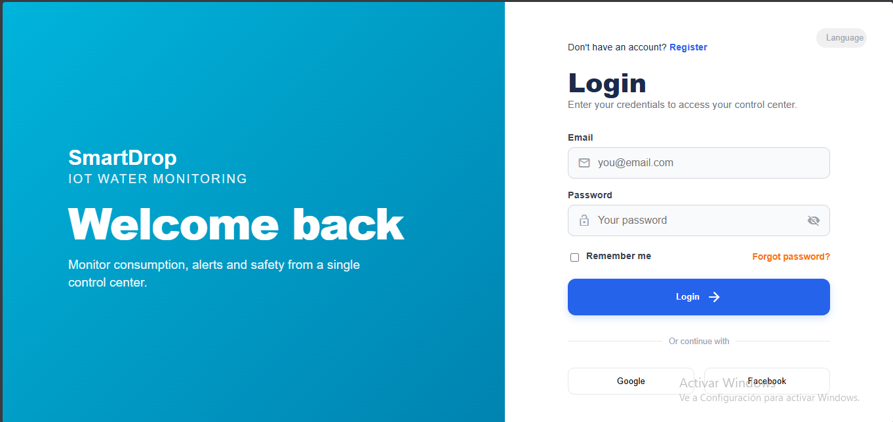
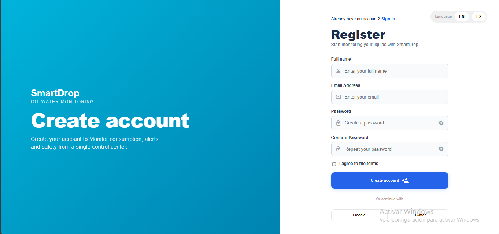
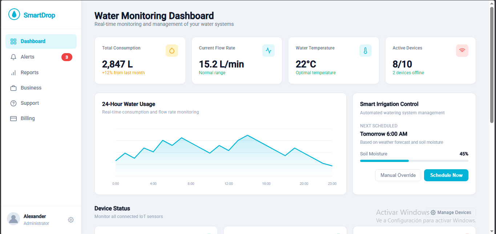
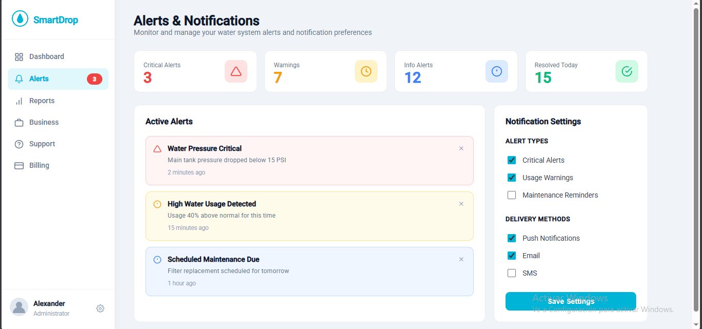
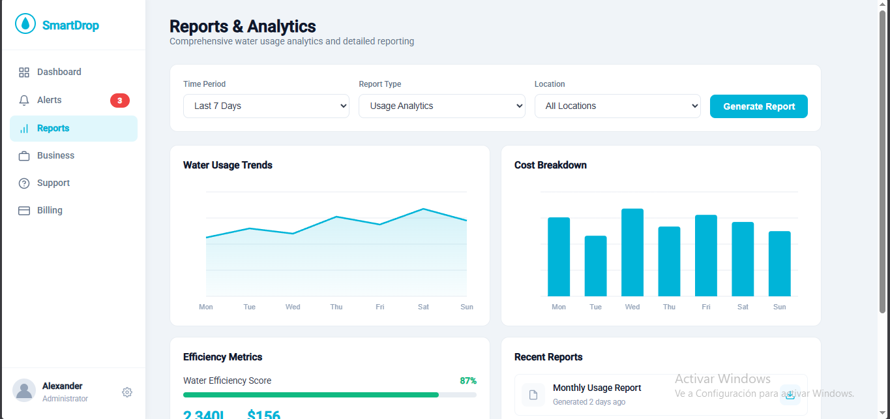
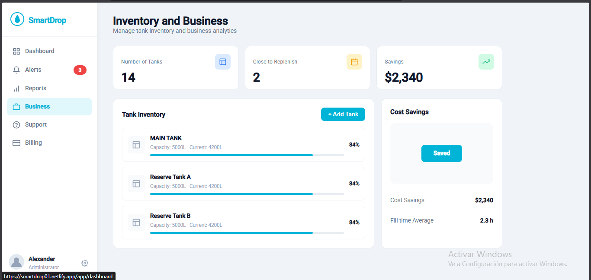
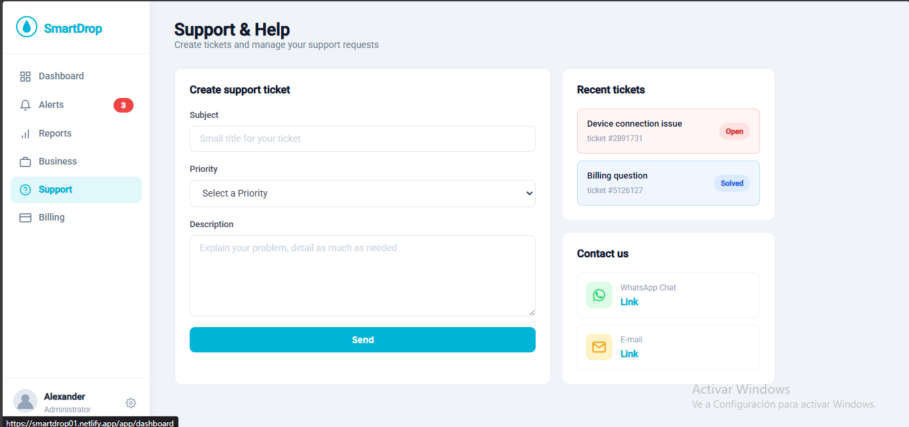
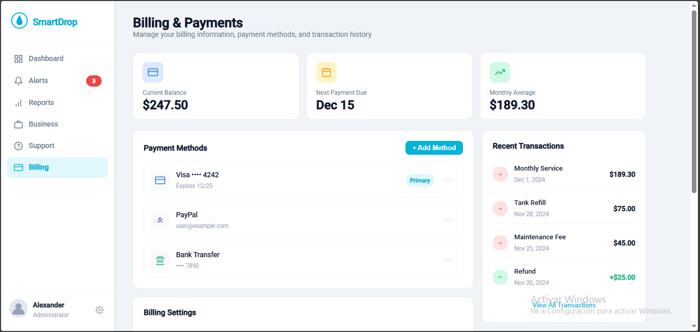

#### 5.2.2.6. Services Documentation Evidence for Sprint Review

De acuerdo con el ciclo de vida del proyecto y los requerimientos de la rúbrica para el hito TB1, el desarrollo y documentación del RESTful API (Web Services) se abordará en la siguiente fase (AV2). Por lo tanto, esta sección no aplica para el presente sprint.

#### 5.2.2.7. Software Deployment Evidence for Sprint Review

La primera versión del Frontend Web Application ha sido desplegada para asegurar su disponibilidad y realizar pruebas de experiencia de usuario en un entorno real. Se ha configurado una canalización automatizada conectada a la rama principal del repositorio.

* **URL de Web Application desplegada:** [https://6a0693fc92c4560008b0ec59--smartdrop01.netlify.app/login]
* **Plataforma utilizada:** Netlify 

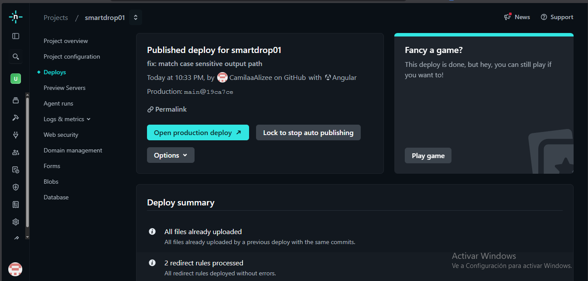
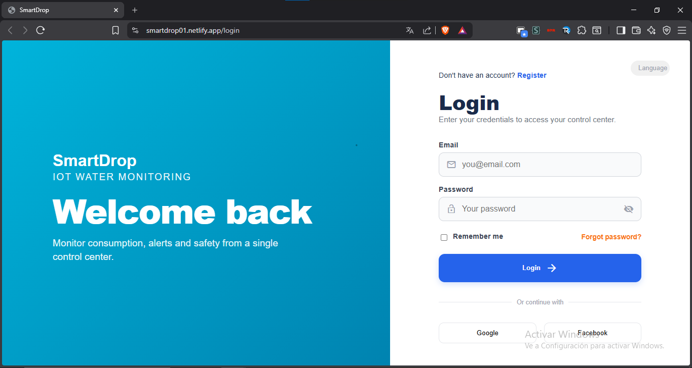

#### 5.2.2.8. Team Collaboration Insights during Sprint

La colaboración para este segundo sprint reflejó una adaptación exitosa a los lineamientos propuestos en la retrospectiva anterior. Al manejar un repositorio de código más complejo, la revisión de *Pull Requests* y la asignación temprana de componentes previnieron sobreescrituras en las vistas principales. A continuación, se muestran las métricas de GitHub que evidencian la participación técnica de todos los desarrolladores.

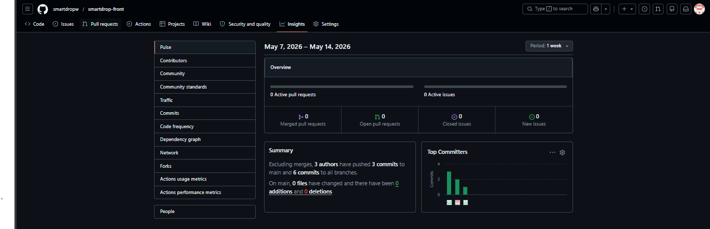

### 5.2.3. Sprint 3
Para la segunda versión de la Frontend Web Application, se completó la implementación y el desarrollo de las funcionalidades faltantes correspondientes a las diferentes secciones del sistema, tales como el Dashboard, Alertas, Reportes y Soporte. 

Esta versión completa también fue desplegada con éxito, manteniendo la automatización con nuestro repositorio de GitHub. De esta manera, cualquier cambio visual o en los datos en tiempo real se actualiza automáticamente en la web, dejándola lista y completamente funcional para las entrevistas de experiencia de usuario.

### 5.2.3.1.Sprint Planning 3.
**Background:** Tras el despliegue de la primera versión del Frontend Web Application en el Sprint 2, el equipo se enfocó en trabajar en una etapa avanzada de la aplicación, con un código más grande y flujos completos para dejar la web lista para las entrevistas de validación.

| Sprint # | Sprint 3 |
| :--- | :--- |
| **Date** | 25/04/2026 |
| **Time** | 16:00 horas |
| **Location** | Reunión virtual - Discord |
| **Prepared By** | Barrenechea Bustamante, Rafael André; Pariona Chacca, Angel Jose |
| **Attendees** | Rafael André Barrenechea Bustamante, Camila Alizée Otiniano Rosales, Angel Jose Pariona Chacca, Francisco Javier Uribe Linares |
| **Sprint 2 Review Summary** | Se validó el despliegue exitoso del login, registro y la estructura base del dashboard. Se determinó que para este nuevo sprint era crucial mantener una revisión constante de los Pull Requests y asignar tareas específicas desde el inicio para evitar conflictos en las pantallas principales. |
| **Sprint Goal & User Stories** | **US05, US06, US07, US12, US13, US15**    **Goal:** Completar el desarrollo del Frontend de SmartDrop, implementando las vistas interactivas del Dashboard, Alertas, Reportes, Negocios, Soporte y Facturación, garantizando su despliegue y funcionalidad automatizada para las entrevistas de validación. |
| **Sprint 3 Velocity** | 26 |
| **Sum of Story Points** | 26 |

### 5.2.3.2. Aspect Leaders and Collaborators.
Para este tercer sprint, la ejecución principal del código y la maquetación de las vistas avanzadas fue liderada de manera centralizada para mantener la consistencia del flujo y los estilos, mientras que el resto del equipo colaboró activamente en la revisión constante de los Pull Requests y la validación funcional de la interfaz para evitar conflictos y sobreescrituras.

| Team Member (Last Name, First Name) | GitHub Username | Frontend Application Leader (L) / Collaborator (C) | Documentation Leader (L) / Collaborator (C) | UI Styles & Routing Leader (L) / Collaborator (C) |
| :--- | :--- | :--- | :--- | :--- |
| **Barrenechea Bustamante, Rafael André** | Rafael1231312331 | C | **L** | **L** |
| Otiniano Rosales, Camila Alizée | CamilaaAlizee | **L** | **L** | C |
| Pariona Chacca, Angel Jose | angelitoso-opp | C | **L** | **L** |
| Uribe Linares, Francisco Javier | FranciscoLinaresX | **L** | **L** | C |

### 5.2.3.3.Sprint Backlog 3.
En base a los objetivos del sprint, las tareas se centraron en materializar las Historias de Usuario restantes del Product Backlog en componentes visuales interactivos para la aplicación web, distribuyendo la carga de trabajo entre los desarrolladores del equipo.

| Sprint # | Sprint 3 | | | | | | |
| :--- | :--- | :--- | :--- | :--- | :--- | :--- | :--- |
| **User Story ID** | **Story Title** | **Work-Item ID** | **Task Title** | **Description** | **Estimation (Hours)** | **Assigned To** | **Status** |
| US07 | Detección temprana de temperatura | T01 | Maquetación del Dashboard de Monitoreo | Desarrollar la vista "Water Monitoring Dashboard" integrando tarjetas de consumo, flujo, temperatura y estado de dispositivos IoT. | 6 | Francisco Uribe | Done |
| US05 | Alertas críticas de fuga | T02 | Panel de Alertas y Notificaciones | Implementar la interfaz "Alerts & Notifications" con listado de alertas activas (críticas, warnings) y configuración de canales. | 5 | Camila Otiniano | Done |
| US06 | Análisis histórico residencial | T03 | Vistas de Reportes e Inventario | Construir las pantallas "Reports & Analytics" (gráficos de tendencias) e "Inventory and Business" (capacidad de tanques y ahorros). | 4 | Rafael Barrenechea | Done |
| US12 | Auditoría de incidentes | T04 | Módulo de Soporte y Tickets | Crear la vista "Support & Help" que permita formular tickets de asistencia y revisar el historial de incidentes. | 3 | Angel Pariona | Done |
| US13 | Reacción de conectividad | T05 | Integración de estados IoT | Automatizar la supervisión visual del estado online/offline de los sensores dentro de las vistas principales. | 4 | Rafael Barrenechea | Done |
| US15 | Elección de planes SaaS | T06 | Módulo de Facturación y Pagos | Desarrollar la pantalla "Billing & Payments" mostrando balance, métodos de pago y transacciones recientes. | 4 | Camila Otiniano | Done |

### 5.2.3.4.Development Evidence for Sprint Review.
Durante este sprint, el desarrollo completo de estas funcionalidades se llevó a cabo en el repositorio de la aplicación web (`smartdropw/smartdrop-front`). Manteniendo el modelo de ramificación GitFlow y el estándar de Conventional Commits definidos para el proyecto, a continuación se presentan los commits más representativos de esta fase, los cuales fueron integrados a la rama principal mediante Pull Requests revisados por el equipo para evitar conflictos.

| Repository | Branch | Commit Id | Commit Message | Commit Message Body | Commited on (Date) |
| :--- | :--- | :--- | :--- | :--- | :--- |
| smartdrop-front | `feature/dashboard-view` | `e3f8a2c` | feat: | Implementación del Water Monitoring Dashboard con métricas y estado de sensores | 27/04/2026 |
| smartdrop-front | `feature/alerts-view` | `9b1d4e7` | feat: | Desarrollo de la vista de Alertas con panel de configuración de notificaciones | 30/04/2026 |
| smartdrop-front | `feature/reports-business` | `4c5a7f2` | feat: | Integración de gráficos en Reports & Analytics y panel de Inventory & Business | 03/05/2026 |
| smartdrop-front | `feature/support-view` | `8d2e1b9` | feat: | Creación de módulo Support & Help para gestión de tickets | 06/05/2026 |
| smartdrop-front | `feature/billing-view` | `1f3a6d4` | feat: | Maquetación del módulo Billing & Payments con historial de transacciones | 09/05/2026 |

### 5.2.3.5.Execution Evidence for Sprint Review.
En esta etapa final de desarrollo de la interfaz, logramos traducir exitosamente la arquitectura de información y los wireframes a código funcional. Las siguientes descripciones y capturas demuestran la navegación interactiva de la aplicación web, abarcando todas las herramientas operativas de SmartDrop, las cuales ya se encuentran completamente funcionales para ser evaluadas en nuestras entrevistas de validación.

* **Vista de Monitoreo (Water Monitoring Dashboard):** Es el panel principal interactivo. Muestra métricas vitales en tiempo real, incluyendo el consumo total (*Total Consumption*), el flujo actual del agua (*Current Flow*) y la temperatura (*Temperature*). Además, integra gráficos dinámicos de barras para analizar el uso en las últimas 24 horas y switches de control para el sistema de irrigación inteligente.
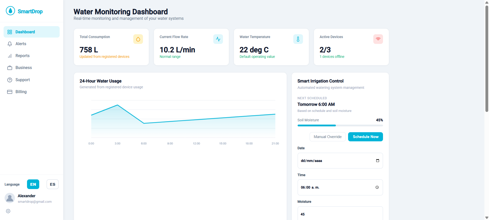
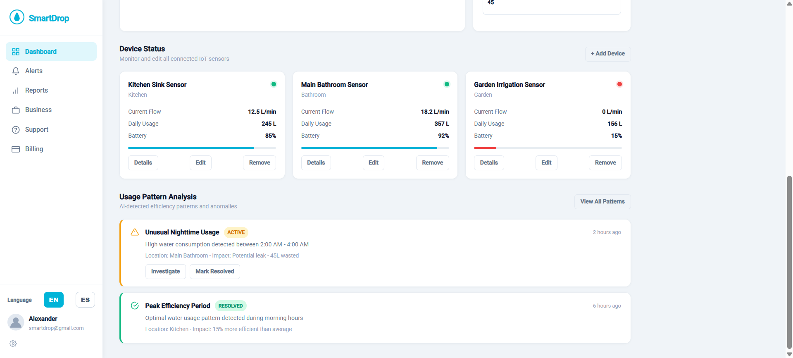

* **Vista de Alertas (Alerts & Notifications):** Interfaz diseñada para la prevención de desastres hídricos. Cuenta con un registro central que clasifica las notificaciones del sistema según su severidad (fugas críticas, caídas de presión, informativas). En el panel derecho, se implementó un formulario de configuración donde el usuario puede activar/desactivar sus canales de aviso preferidos (Push, Email, SMS) y gestionar sus contactos de emergencia.
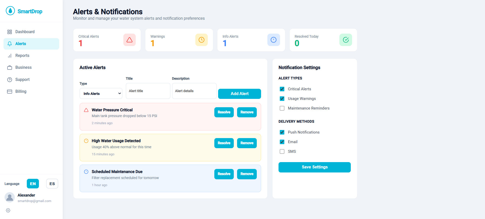

* **Vista de Reportes y Analíticas (Reports & Analytics):** Pantalla orientada al análisis de datos históricos para la toma de decisiones. Incluye un gráfico de líneas para evaluar las tendencias de consumo a lo largo del tiempo, un gráfico de barras para el desglose detallado de costos (*Cost Breakdown*), y un indicador circular que calcula la puntuación de eficiencia hídrica del usuario (*Water Efficiency Score*).
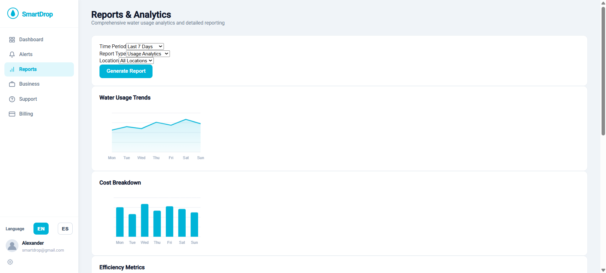
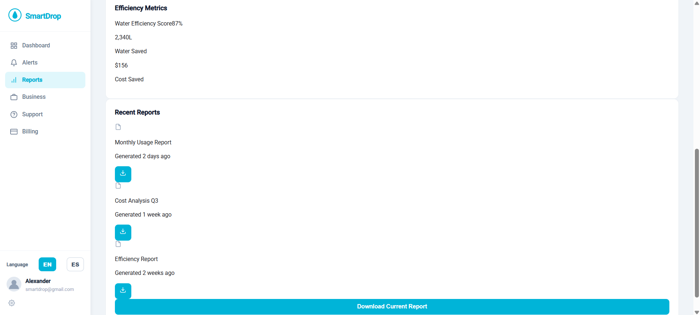

* **Vista de Inventario y Negocios (Inventory and Business):** Módulo exclusivo diseñado para el segmento B2B (PYMEs). Permite monitorear el estado de múltiples contenedores de forma simultánea, visualizando el porcentaje de capacidad actual del tanque principal y los tanques de reserva. Destaca visualmente cuántos de estos requieren reabastecimiento próximo y presenta una tarjeta de resumen con los ahorros económicos logrados.
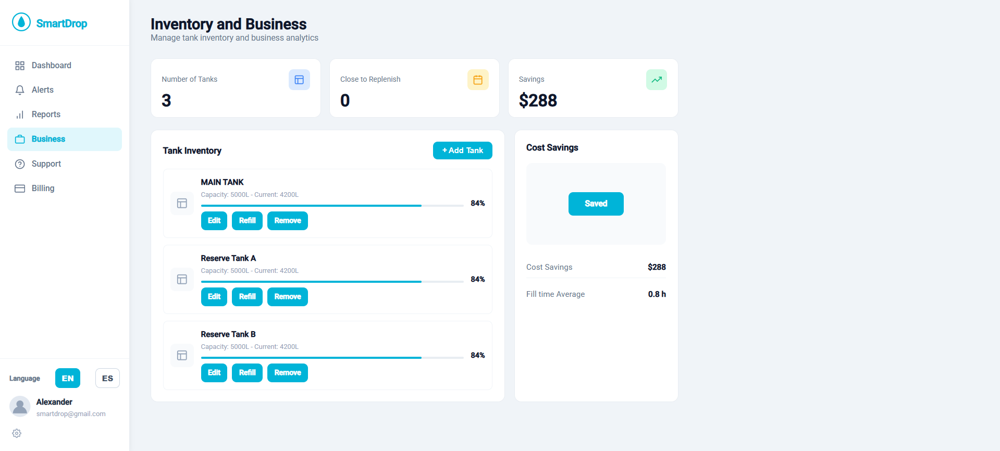

* **Vista de Soporte (Support & Help):** Interfaz dedicada a la atención al cliente. Cuenta con un formulario rápido para la creación de nuevos tickets especificando el nivel de urgencia. En la parte inferior, despliega una tabla de datos con el historial de incidentes recientes, mostrando su ID, asunto, prioridad (Alta, Media, Baja) y estado de resolución (Abierto, Solucionado).
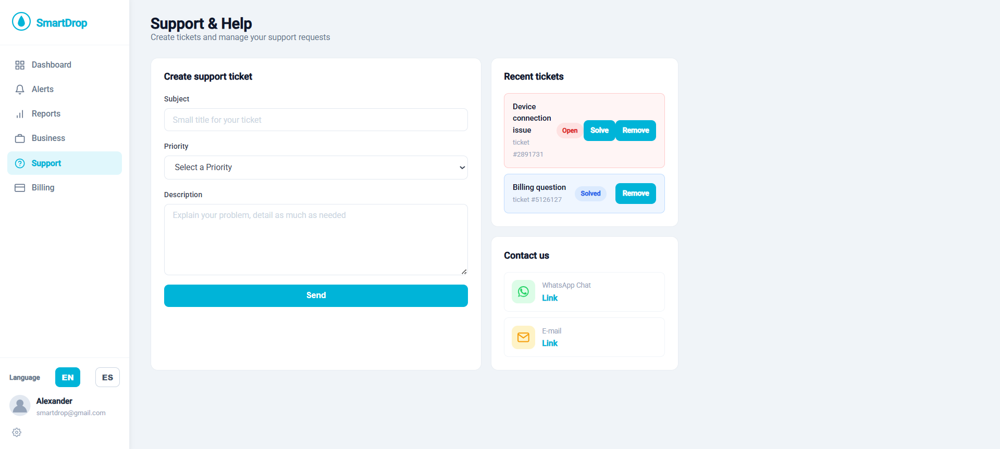

* **Vista de Facturación (Billing & Payments):** Panel administrativo y financiero. Muestra de forma clara el balance actual de la cuenta del usuario, los métodos de pago vinculados (Tarjetas de crédito, PayPal, transferencias), el gasto mensual promedio proyectado y una tabla cronológica detallada con las últimas transacciones realizadas en la plataforma.
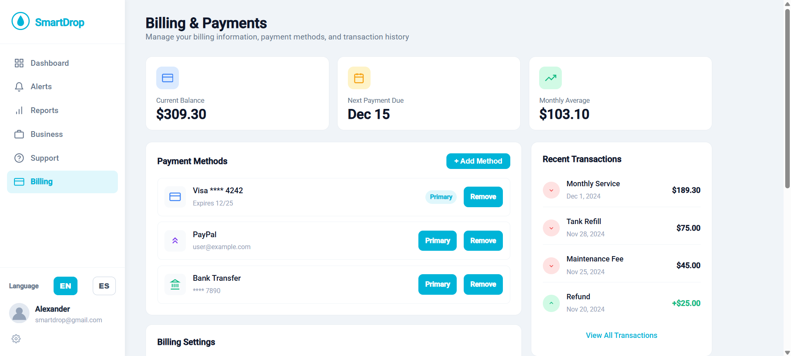
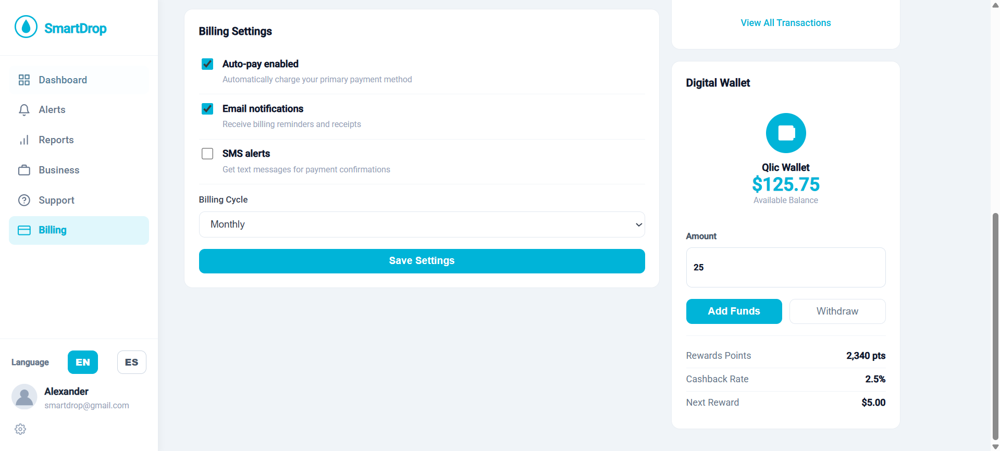

### 5.2.3.6.Services Documentation Evidence for Sprint Review.
Durante este sprint, se completó de manera exitosa el diseño, la implementación y la documentación técnica de nuestra API RESTful (Web Services). Para asegurar que el equipo de desarrollo Frontend y los futuros integradores dispongan de una referencia clara, interactiva y estandarizada, toda la arquitectura de servicios ha sido documentada utilizando el estándar OpenAPI.

Esta documentación detalla de forma exhaustiva los esquemas de datos, los parámetros requeridos, los métodos HTTP soportados y los códigos de respuesta para los controladores principales del sistema, incluyendo la gestión de identidades (*Identity & Access*), el monitoreo de telemetría (*Monitoring & Alerts*) y la gestión de planes de usuario (*Payments & Subscriptions*).

* **Herramienta de Documentación:** Swagger UI (OpenAPI Specification)
* **URL de la Documentación de la API:** http://localhost:8080/swagger-ui/index.html#/dashboard-controller/getDashboardSummary

### 5.2.3.7.Software Deployment Evidence for Sprint Review.

Para la segunda versión de la Frontend Web Application, se completó la implementación y el desarrollo de las funcionalidades faltantes correspondientes a las diferentes secciones del sistema, tales como el Dashboard, Alertas, Reportes y Soporte.

Esta versión completa también fue desplegada con éxito, manteniendo la automatización con nuestro repositorio de GitHub. De esta manera, cualquier cambio visual o en los datos en tiempo real se actualiza automáticamente en la web, dejándola lista y completamente funcional para las entrevistas de experiencia de usuario.

URL de Web Application desplegada: [https://6a0693fc92c4560008b0ec59--smartdrop01.netlify.app/login]
Plataforma utilizada: Netlify

### 5.2.3.8.Team Collaboration Insights during Sprint.
La colaboración en este tercer sprint demostró una mejor organización del equipo siguiendo lo aprendido en las entregas anteriores. Al trabajar en una etapa avanzada de la aplicación, con un código más grande y flujos completos, mantener una revisión constante de los Pull Requests y asignar tareas específicas desde el inicio fue clave para evitar conflictos o sobreescrituras en las pantallas principales. A continuación, se muestran las métricas de GitHub que reflejan el trabajo técnico de cada uno de los integrantes en este sprint.

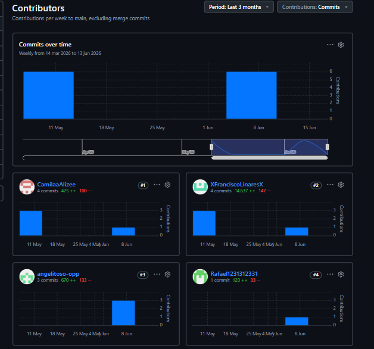

## 5.3. Validation Interviews.
### 5.3.1. Diseño de Entrevistas.
A continuación, se presenta el diseño de la entrevista de validación, enfocada directamente en la experiencia de usuario, diseño visual y funcionalidad de nuestra Landing Page y la plataforma web de SmartDrop:

a. PERFIL DEL ENTREVISTADO
* ¿Cuál es tu nombre y a qué te dedicas actualmente?
 
* ¿Qué tan familiarizado estás con el uso de plataformas web o paneles de control?

b. FEEDBACK DE LA LANDING PAGE (Presentación)
* Al revisar la Landing Page, ¿te queda claro en los primeros segundos qué problema resuelve SmartDrop?
 
* ¿El diseño visual de la landing te transmite confianza y te invita a querer registrarte en la plataforma?
 
c. FEEDBACK DEL FRONTEND WEB 
* Flujo de Acceso: ¿Qué tal te pareció el proceso para crear una cuenta e iniciar sesión? ¿Te resultó rápido e intuitivo?
 
* Facilidad de Uso: Al mirar el panel principal con los gráficos y los datos en tiempo real, ¿sentiste que la información era fácil de entender o te pareció muy compleja a primera vista?
 
* Controles y Funciones: ¿Consideras que los botones y las opciones para interactuar con el sistema (como las alertas o los controles de automatización) están bien ubicados y son fáciles de usar?
 
* Navegación: En general, ¿te resultó cómodo moverte entre las diferentes secciones del menú lateral o hubo algo que te causara confusión?

d. VALORACIÓN FINAL
* ¿Qué es lo que más y lo que menos te gustó de la interfaz actual de la plataforma?
 
* ¿Qué elemento o funcionalidad técnica crees que le falta al panel para mejorar tu experiencia como usuario?
 
* Si esta plataforma estuviera disponible hoy en el mercado, ¿la implementarías para la gestión de tus sistemas de agua? ¿Por qué?

### 5.3.2. Registro de Entrevistas.

A continuación, se presenta el registro de entrevistas realizadas a usuarios potenciales de smartdrop.

**Entrevistado N°1:** 

**Sexo:** 
**Edad:**
**Ubicación en la que vive:** 
**Acerca de la entrevista:**

**Link:** 
**Instante en el que inicia:**
**Duración:** 
**Resumen:**

**Captura de pantalla:**

**Entrevistado N°2:** 

**Sexo:** 
**Edad:**
**Ubicación en la que vive:** 
**Acerca de la entrevista:**

**Link:** 
**Instante en el que inicia:**
**Duración:** 
**Resumen:**

**Captura de pantalla:**

**Entrevistado N°3:** 

**Sexo:** 
**Edad:**
**Ubicación en la que vive:** 
**Acerca de la entrevista:**

**Link:** 
**Instante en el que inicia:**
**Duración:** 
**Resumen:**

**Captura de pantalla:**

**Entrevistado N°4:** 

**Sexo:** 
**Edad:**
**Ubicación en la que vive:** 
**Acerca de la entrevista:**

**Link:** 
**Instante en el que inicia:**
**Duración:** 
**Resumen:**

**Captura de pantalla:**

**Entrevistado N°5:** 

**Sexo:** 
**Edad:**
**Ubicación en la que vive:** 
**Acerca de la entrevista:**

**Link:** 
**Instante en el que inicia:**
**Duración:** 
**Resumen:**

**Captura de pantalla:**

**Entrevistado N°6:** 

**Sexo:** 
**Edad:**
**Ubicación en la que vive:** 
**Acerca de la entrevista:**

**Link:** 
**Instante en el que inicia:**
**Duración:** 
**Resumen:**

**Captura de pantalla:**

**Entrevistado N°7:** 

**Sexo:** 
**Edad:**
**Ubicación en la que vive:** 
**Acerca de la entrevista:**

**Link:** 
**Instante en el que inicia:**
**Duración:** 
**Resumen:**

**Captura de pantalla:**

**Entrevistado N°8:** 

**Sexo:** 
**Edad:**
**Ubicación en la que vive:** 
**Acerca de la entrevista:**

**Link:** 
**Instante en el que inicia:**
**Duración:** 
**Resumen:**

**Captura de pantalla:**

### 5.3.3. Evaluaciones según heurísticas.
## 5.4. Video About-the-Product

# Conclusiones
Durante el proceso de creación y desarrollo de este trabajo pudimos llegar a las siguientes conclusiones:

### 1. Trabajo en equipo y colaboración
El éxito de este proyecto demuestra la importancia del trabajo en equipo y la colaboración efectiva entre los miembros del grupo.
La sinergia, comunicación constante y distribución de roles permitieron integrar diferentes perspectivas y habilidades,
logrando un desarrollo más robusto y eficiente.

### 2. Planificación y organización en el desarrollo de software
Una adecuada planificación y organización fueron clave para el cumplimiento de los objetivos del proyecto.
La metodología empleada (como Agile o SCRUM) facilitó la gestión de tareas, la priorización de funcionalidades y la entrega
de resultados en los tiempos establecidos, asegurando un producto de calidad.

### 3. Tecnología y herramientas aplicadas a la realidad
El uso de tecnologías modernas y herramientas innovadoras permitió desarrollar una solución alineada con las necesidades
reales del sector. La integración de frameworks ágiles, bases de datos eficientes y sistemas en la nube garantizó un producto
escalable, seguro y adaptable al contexto peruano.

### 4. Solución rentable y sostenible contra el desperdicio alimentario
Este proyecto se consolida como una solución rentable y sostenible para reducir el desperdicio de alimentos en Perú,
especialmente en el sector restaurantero. Al conectar a establecimientos con consumidores, se optimiza el uso de excedentes,
generando un impacto económico, social y ambiental positivo.

### 5. Consolidación de la experiencia interactiva
Con el desarrollo del Sprint 2 y el despliegue del Frontend Web Application, el proyecto SmartDrop evoluciona de una fase puramente informativa hacia una plataforma funcional. La traducción exitosa de los wireframes a componentes en código demuestra que el equipo ha logrado mantener la consistencia del diseño visual y la arquitectura de la información, sentando una base sólida, inclusiva y escalable para la futura integración con los servicios en la nube.

# Bibliografía
Conne, M(2024). _The Markdown Guide_. MarkdownGuide. Recuperado de: https://www.markdownguide.org/

- Conventional Commits. (n.d.). *Conventional commits v1.0.0.* Retrieved from https://www.conventionalcommits.org/en/v1.0.0/

- BrowserStack. (n.d.). Responsive Web Design: A Complete Guide. Recuperado de https://www.browserstack.com/guide/responsive-web-design

- Spring Boot. (n.d.). Spring Boot Documentation. Retrieved from https://docs.spring.io/spring-boot/documentation.html#documentation.web

- Modyo. (n.d.). Domain-Driven Design (DDD) - Patrones de arquitectura. Retrieved from https://docs.modyo.com/es/architecture/patterns/ddd.html

- Pivotal Software (2024). Spring Boot Reference Documentation (v3.2.4). https://docs.spring.io/spring-boot/docs/current/reference/html/

- Evans, E. (2004). Domain-Driven Design: Tackling Complexity in the Heart of Software. Addison-Wesley. https://www.domainlanguage.com/ddd/

- Eser, A. (2025, 30 de mayo). *Marketing in the Water Industry Statistics*. ZipDo Education Reports. Recuperado de https://zipdo.co/marketing-in-the-water-industry-statistics/

- América Noticias. (2025). *Sunass: cierre de brechas en agua y saneamiento requiere cerca de 95 mil millones inversión*. América TV. Recuperado de https://www.americatv.com.pe/noticias/actualidad/sunass-cierre-brechas-agua-y-saneamiento-requiere-cerca-s-95-mil-millones-inversion-n468439

- Ministerio de Vivienda, Construcción y Saneamiento. (2024, 9 de agosto). *Más de 500 mil peruanos accederán a servicios de agua potable y saneamiento con obras que el Ministerio de Vivienda concluirá al 2025*. Gobierno del Perú. Recuperado de https://www.gob.pe/institucion/vivienda/noticias/1000795-mas-de-500-mil-peruanos-accederan-a-servicios-de-agua-potable-y-saneamiento-con-obras-que-el-ministerio-de-vivienda-concluira-al-2025

- Angular. (s.f.). *Angular documentation: Getting started*. Recuperado el 14 de mayo de 2026, de https://angular.io/docs

- Vercel. (s.f.). *Vercel documentation: Frontend cloud framework deployment*. Recuperado el 14 de mayo de 2026, de https://vercel.com/docs

# Anexos
**GITHUB:**

| Título | Descripción | Enlace                                                                                                     |
| :---- | :---- |:-----------------------------------------------------------------------------------------------------------|
| Reporte | Enlace al repositorio del reporte | [https://github.com/smartdropw/project-report-smartdrop](https://github.com/smartdropw/project-report-smartdrop) |
| Landing Page | Enlace al repositorio del Landing Page | [https://github.com/smartdropw/LandingPage-SmartDrop](https://github.com/smartdropw/LandingPage-SmartDrop)                      |
| Landing Page Desplegada | Enlace de Landing Page Desplegada | [https://smartdropw.github.io/LandingPage-SmartDrop/](https://smartdropw.github.io/LandingPage-SmartDrop/)                      |
| Frontend Web App | Enlace al repositorio de la aplicación web | [https://github.com/smartdropw/smartdrop-front](https://github.com/smartdropw/smartdrop-front) |
| Web App Desplegada | Enlace a la aplicación web en producción | [https://6a0693fc92c4560008b0ec59--smartdrop01.netlify.app/login](https://6a0693fc92c4560008b0ec59--smartdrop01.netlify.app/login) |
