

## Universidad Peruana de Ciencias Aplicadas

**Ingeniería de Software**

**Ciclo:** 2026-1

**Codigo del curso:** 1ASI0729

**Curso:** Desarrollo de Aplicaciones Open Source

**Sección:** 12010

**Profesor:** Ivan Robles Fernández

----

## Informe de Trabajo Final

**Startup:** SmartDrop

#### Relación de integrantes

| Nombre                       | Código     |
| ---------------------------- | ---------- |
|                              |            |
|                              |            |
|                              |            |
| Pariona Chacca, Angel Jose   | u202320613 |

 

### Marzo 2026
 

---
# Registro de Versiones

| Versión |   Fecha    |            Autor | Descripción de modificación |
| :---: |:----------:|:--------------:| ----- |
| tb1 |            |           |              |
|  |            |         |            |
|  |            |         |           |
|  |            |            |           |
| tp1 |      |                |            |
|  |         |            |             |
|  |         |            |             |
|  |             |              |             |
| tb2 |            |                |                |
|  |            |                |               |
|  |            |                |            |
|  |            |                |            |
| tf1 |            |                |            |
|  |            |                |             |
|  |            |                |             |
|  |            |                |               |

# Project Report Collaboration Insights

Repositorio del informe del proyecto  
El informe del proyecto se encuentra alojado en el siguiente repositorio de la organización de GitHub del equipo:

🔗 Enlace de la organización:  
🔗 Enlace de repositorios: 

A continuación, se detallan las actividades realizadas en cada entrega, la participación de los miembros del equipo, y las evidencias correspondientes.

TB1  
Para la primera entrega (TB1) se trabajó en la estructura inicial del informe, definiendo el índice y distribuyendo las secciones entre los miembros.

---
# Contenido
- [Registro de Versiones](#registro-de-versiones)
- [Project Report Collaboration Insights](#project-report-collaboration-insights)
- [Contenido](#contenido)
- [Student Outcome](#student-outcome)
- [Capitulo I: Introducción](#capitulo-I-introducción)
    - [1.1. Startup Profile](#11-startup-profile)
        - [1.1.1. Descripcion del Startup](#111-Descripcion-del-startup)
        - [1.1.2. Perfiles de Integrantes del equipo](#112-perfiles-de-integrantes-del-equipo)
    - [1.2. Solution Profile](#12-solution-profile)
        - [1.2.1. Antecedentes y problemática](#121-antecedentes-y-problemática)
        - [1.2.2. Lean UX Process](#122-lean-ux-process)
            - [1.2.2.1. Lean UX Problem Statements](#1221-lean-ux-problem-statements)
            - [1.2.2.2. Lean UX Assumptions](#1222-lean-ux-assumptions)
            - [1.2.2.3. Lean UX Hypothesis Statements](#1223-lean-ux-hypothesis-statements)
            - [1.2.2.4. Lean UX Canvas](#1224-lean-ux-canvas)
    - [1.3. Segmentos objetivos](#13-segmentos-objetivos)
- [Capitulo 2: Requirements Elicitation \& Analysis](#capitulo-2-requirements-elicitation--analysis)
    - [2.1. Competidores](#21-competidores)
        - [2.1.1. Analisis competitivo](#211-analisis-competitivo)
        - [2.1.2. Estrategias y tácticas frente a competidores](#212-estrategias-y-tácticas-frente-a-competidores)
    - [2.2. Entrevistas](#22-entrevistas)
        - [2.2.1. Diseño de entrevistas](#221-diseño-de-entrevistas)
        - [2.2.2. Registro de entrevistas](#222-registro-de-entrevistas)
        - [2.2.3. Análisis de entrevistas](#223-análisis-de-entrevistas)
    - [2.3. Needfinding](#23-needfinding)
        - [2.3.1. User Personas](#231-user-personas)
        - [2.3.2  User Task Matrix](#232--user-task-matrix)
        - [2.3.3. User Journey Mapping](#233-user-journey-mapping)
        - [2.3.4. Empathy Mapping](#234-empathy-mapping)
            - [2.3.5. As-is Scenario Mapping](#235-as-is-scenario-mapping)
    - [2.4. Ubiquitous Language](#24-ubiquitous-language)
- [Capitulo 3: Requirements Specification](#capitulo-3-requirements-specification)
    - [3.1. To-Be Scenario Mapping](#31-to-be-scenario-mapping)
    - [3.2. User Stories](##32-user-stories)
    - [3.3. Impact Mapping](#33-impact-mapping)
    - [3.4. Product Backlog](#34-product-backlog)
- [Capítulo 4: Product Design](#capítulo-4-product-design)
    - [4.1. Style Guidelines](#41-style-guidelines)
        - [4.1.1. General Style Guidelines](#411-general-style-guidelines)
        - [4.1.2. Web Style Guidelines](#412-web-style-guidelines)
    - [4.2. Information Architecture](#42-information-architecture)
        - [4.2.1. Organization Systems](#421-organization-systems)
        - [4.2.2. Labeling Systems](#422-labeling-systems)
        - [4.2.3. SEO Tags and Meta Tags](#423-seo-tags-and-meta-tags)
        - [4.2.4. Searching Systems](#424-searching-systems)
        - [4.2.5. Navigation Systems](#425-navigation-systems)
    - [4.3. Landing Page UI Design](#43-landing-page-ui-design)
        - [4.3.1. Landing Page Wireframe](#431-landing-page-wireframe)
        - [4.3.2. Landing Page Mock-up](#432-landing-page-mock-up)
    - [4.4. Web Applications UX/UI Design](#44-web-applications-uxui-design)
        - [4.4.1. Web Applications Wireframes](#441-web-applications-wireframes)
        - [4.4.2. Web Applications Wireflow Diagrams](#442-web-applications-wireflow-diagrams)
        - [4.4.3. Web Applications Mock-ups](#443-web-applications-mock-ups)
        - [4.4.4. Web Applications User Flow Diagrams](#444-web-applications-user-flow-diagrams)
    - [4.5. Web Applications Prototyping.](#45-web-applications-prototyping)
    - [4.6. Domain-Driven Software Architecture](#46-domain-driven-software-architecture)
        - [4.6.1. Software Architecture Context Diagram](#461-software-architecture-context-diagram)
        - [4.6.2. Software Architecture Container Diagrams](#462-software-architecture-container-diagrams)
        - [4.6.3. Software Architecture Components Diagrams](#463-software-architecture-components-diagrams)
    - [4.7. Software Object-Oriented Design](#47-software-object-oriented-design)
        - [4.7.1. Class Diagrams](#471-class-diagrams)
        - [4.7.2. Class Dictionary](#472-class-dictionary)
    - [4.8. Database Design](#48-database-design)
        - [4.8.1. Database Diagram](#481-database-diagram)
- [Capítulo 5: Product Implementation, Validation \& Deployment](#capítulo-5-product-implementation-validation--deployment)
    - [5.1. Software Configuration Management](#51-software-configuration-management)
        - [5.1.1. Software Development Environment Configuration](#511-software-development-environment-configuration)
        - [5.1.2. Source Code Management](#512-source-code-management)
        - [5.1.3. Source Code Style Guide \& Conventions](#513-source-code-style-guide--conventions)
        - [5.1.4. Software Deployment Configuration](#514-software-deployment-configuration)
    - [5.2. Landing Page, Services \& Applications Implementation](#52-landing-page-services--applications-implementation)
        - [5.2.1. Sprint 1](#521-sprint-1)
            - [5.2.1.1. Sprint Planning 1](#5211-sprint-planning-1)
            - [5.2.1.2. Aspect Leaders and Collaborators](#5212-aspect-leaders-and-collaborators)
            - [5.2.1.3. Sprint Backlog 1](#5213-sprint-backlog-1)
            - [5.2.1.4. Development Evidence for Sprint Review](#5214-development-evidence-for-sprint-review)
            - [5.2.1.5. Execution Evidence for Sprint Review](#5215-execution-evidence-for-sprint-review)
            - [5.2.1.6. Services Documentation Evidence for Sprint Review](#5216-services-documentation-evidence-for-sprint-review)
            - [5.2.1.7. Software Deployment Evidence for Sprint Review](#5217-software-deployment-evidence-for-sprint-review)
            - [5.2.1.8. Team Collaboration Insights during Sprint](#5218-team-collaboration-insights-during-sprint)
- [Conclusiones](#conclusiones)
- [Bibliografía](#bibliografía)
- [Anexos](#anexos)

# Student Outcome

El curso contribuye al cumplimiento del Student Outcome ABET:

**ABET – EAC \- Student Outcome 3**  
**Criterio: Capacidad de comunicarse efectivamente con un rango de audiencias.**

En el siguiente cuadro se describen las acciones realizadas y enunciados de  
conclusiones por parte del grupo, que permiten sustentar el haber alcanzado el logro  
del ABET – EAC \- Student Outcome 3\.

| Criterio Específico                                                   | Acciones Realizadas  | Conclusiones |
|-----------------------------------------------------------------------|----------------------|--------------|
| Comunica por escrito con efectividad a diferentes rangos de audiencia |                      |              |        
| Comunica oralmente con efectividad a diferentes rangos de audiencia |                        |              |
---

<!-- CHAPTER-1:START -->
# Capítulo I: Introducción

## 1.1. Startup Profile

### 1.1.1. Descripción de la Startup

### 1.1.2. Perfiles de integrantes del equipo

## 1.2. Solution Profile

### 1.2.1. Antecedentes y problemática

### 1.2.2. Lean UX Process

#### 1.2.2.1. Lean UX Problem Statements

#### 1.2.2.2. Lean UX Assumptions

#### 1.2.2.3 Lean UX Hypothesis Statements

#### 1.2.2.4 Lean UX Canvas

<!-- CHAPTER-1:END -->

<!-- CHAPTER-2:START -->
# Capítulo 2: Elicitación y Análisis de Requisitos

## 2.1. Competidores
**¿Por qué llevar a cabo este análisis?**

 Identificar fortalezas, debilidades y estrategias de competidores directos que ofrecen soluciones IoT para gestión y monitoreo de líquidos en tiempo real.

| Competidor                                           | SmartDrop (Mi startup)                                            | INYT (Chile)                                                                 | ONE 1oT                                                                 | AIoT4All – Internet of Water (México)                                          |
|------------------------------------------------------|---------------------------------------------------------------|------------------------------------------------------------------------------|------------------------------------------------------------------------|----------------------------------------------------------------------------------|
| **Perfil – Overview**                               | Plataforma IoT integral para gestión de líquidos en hogares e industrias, con sensores y analítica predictiva. | Telemetría IoT para líquidos industriales (diésel, agua, lubricantes) con alertas y panel  | Soluciones IoT para gestión del agua: monitoreo de nivel, consumo, calidad, alertas.  | Sistema IoT para calidad de agua en cuerpos naturales (ríos/lagos), con sensores flotantes y LoRaWAN.  |
| **Ventaja competitiva**                             | Integración completa hardware + software; predicción de consumo; dashboards multi-líquidos. | Media autonomía y precisión; fácil instalación y monitoreo remoto.            | Solución integral para agua con enfoque en calidad y fugas.              | Alto nivel de detalle en calidad del agua con múltiples parámetros ambientales.  |
| **Mercado objetivo**                               | Hogares, PYMES (bebidas, combustibles), industrias de líquidos críticos. | Industrias, minería, petróleo, instalaciones remotas.                       | Sector agrícola, industrial y de agua potable.                         | Gobiernos, instituciones ambientales, monitoreo de ecosistemas.                  |
| **Estrategias de marketing**                       | Pilotos, marketing digital, alianzas estratégicas.             | Enfoque B2B en sectores industriales con relaciones técnicas.                | Canales técnicos, integraciones ambientales.                           | Colaboración universitaria, proyectos gubernamentales y medioambientales.        |
| **Productos & Servicios**                          | Sensores IoT (nivel, caudal, pH, temp.) + plataforma web/móvil. | Sensores IoT con panel y alertas para múltiples fluidos.                    | Sensores y dashboards para calidad del agua y fugas.                    | Boyas con sensores intercambiables, conectividad LoRaWAN, dashboard ambiental.   |
| **Precios & Costos**                               | SaaS + venta de sensores a precio accesible.                   | Proyectos industrializados, costos según volumen.                         | Proyectos segmentados con soluciones modulares.                         | Modelos de colaboración con universidades y licenciamiento técnico.               |
| **Canales de distribución**                        | Web/móvil, e-commerce, APIs.                                   | Venta directa con integradores industriales.                               | Canal técnico/B2B especializado.                                        | Proyectos educativos y gubernamentales.                                         |
| **Fortalezas**                                     | Innovación, predicción, multi-líquido, IoT integral.           | Remoto, precisión, fácil uso, buena autonomía.                             | Monitoreo completo del agua con alertas.                               | Media sofisticación técnica y enfoque ambiental.                                  |
| **Debilidades**                                    | Marca emergente y recursos limitados.                          | Enfoque industrial, poco para hogares/residencial.                         | Puede ser costoso, menos aplicable a hogares.                          | Enfoque  especializado, menos aplicable a uso doméstico.                       |
| **Oportunidades**                                  | Expansión regional, digitalización, regulaciones ambientales. | Expandirse a agua potable o agricultura.                                  | Integrarse en redes de distribución pública.                           | Adaptación a cuerpos de agua urbanos y rurales.                                 |
| **Amenazas**                                       | Competidores consolidados, barreras regulatorias.              | Competencia global, soluciones estandarizadas.                            | Competidores tecnológicos, adopción de soluciones genéricas.           | Media barrera técnica y regulatoria para adopción masiva.                          |

## 2.1.2. Estrategias y tácticas frente a competidores

A partir del análisis competitivo realizado, SmartDrop plantea las siguientes estrategias y tácticas para diferenciarse y posicionarse en el mercado:

### Estrategias principales

- **Diferenciación por amplitud**: mientras competidores como INYT se enfocan en la industria y AIoT4All en temas ambientales, SmartDrop se posiciona como una plataforma integral capaz de gestionar múltiples líquidos (agua, combustibles, bebidas) tanto en hogares como en PYMEs.
- **Accesibilidad y usabilidad**: ofrecer precios más bajos y un modelo SaaS flexible, acompañado de interfaces simples y predicciones inteligentes, lo que permite captar clientes que buscan soluciones fáciles y económicas.
- **Presencia local**: reforzar el soporte técnico y la atención cercana en la región, donde competidores internacionales suelen ser menos accesibles.

### Tácticas preliminares

1. **Pilotos estratégicos** en PYMEs y hogares para validar casos de uso reales y demostrar beneficios de ahorro.
2. **Campañas digitales educativas** que comuniquen el valor de monitorear líquidos, enfocándose en sostenibilidad y reducción de costos.
3. **Alianzas con municipalidades y empresas de servicios**, aprovechando la tendencia hacia la digitalización y la gestión eficiente de recursos.
4. **Modelo freemium**: funciones básicas gratuitas (monitoreo de consumo) y planes pagos con predicción de consumo, alarmas avanzadas y reportes.
5. **Desarrollo modular** de sensores que permita ampliar funcionalidades (ej. calidad del agua, temperatura, caudal), adaptándose mejor a distintos sectores.

Con estas acciones, SmartDrop busca **aprovechar las debilidades** de los competidores (enfoque limitado, alto costo, poca presencia en hogares) y **potenciar las oportunidades** del mercado, posicionándose como la opción más flexible y accesible en la región.

### 2.1.1. Análisis competitivo

Motivación: realizar este análisis permite identificar las ventajas y limitaciones de soluciones similares en el mercado, así como oportunidades para diferenciar a nuestra propuesta IoT de gestión de líquidos.

A continuación se resume, en formato tabular, una comparación sintetizada entre nuestra solución (SmartDrop) y otros actores relevantes en la región:

| Competidor | Resumen | Ventaja diferencial | Mercado objetivo | Productos y servicios | Canales | Fortalezas | Debilidades | Oportunidades | Amenazas |
|------------|---------|---------------------|------------------|-----------------------|---------|-----------|-------------|--------------|---------|
| SmartDrop (nuestra propuesta) | Plataforma IoT completa para monitoreo y gestión de líquidos en hogares y entornos industriales; combina sensores físicos con analítica predictiva y paneles de control. | Integración hardware+software, soporte multi-líquido y capacidades predictivas. | Hogares, PYMES (bebidas, combustibles), industrias que manejan líquidos críticos. | Sensores de nivel/caudal/pH/temperatura, plataforma web y móvil con dashboards. | Venta online, APIs y pilotos con clientes. | Innovación en analítica y enfoque multi-líquido. | Marca emergente, recursos limitados. | Crecimiento regional y nuevas regulaciones ambientales. | Competidores consolidados y barreras regulatorias. |
| INYT (Chile) | Sistemas de telemetría para líquidos industriales con enfoque en instalaciones remotas. | Buen equilibrio entre autonomía y precisión; fácil puesta en marcha. | Industrias, minería y sectores con infraestructura remota. | Sensores industriales y paneles con alertas configurables. | Venta directa y partners integradores. | Robusto en entornos industriales. | Enfoque limitado a industria; poca oferta para uso doméstico. | Diversificación hacia agua potable o agricultura. | Entrada de competidores globales con soluciones estandarizadas. |
| ONE 1oT | Soluciones para control y monitoreo del agua: nivel, consumo y calidad, con alertas. | Cobertura funcional amplia para agua (detección de fugas y consumo). | Agricultura, industria y utilities de agua. | Sensores y dashboards orientados a calidad y fugas. | Canales técnicos B2B e integradores. | Enfoque integral para servicios de agua. | Puede resultar costoso para hogares. | Integración con redes de distribución y utilities. | Presión de soluciones más económicas o genéricas. |
| AIoT4All – Internet of Water (México) | Plataforma centrada en calidad de cuerpos de agua (ríos/lagos) con boyas y conectividad LoRaWAN. | Mediciones ambientales detalladas y parámetros múltiples. | Gobiernos, instituciones ambientales y proyectos académicos. | Boyas con sensores intercambiables y dashboards ambientales. | Proyectos institucionales y colaboraciones académicas. | Alta especialización técnica en calidad ambiental. | No está orientado al mercado doméstico. | Adaptación a monitoreo urbano y control ambiental. | Complejidad técnica y obstáculos regulatorios para escalamiento. |

**Resumen del análisis:** los competidores presentan enfoques especializados (industrial, calidad ambiental, utilities). Nuestra oportunidad está en posicionar a SmartDrop como una plataforma versátil que combine facilidad de uso, escalabilidad y capacidades predictivas para cubrir tanto hogares como clientes comerciales de menor escala.

### 2.1.2. Estrategias y tácticas frente a competidores

A partir del análisis competitivo realizado, SmartDrop plantea las siguientes estrategias y tácticas para diferenciarse y posicionarse en el mercado:

### Estrategias principales

- **Diferenciación por amplitud**: mientras competidores como INYT se enfocan en la industria y AIoT4All en temas ambientales, SmartDrop se posiciona como una plataforma integral capaz de gestionar múltiples líquidos (agua, combustibles, bebidas) tanto en hogares como en PYMEs.
- **Accesibilidad y usabilidad**: ofrecer precios más bajos y un modelo SaaS flexible, acompañado de interfaces simples y predicciones inteligentes, lo que permite captar clientes que buscan soluciones fáciles y económicas.
- **Presencia local**: reforzar el soporte técnico y la atención cercana en la región, donde competidores internacionales suelen ser menos accesibles.

### Tácticas preliminares

1. **Pilotos estratégicos** en PYMEs y hogares para validar casos de uso reales y demostrar beneficios de ahorro.
2. **Campañas digitales educativas** que comuniquen el valor de monitorear líquidos, enfocándose en sostenibilidad y reducción de costos.
3. **Alianzas con municipalidades y empresas de servicios**, aprovechando la tendencia hacia la digitalización y la gestión eficiente de recursos.
4. **Modelo freemium**: funciones básicas gratuitas (monitoreo de consumo) y planes pagos con predicción de consumo, alarmas avanzadas y reportes.
5. **Desarrollo modular** de sensores que permita ampliar funcionalidades (ej. calidad del agua, temperatura, caudal), adaptándose mejor a distintos sectores.

Con estas acciones, SmartDrop busca **aprovechar las debilidades** de los competidores (enfoque limitado, alto costo, poca presencia en hogares) y **potenciar las oportunidades** del mercado, posicionándose como la opción más flexible y accesible en la región.

---

## 2.2. Entrevistas

### 2.2.1. Diseño de entrevistas

### Segmento 1: Hogares con tanques/cisternas de agua

| Bloque | Preguntas |
|--------|-----------|
| Perfil del entrevistado | ¿Cuál es tu nombre y edad?   ¿Dónde vives (ciudad, tipo de vivienda: casa, departamento, etc.)?   ¿Cuántas personas viven en tu hogar?   ¿Tienen cisterna o tanque de agua? ¿De qué capacidad aproximada?   ¿Quién se encarga habitualmente de revisar o controlar el agua en casa? |
| Prácticas actuales | ¿Cómo monitorean actualmente el nivel del agua?   ¿Usan herramientas digitales o solo verificación visual? |
| Problemas y frustraciones | ¿Han tenido problemas de quedarse sin agua o de fugas?   ¿Qué es lo que más les preocupa respecto al suministro? |
| Necesidades y motivaciones | ¿Qué mejoras les gustaría tener en la forma en que gestionan el agua?; ¿Les serviría recibir alertas cuando el nivel está bajo? |
| Tecnología y disposición | ¿Usan apps en su día a día (ej. para pagos, control de gastos, domótica)?   ¿Estarían dispuestos a pagar por un servicio que les evite quedarse sin agua? |

---

### Segmento 2: PYMEs de bebidas/producción

| Bloque | Preguntas |
|--------|-----------|
| Perfil del entrevistado | ¿Cuál es el nombre de tu empresa?   ¿En qué sector/producto trabajan (ej. cervezas artesanales, jugos, licores, etc.)?   ¿Cuál es tu rol en la empresa?   ¿Cuántos empleados tienen aproximadamente?   ¿Qué volumen de líquidos gestionan por semana o mes?   ¿Cuentan con alguna certificación o estándar de control de calidad? |
| Prácticas actuales | ¿Cómo registran y monitorean actualmente los líquidos usados en la producción?   ¿Qué tan confiable consideran ese proceso? |
| Problemas y frustraciones | ¿Han tenido pérdidas por falta de control en insumos líquidos?   ¿Qué aspectos de la gestión actual generan más dolores de cabeza? |
| Necesidades y motivaciones | ¿Qué mejoras serían más valiosas para su negocio (reportes, trazabilidad, alertas)?   ¿Qué impacto tendría una mejor gestión de líquidos en sus costos y productividad? |
| Tecnología y disposición | ¿Usan actualmente software de gestión o solo registros manuales?   ¿Qué características necesitaría una solución digital para que ustedes confíen en adoptarla? |

### 2.2.2. Registro de entrevistas

A continuación, se presenta el registro de entrevistas realizadas a usuarios potenciales de smartdrop.

### Formato de registro
### Segmento objetivo #1: Hogares (Usuarios residenciales)

**Entrevistado N°1:** Robert Otiniano Rodriguez

- **Sexo:** Masculino
- **Edad:** 39 años.
- **Ubicación en la que vive:** Trujillo, Trujillo

**Acerca de la entrevista:**

- **Link:** https://youtu.be/SjMXJEQgEJ0
- **Instante en el que inicia:** 00:00
- **Duración:** 03:26

**Resumen:**  

El entrevistado Robert Otiniano, de 39 años y residente en Trujillo, gestiona un hogar de cinco personas con un sistema de cisterna de $5m^3$ y un tanque elevado de 500 litros. Actualmente, carece de herramientas de monitoreo y su control es puramente visual y reactivo ante cortes de agua, lo que ha provocado episodios de desabastecimiento y fugas no detectadas a tiempo. Robert manifiesta una necesidad clara de conocer los niveles de almacenamiento en tiempo real y visualizar su consumo diario en metros cúbicos para proyectar sus gastos mensuales. Dada su familiaridad con aplicaciones digitales de seguridad y banca, muestra una disposición positiva a pagar por una solución como SmartDrop, siempre que el costo sea proporcional al beneficio de asegurar el suministro familiar.

**Captura de pantalla:**

**Entrevistado N°2:** Carlos Mendoza Simeon

- **Sexo:** Masculino
- **Edad:** 35 años.
- **Ubicación en la que vive:** Jesús María, Lima.

**Acerca de la entrevista:**

- **Link:** https://youtu.be/C1wwL219tbI
- **Instante en el que inicia:** 00:00
- **Duración:** 04:09

**Resumen:**  

El entrevistado Carlos, de 42 años y residente en Jesús María, gestiona un hogar de cuatro personas que cuenta con un tanque elevado de 1100 litros. Actualmente, carece de herramientas digitales de monitoreo y su control es puramente visual y reactivo, obligándolo a subir al techo para revisar el nivel. Esta falta de visibilidad ha provocado episodios de desabastecimiento prolongado ante cortes en su zona y fugas nocturnas no detectadas a tiempo, impactando negativamente en su facturación mensual. Carlos manifiesta una necesidad clara de recibir alertas preventivas en su dispositivo móvil y conocer el nivel de almacenamiento sin esfuerzo físico. Dada su alta familiaridad con aplicaciones móviles de uso diario, muestra una disposición muy positiva a pagar por una solución como SmartDrop, valorando principalmente la tranquilidad y el ahorro en el hogar.

**Captura de pantalla:**

**Entrevistado N°3:** Alvaro Montes

- **Sexo:** Masculino
- **Edad:** 20
- **Ubicación en la que vive:** Lima, Ventanilla

**Acerca de la entrevista:**

- **Link:** https://www.youtube.com/watch?v=Bzd4sCZ0EIs
- **Instante en el que inicia:** 00:00
- **Duración:** 2:20

**Resumen:**  Álvaro, de 20 años y residente de Ventanilla, vive en un hogar de cinco personas que se abastece mediante un tanque de agua de 600 litros. Actualmente no utilizan ninguna herramienta tecnológica para el control del agua, siendo su padre el encargado exclusivo de realizar las revisiones de forma manual. El problema que más les afecta y preocupa es la constante intermitencia del servicio público, ya que sufren cortes repentinos durante el día y temen quedarse totalmente desabastecidos. Para mejorar esta situación, Álvaro considera vital poder recibir alertas proactivas cuando el nivel del tanque esté bajo, evitando así agotar su reserva a ciegas, y confirmó que estarían dispuestos a pagar por un servicio que les brinde esta capacidad de prevención.

**Captura de pantalla:**

**Entrevistado N°4:** Martin Perez

- **Sexo:** Masculino
- **Edad:** 20
- **Ubicación en la que vive:** Lima, Puente Piedra

**Acerca de la entrevista:**

- **Link:**https://www.youtube.com/watch?v=yECqt05TC5w
- **Instante en el que inicia:** 00:00
- **Duración:** 3:36

**Resumen:** Martín Pérez, de 20 años y residente de Puente Piedra, vive en un hogar de siete personas donde monitorean de forma manual y visual una cisterna de 700 litros. Recientemente sufrieron una grave fuga que los dejó sin agua por varios días y representó un fuerte golpe económico imprevisto que los obligó a "ajustar cuentas". Ante este problema, Martín consideró "muy conveniente" la propuesta de una aplicación de monitoreo diario para tener certeza y tranquilidad, confirmando además su total disposición a pagar una suscripción por el servicio; lo percibe como una "gran oferta" si esto le garantiza evitar los altísimos costos de futuras fugas y proteger la economía de su familia, validando así perfectamente el modelo de negocio de SmartDrop.

**Captura de pantalla:**

**Entrevistado N°5:** Griselda Ramirez

- **Sexo:** Femenino
- **Edad:** 26
- **Ubicación en la que vive:** Lima, Ventanilla

**Acerca de la entrevista:**

- **Link:**https://www.youtube.com/watch?v=DR-pz6XQt_Y
- **Instante en el que inicia:** 00:00
- **Duración:** 2:30

**Resumen:** Grisel, de 26 años y residente de Ventanilla, vive con seis personas en una casa equipada con un tanque de agua. Actualmente, el control del nivel hídrico es 100% visual, obligando a su abuelo y a su padrino —ambas personas mayores— a subir físicamente al techo para revisarlo, lo cual representa una incomodidad y un riesgo. Su mayor preocupación es sufrir fugas inadvertidas que disparen el costo del recibo a fin de mes. Al plantearle una solución, expresó un fuerte deseo por contar con una herramienta digital en el celular para monitorear la capacidad del tanque, confirmando que sí estaría dispuesta a pagar por este servicio. Para ella, la suscripción se justifica plenamente por el control de gastos y, sobre todo, por la seguridad y comodidad de tener la información "en la palma de la mano", evitando exponer a sus familiares al tener que subir al techo.

**Captura de pantalla:**

### Segmento objetivo #2: PYMEs de Bebidas

**Entrevistado N°1:** [rellenar]

- **Sexo:** [rellenar]
- **Edad:** [rellenar]
- **Ubicación de la empresa:** [rellenar], [rellenar]
- **Nombre de la empresa:** [rellenar]
- **Sector:** [rellenar]
- **Rol:** [rellenar]

**Acerca de la entrevista:**

- **Link:** [rellenar]
- **Instante en el que inicia:** [rellenar]
- **Duración:** [rellenar]

**Resumen:**  

### 2.2.3. Análisis de entrevistas

Con el objetivo de comprender las necesidades reales de los usuarios, se realizaron entrevistas a representantes de los dos segmentos definidos: hogares con tanques de agua y PYMEs que gestionan líquidos (bebidas y lácteos).

#### Segmento Hogares
De las tres entrevistas realizadas, se identifican los siguientes patrones:
- **Monitoreo manual:** El 100% de los entrevistados controla el agua de manera visual o a través del recibo mensual, sin herramientas digitales.
- **Problemas frecuentes:** El 67% ha experimentado cortes de agua o dificultades de suministro, lo que genera preocupación por quedarse sin agua en momentos críticos.
- **Percepción de valor:** El 100% considera útil recibir alertas cuando el nivel del tanque esté bajo, como una forma de anticiparse a problemas.
- **Disposición al pago:** Dos de cada tres entrevistados estarían dispuestos a pagar por una solución, siempre que sea sencilla y con un costo accesible.

**Insight clave:** Los hogares valoran la **tranquilidad** que les otorgaría un sistema de alertas predictivas, más que un control exhaustivo del consumo.

---

## 2.3. Needfinding

Objetivo: transformar hallazgos de entrevistas y observación en artefactos que guíen el diseño y desarrollo.

### 2.3.1. User Personas

En esta seccion del documento , se presentan perfiles ficticios que representan a los grupos de interes identificados y que fueron objeto de entrevistas. La informacion proporcionada inclurira datos demograficos, la personalidad de los individuos, sus motiavaciones, las preferencias y metas de cada uno, sus propios desafios y comportamientos tipicos. Estos detalles estan basados en las entrevistas realizadas previamente. Se ha utilizado las herramientas de UXPressia para facilitar la elaboracion de estos perfiles.

#### User Persona 1: Hogar con cisterna

La user persona de Rosa Gutiérrez representa a los usuarios de hogares que buscan controlar mejor el consumo de recursos en su vida diaria. Rosa es una persona organizada y práctica, que necesita soluciones simples para optimizar el uso de líquidos en su casa. Se frustra cuando no puede medir ni reducir sus gastos de manera efectiva y busca herramientas confiables que le brinden tranquilidad y le ayuden a mejorar su bienestar y el de su entorno.

.png)

**User Persona 2: Pyme de bebidas**

La user persona de Mariana Torres representa a administradores de pequeñas y medianas empresas de bebidas que necesitan mantener un control eficiente sobre sus procesos productivos. Mariana es una profesional responsable y orientada a resultados, que busca soluciones digitales confiables para mejorar la trazabilidad y reducir pérdidas en la gestión de líquidos. Se frustra cuando los registros manuales generan errores o demoras, y busca herramientas que le permitan optimizar recursos, garantizar calidad y facilitar la toma de decisiones dentro de la empresa.

.png)
    
---
### 2.3.2. User Task Matrix

En el User Task Matrix hemos identificado las actividades que realizan nuestros dos segmentos y hemos evaluado la importancia de cada una de estas tareas para cada segmento.

#### Indicadores de Importancia

#### 1. Alta   2. Media  3. Baja

#### Indicadores de Frecuancia

#### 1. Alta   2. Media   3. Baja

| **Tarea** | **Hogar** | Frecuencia | Importancia | **Pyme** | Frecuencia | Importancia |
|-----------|-------------------|------------|-------------|-------------------|------------|-------------|
| Revisar niveles de tanque | Mira manualmente el agua en la cisterna | Alto | Media | Control de insumos líquidos | Alto |  alta |
| Detectar fugas | Revisa visualmente o espera a ver cuenta alta | Bajo | Media | Detectar pérdidas en producción | Medio |  alta |
| Planificar abastecimiento | Llama al camión cisterna | Bajo | Media | Coordinar compras de insumos líquidos | Medio | Media |
| Registrar consumo | No lleva registro formal | Nunca | Baja | Registrar datos en Excel | Alto | Media |
| Control de calidad | No aplica | - | - | Medir pH, densidad, temperatura | Alto |  alta |

**Explicación:**

### Hogares

Para los usuarios de hogares, las tareas que presentan mayor frecuencia son:

- Revisar los niveles de consumo de agua y otros líquidos.
- Detectar fugas o desperdicios en el hogar.

Estas tareas son cruciales porque permiten mantener un control básico del consumo y reducir gastos innecesarios.

En cuanto a importancia, destacan:

- Detectar fugas o desperdicios.
- Llevar un registro simple del consumo mensual.

Son importantes porque aseguran tranquilidad en el hogar y permiten una gestión más consciente de los recursos.

---

### PYMEs de bebidas

Para las PYMEs, las tareas más frecuentes son:

- Controlar el ingreso y uso de insumos líquidos en producción.
- Monitorear procesos de calidad asociados a los líquidos.

Estas tareas son esenciales para evitar pérdidas y mantener la continuidad de la producción.

En cuanto a importancia, destacan:

- Garantizar la calidad del producto final.
- Reducir pérdidas por errores o falta de control.

Son importantes porque inciden directamente en los costos y en la reputación de la empresa.

---

### Diferencias

Los hogares se enfocan en la eficiencia y el ahorro en el consumo diario, mientras que las PYMEs priorizan la trazabilidad, la calidad y la reducción de pérdidas en escala productiva. Ambos segmentos buscan reducir incertidumbre, pero con distintos niveles de rigor y alcance.

---

### 2.3.3. User Journey Mapping

En esta sección, hemos creado los mapas de recorrido del usuario para cada tipo de cliente de **SmartDrop** (**hogares** y **PYMEs de bebidas**).

Para el **usuario residencial**, el proceso comienza con la búsqueda de una solución confiable para monitorear el nivel de agua en su tanque, continúa con la evaluación de la plataforma SmartDrop, el registro en la página web, y la configuración inicial del sistema. Después, el cliente accede al dashboard para revisar consumos, recibe notificaciones preventivas y consulta reportes periódicos que le permiten controlar mejor su gasto y evitar quedarse sin suministro. Este recorrido refleja las metas, preocupaciones y oportunidades de mejora en la gestión del agua doméstica.

Por otro lado, desde la perspectiva de la **PYME de bebidas**, el proceso se centra en identificar pérdidas o ineficiencias en la producción, evaluar soluciones tecnológicas que ofrezcan trazabilidad y reportes, e implementar SmartDrop en sus procesos de almacenamiento y control de lotes. A partir de ahí, la administradora consulta métricas en el dashboard, genera reportes descargables y utiliza los datos para justificar decisiones estratégicas en su negocio. El objetivo es optimizar la producción, reducir desperdicios y generar confianza en que SmartDrop se convierte en un aliado clave para el crecimiento de la empresa.

##### User Journey mapping para hogares con cisterna/tanque de agua

Este **User Journey Mapping** muestra las etapas que un usuario residencial atraviesa al interactuar con SmartDrop, desde descubrir la plataforma hasta evaluar su consumo de agua en el tiempo. Identifica los **puntos de contacto** (página web y dashboard), los **problemas** (falta de control y confianza inicial) y las **oportunidades** (alertas predictivas y reportes de ahorro) que mejoran la gestión del agua en el hogar.

.png)

##### User Journey mapping para Pymes de bebidas

Este **User Journey Mapping** muestra las etapas que una administradora de una cervecería recorre al implementar SmartDrop, desde conocer la solución hasta usar los reportes en su negocio. Señala los **puntos de contacto** (plataforma web y reportes descargables), los **problemas** (pérdidas en inventario y curva de aprendizaje) y las **oportunidades** (dashboards personalizables y predicción de demanda) que fortalecen la trazabilidad y eficiencia en la producción.

.png)
---

### 2.3.4. Empathy Mapping

En esta sección, hemos creado los mapas de recorrido del usuario para cada tipo de cliente de **SmartDrop** (**hogares** y **PYMEs de bebidas**).

Para el **usuario residencial**, el proceso comienza con la búsqueda de una solución confiable para monitorear el nivel de agua en su tanque, continúa con la evaluación de la plataforma SmartDrop, el registro en la página web, y la configuración inicial del sistema. Después, el cliente accede al dashboard para revisar consumos, recibe notificaciones preventivas y consulta reportes periódicos que le permiten controlar mejor su gasto y evitar quedarse sin suministro. Este recorrido refleja las metas, preocupaciones y oportunidades de mejora en la gestión del agua doméstica.

Por otro lado, desde la perspectiva de la **PYME de bebidas**, el proceso se centra en identificar pérdidas o ineficiencias en la producción, evaluar soluciones tecnológicas que ofrezcan trazabilidad y reportes, e implementar SmartDrop en sus procesos de almacenamiento y control de lotes. A partir de ahí, la administradora consulta métricas en el dashboard, genera reportes descargables y utiliza los datos para justificar decisiones estratégicas en su negocio. El objetivo es optimizar la producción, reducir desperdicios y generar confianza en que SmartDrop se convierte en un aliado clave para el crecimiento de la empresa.

### Segmento objetivo: Hogares con cisterna/tanque de agua

Este **Empathy Map** representa a usuarios residenciales con tanques de agua que enfrentan dificultades para controlar su consumo y evitar quedarse sin suministro. Expresa sus frustraciones por la falta de información en tiempo real y su deseo de contar con una herramienta que les brinde alertas y reportes confiables para gestionar mejor el agua en el hogar.

.png)

### Segmento objetivo: Pymes de bebidas

Este **Empathy Map** representa a administradores de cervecerías artesanales que enfrentan pérdidas e ineficiencias en sus procesos de producción y almacenamiento. Expresa sus frustraciones por la falta de trazabilidad y reportes claros, y su deseo de disponer de una plataforma que les brinde métricas en tiempo real y dashboards que faciliten la toma de decisiones estratégicas.

.png)

## 2.4. Big Picture Event Storming

En esta sección, el equipo realizó un **Big Picture Event Storming** con el objetivo de entender el dominio de SmartDrop y visualizar los eventos más importantes que ocurren tanto en **hogares** como en **PYMEs de bebidas**.  
El ejercicio permitió identificar **eventos de negocio clave**, los **actores involucrados**, así como los **problemas actuales** y las **oportunidades de mejora** que la plataforma puede ofrecer.

### Segmento Hogares

.jpeg)

### Segmento PYMEs de Bebidas

.png)

## 2.5. Ubiquitous Language

A continuación, se presenta un **glosario de términos del dominio de SmartDrop**, definido de forma clara y sin ambigüedades, para asegurar una comunicación uniforme entre los miembros del equipo y los stakeholders.

| **Término (English)**   | **Término (Español)**      | **Definición** |
|--------------------------|----------------------------|----------------|
| **Liquid Monitoring**    | Monitoreo de líquidos      | Proceso de medición en tiempo real del nivel, temperatura u otras propiedades del líquido almacenado. |
| **Consumption Report**   | Reporte de consumo         | Documento generado automáticamente con estadísticas de uso en un periodo determinado. |
| **Alert Notification**   | Notificación de alerta     | Aviso enviado al usuario cuando el nivel de líquido alcanza un umbral crítico. |
| **Dashboard**            | Tablero de control         | Interfaz web donde el usuario consulta métricas, gráficos y reportes. |
| **Loss Tracking**        | Trazabilidad de pérdidas   | Registro de eventos donde se pierde producto en transporte, almacenamiento o producción. |
| **Predictive Alert**     | Alerta predictiva          | Sistema que anticipa riesgos futuros de desabastecimiento o pérdidas mediante análisis de datos. |
| **User Segment**         | Segmento de usuario        | Clasificación de usuarios de SmartDrop (hogares, PYMEs de bebidas). |
| **Tank Level**           | Nivel de tanque            | Cantidad de líquido disponible en un depósito en un momento dado. |
| **Waste Reduction**      | Reducción de desperdicio   | Estrategias para optimizar el uso de líquidos y minimizar pérdidas. |
| **Storage Unit**         | Unidad de almacenamiento   | Tanques, barriles u otros recipientes utilizados para conservar líquidos. |
| **Production Batch**     | Lote de producción         | Cantidad de bebida producida en un ciclo específico de fermentación o mezcla. |
| **Real-time Data**       | Datos en tiempo real       | Información actualizada instantáneamente sobre los parámetros del líquido. |
| **Business Report**      | Reporte de negocio         | Documento con métricas clave para evaluar eficiencia y tomar decisiones estratégicas. |

---

<!-- CHAPTER-2:END -->

<!-- CHAPTER-3:START -->
# Capitulo 3: Requirements Specification
## 3.1. User Stories.

## 3.2. Impact Mapping

## 3.3. Product Backlog
<!-- CHAPTER-3:END -->

<!-- CHAPTER-4:START -->

# Capítulo IV: Product Design

## 4.1. Style Guidelines

### 4.1.1. General Style Guidelines

### 4.1.2. Web Style Guidelines

## 4.2. Information Architecture

### 4.2.1. Organization Systems

### 4.2.2. Labeling Systems

### 4.2.3. SEO Tags and Meta Tags

### 4.2.4. Searching Systems

### 4.2.5. Navigation Systems

## 4.3. Landing Page UI Design

### 4.3.1. Landing Page Wireframe

### 4.3.2. Landing Page Mock-up

## 4.4. Web Applications UX/UI Design

### 4.4.1. Web Applications Wireframes

### 4.4.2. Web Applications Wireflow Diagrams

### 4.4.2. Web Applications Mock-ups

### 4.4.3. Web Applications User Flow Diagrams

## 4.5. Web Applications Prototyping

## 4.6. Domain-Driven Software Architecture
### 4.6.1. Design-Level Event Storming
### 4.6.2. Software Architecture Context Diagram

### 4.6.1. Software Architecture Context Diagram

### 4.6.2. Software Architecture Container Diagrams

## 4.7. Software Object-Oriented Design

### 4.7.1. Class Diagrams

## 4.8. Database Design

### 4.8.1. Database Diagrams

# Capítulo V: Product Implementation, Validation & Deployment

## 5.1. Software Configuration Management
### 5.1.1. Software Development Environment Configuration

En esta sección, se incluirá los productos de software que se usaron en el proyecto.

Se clasificará en el siguiente orden:
- Producto UX/UI Design.
- Software Development.
- Software Deployment.

**Producto UX/UI Design:** 
- [Figma](https://www.figma.com/) - Herramienta de diseño colaborativo para crear prototipos y maquetas de interfaces de usuario.
- [Lucidchart](https://lucid.app/) - Herramienta de diagramación para crear diagramas de flujo, wireframes y otros elementos visuales.
- [Uxpressia](https://uxpressia.com/) - Herramienta de diseño centrada en el usuario para crear mapas de empatía y customer journey maps.
- [Structurizr](https://structurizr.com/) - Herramienta de modelado de software para crear diagramas de arquitectura y diseño orientado a dominios.
- [Miro](https://miro.com/) - Plataforma de pizarra colaborativa en línea que permite a equipos trabajar juntos en tiempo real para crear mapas mentales, flujos de usuarios y planificaciones de producto.
- [Vertabelo](https://vertabelo.com/) - Herramienta de modelado de bases de datos que permite diseñar esquemas visuales, generar scripts SQL y colaborar en tiempo real con tu equipo.
- [Trello](https://trello.com/) - Herramienta visual de gestión de proyectos basada en tableros y tarjetas que facilita la organización, seguimiento y colaboración en tareas dentro de equipos de trabajo.

**Software Development:** 
- [IntelliJ IDEA](https://www.jetbrains.com/idea/) - Entorno de desarrollo integrado (IDE) para Java y otros lenguajes de programación.
- [Github](https://www.github.com/) - Plataforma de control de versiones y colaboración para el desarrollo de software.
- [Visual Studio Code](https://code.visualstudio.com/) - Editor de código fuente ligero y potente para varios lenguajes de programación.
- [HTML](https://www.w3.org/TR/html52/) - Lenguaje de marcado para la creación de páginas web.
- [CSS](https://www.w3.org/Style/CSS/) - Lenguaje de estilo para la presentación de documentos HTML.

**Software Deployment:** 
- GitHub Pages - Servicio de alojamiento web para proyectos estáticos.

### 5.1.2. Source Code Management

Para la gestión del código fuente, se utilizará GitHub como plataforma central de control de versiones y colaboración entre los miembros del equipo. Se han creado repositorios separados para los distintos productos del proyecto.
Los enlaces también están disponibles en la sección de anexos.

- **Organización en GitHub:** [https://github.com/smartdropw](https://github.com/smartdropw)
- **Repositorio del informe:** [https://github.com/smartdropw/project-report-smartdrop](https://github.com/smartdropw/project-report-smartdrop)
- **Repositorio de la Landing Page:** [https://github.com/smartdropw/LandingPage-SmartDrop](https://github.com/smartdropw/LandingPage-SmartDrop)

#### Modelo de ramificación: GitFlow

Para el modelo de desarrollo, se decidió usar GitFlow como modelo de ramificación. Este modelo permite una gestión eficiente de las ramas y facilita la colaboración entre los desarrolladores.

Para el repositorio del informe se crearon las siguientes ramas:
- **main:** Rama principal de desarrollo, donde se integrarán todas las características y correcciones de errores.
- **develop:** Rama de desarrollo, donde se realizarán las integraciones de las características antes de ser fusionadas a main.
- **caratula:** Rama para el desarrollo de la carátula del informe.
- **chapter1:** Rama para el desarrollo del capítulo 1 del informe.
- **chapter2:** Rama para el desarrollo del capítulo 2 del informe.
- **chapter3:** Rama para el desarrollo del capítulo 3 del informe.
- **chapter4:** Rama para el desarrollo del capítulo 4 del informe.
- **chapter5:** Rama para el desarrollo del capítulo 5 del informe.

Para el repositorio de Landing Page se crearon las siguientes ramas:

- Features
1. header
2. hero
3. about-us
4. solutions
5. subscriptions
6. contact-sales
7. faq
8. footer
9. product

#### Estilo de commits: Conventional Commits
Para asegurar mensajes de commits claros y estandarizados, se seguirá la convención [Conventional Commits](https://www.conventionalcommits.org/en/v1.0.0/). Algunos ejemplos:

- feat: add search by name functionality
- fix: correct form validation error
- docs: update installation instructions
- refactor: simplify calculation logic

El prefijo de categorías se define de la siguiente forma:
- feat: A new feature
- fix: A bug fix
- docs: Documentation only changes
- style: Changes that do not affect the meaning of the code (formatting, missing semicolons, etc.)
- refactor: A code change that neither fixes a bug nor adds a feature
- test: Adding missing tests or correcting existing ones
- chore: Changes to the build process or auxiliary tools

### 5.1.3. Source Code Style Guide & Conventions

En esta sección se definen las convenciones de nombres y codificación adoptadas por el equipo para los lenguajes utilizados en el proyecto: HTML, CSS, JavaScript, TypeScript y Java. El idioma estándar para todo el código (nombres de variables, funciones, clases, archivos, etc.) es el **inglés**.

#### Principios generales

- **Idioma estándar:** Todo el código fuente está escrito en inglés, incluyendo nombres de archivos, clases, variables y funciones.
- **Legibilidad ante todo:** Se prioriza el uso de nombres descriptivos y claros por encima de abreviaciones o tecnicismos innecesarios.
- **Formato consistente:** Se aplica un estilo uniforme en todo el equipo y en todos los lenguajes, reforzado por herramientas automáticas.
- **Nombres semánticos:** Se usan **sustantivos** para clases, componentes y archivos, y **verbos** para funciones o métodos.
- **Indentación:** 2 espacios para HTML, CSS, JS.

#### HTML y CSS

**HTML**
- Archivos terminan en `.html`.
- Se utilizan etiquetas semánticas como `<header>`, `<section>`, `<nav>`, `<footer>`, etc.
- Se incluye `alt` en imágenes y atributos `aria-*` para accesibilidad.
- Atributos con comillas dobles (`"`).
- Indentación: 2 espacios.

**CSS**
- Archivos terminan en `.css`.
- Los selectores y clases se nombran en minúsculas y guiones medios `.form-container`, `.btn-enviar`.
- Se agrupan estilos relacionados y se separan con comentarios.
- Se define una paleta de colores base en variables CSS para mantener consistencia.

#### JavaScript

**JS**
- Archivos terminan en `.js`.
- Las variables se escriben en minúsculas con guiones bajos: `datos_usuario`, `correo_valido`.
- Se evita el uso de var y let, priorizando const para mayor seguridad.
- Se emplea indentación de 4 espacios para bloques de código.
- Se prefiere la declaración explícita de funciones en lugar de funciones flecha para mayor legibilidad

Basado en:
- [Guía de estilo JavaScript de Airbnb](https://github.com/airbnb/javascript)

### 5.1.4. Software Deployment Configuration
Con el propósito de garantizar la disponibilidad de nuestra landing page para todos los usuarios, se procedió a su publicación como sitio web a través de la plataforma GitHub Pages. El proceso contempló las siguientes etapas:

#### Despliegue de Landing Page

**1. Registro en la plataforma GitHub**  
Se efectuó la creación de una cuenta en GitHub, lo que permitió disponer de un espacio de gestión y control de repositorios para el proyecto.

**2. Creación del repositorio**  
Mediante la opción *New repository*, se generó un repositorio denominado **“SmartDrop-Landing-Page”**, asociado a la organización **SmartDrop**.

**3. Configuración inicial del repositorio**  
Se estableció que el repositorio fuese público, con el propósito de asegurar el acceso por parte de los usuarios.

**4. Incorporación de los archivos**  
Una vez creado el repositorio, se añadieron los archivos de la *landing page*.

**5. Implementación de GitHub Pages**  
Finalmente, en la sección *Settings* del repositorio, apartado *GitHub Pages*, se habilitó la publicación del proyecto, lo que permitió poner el sitio a disposición de todos los usuarios.

**6. Verificación del sitio web**  
Tras unos minutos de habilitar GitHub Pages, el sitio queda disponible en la dirección: https://github.com/smartdropw/LandingPage-SmartDrop. Para corroborar su funcionamiento, se accede a dicha URL desde el navegador, lo que permite confirmar que la página se encuentra activa.

**7. Actualización del sitio**  
En caso de requerir modificaciones, basta con realizar los correspondientes commits y efectuar nuevamente la acción de merge siguiendo el mismo procedimiento descrito. Los cambios aplicados se reflejan de manera automática en la versión en línea del sitio web.

**Repositorio:** [https://github.com/smartdropw/LandingPage-SmartDrop](https://github.com/smartdropw/LandingPage-SmartDrop) 
**URL desplegada:** [https://smartdropw.github.io/LandingPage-SmartDrop/](https://smartdropw.github.io/LandingPage-SmartDrop/) 

## 5.2. Landing Page, Services & Applications Implementation

En esta sección se detalla y evidencia la implementación de cada entregable de SmartDrop.

**Landing page:** La landing page fue realizada de manera grupal y desplegada debidamente con la herramienta GitHub Pages.
A continuación las siguientes imágenes sirven de referencia para evidenciar la implementación de la Landing Page.

### 5.2.1. Sprint 1
#### 5.2.1.1. Sprint Planning 1

A continuación, se presenta la planificación del sprint. En esta sección se expone la reunión inicial correspondiente, en la cual se establecieron los objetivos, se definieron los acuerdos y se revisaron los aspectos fundamentales que orientarían el desarrollo del sprint.

| **Sprint #**                       | **Sprint 1**                                                                                                                                                                                                                                                                                                                                                                                                                                                                                                                                                |
|------------------------------------|-------------------------------------------------------------------------------------------------------------------------------------------------------------------------------------------------------------------------------------------------------------------------------------------------------------------------------------------------------------------------------------------------------------------------------------------------------------------------------------------------------------------------------------------------------------|
| **Sprint Planning Background**     | En el sprint decidimos reunirnos para verificar el progreso de cada uno de los participantes y el progreso desde el punto de vista grupal, luego de ello buscamos formas y acciones de mejora.                                                                                                                                                                                                                                                                                                                                                              |
| **Date**                           | 13/09/25                                                                                                                                                                                                                                                                                                                                                                                                                                                                                                                                                    |
| **Time**                           | 21:00 horas                                                                                                                                                                                                                                                                                                                                                                                                                                                                                                                                                 |
| **Location**                       | Reunión virtual – Zoom                                                                                                                                                                                                                                                                                                                                                                                                                                                                                                                                      |
| **Prepared By**                    | Angel Pariona Chacca                                                                                                                                                                                                                                                                                                                                                                                                                                                                                                                                        |
| **Attendees**                      | Angel Jose Pariona Chacca, Camila Alizée Otiniano Rosales, Juan Diego Flores Rios                                                                                                                                                                                                                                                                                                                                                                                                                                                                           |
| **Sprint 1 Review Summary**        | Se analizaron los *business goals* planteados para **SmartDrop**, verificando que la primera versión de la landing page cumpliera con el objetivo principal de comunicar la propuesta de valor de **SmartDrop**. Asimismo, se discutieron las *user stories* implementadas y se brindó retroalimentación tanto a nivel individual como grupal. Finalmente, se identificaron riesgos potenciales relacionados con la optimización visual, la integración de analítica y la escalabilidad de la página, los cuales serán considerados en los próximos sprints. |
| **Sprint 1 Retrospective Summary** | Se concluyó que es necesario mejorar la comunicación dentro del equipo y organizar con mayor anticipación tanto las tareas grupales como las individuales, evitando dejarlas para último momento. También se destacó la relevancia de mantener las reuniones interdiarias de seguimiento.                                                                                                                                                                                                                                                                   |
| **Sprint Goal & User Stories**     | US27 ,US28, US29, US30, US31, US31                                                                                                                                                                                                                                                                                                                                                                                                                                                                                                                          |
| **Sprint 1 Goal**                  | Nuestro enfoque está en desarrollar la Landing Page de **SmartDrop**, ofreciendo a los nuevos usuarios una interfaz clara, informativa y fácil de navegar que comunique los beneficios, servicios y características de la solución. Creemos que esto permitirá a los usuarios comprender de manera sencilla el valor que aporta, generando una primera experiencia positiva y sentando las bases para futuras funcionalidades.                                                                                                                              |
| **Sprint 1 Velocity**              | 21                                                                                                                                                                                                                                                                                                                                                                                                                                                                                                                                                          |
| **Sum of Story Points**            | 21                                                                                                                                                                                                                                                                                                                                                                                                                                                                                                                                                          |
#### 5.2.1.2. Aspect Leaders and Collaborators

| **Team Member (Last Name, First Name)** | **GitHub Username** | **Landing Page Leader (L) / Collaborator (C)** | **Documentation Leader (L) / Collaborator (C)** | **Epics Leader (L) / Collaborator (C)** |
|-----------------------------------------|---------------------|------------------------------------------------|-------------------------------------------------|-----------------------------------------|
| Camila Alizée Otiniano Rosales          | CamilaaAlizee       | C                                              | L                                               | C                                       |
| Juan Diego Flores Rios                  | YopoFlores          | C                                              | C                                               | L                                       |
|                                         |                     |                                                |                                                 |                                         |
| Pariona Chacca, Angel Jose              | angelitoso-opp      | L                                              | C                                               | C                                       |
|                                         |                     |                                                |                                                 |                                         |

#### 5.2.1.3. Sprint Backlog 1

Sprint # | Sprint 1 |     |                                                   |                                                                         |                    |                      |        |
---------|----------|-----|---------------------------------------------------|-------------------------------------------------------------------------|--------------------|----------------------|--------|
User Story | Work-Item / Task |     |                                                   |                                                                         |                    |                      |        | |  
ID | Title | ID  | Title                                             | Description                                                             | Estimation (Hours) | Assigned To          | Status 
US27 | Visualización de la misión y visión de SmartDrop | T01 | Implementación de la sección “Misión y Visión”    | Diseñar y maquetar el bloque con la misión y visión de la startup       | 4                  | Angel Jose Pariona            | Done   
US28 | Información clara de la propuesta de valor | T02 | Implementación de la sección “Propuesta de Valor” | Redactar y estructurar la propuesta de valor en la landing page         | 5                  | Angel Jose Pariona         | Done   
US29 | Mostrar beneficios de SmartDrop a potenciales clientes | T03 | Implementación de la sección “Beneficios”         | Diseñar tarjetas/íconos con beneficios principales para hogares y pymes | 3                  | Angel Jose Pariona   | Done   
US30 | Sección de contacto para interesados | T04 | Implementación de formulario de contacto          | Crear formulario con validaciones básicas y envío simulado              | 4                  | Angel Jose Pariona  | Done   
US31 | Mejora de la interfaz visual y navegación | T05 | Implementación del header y barra de navegación   | Implementar header con logotipo, menú y enlaces internos                | 3                  | Angel Jose Pariona                     | Done   
US31 | Mejora de la interfaz visual y navegación | T06 | Publicación en GitHub Pages y pruebas             | Configurar el repositorio y desplegar la landing page en GitHub Pages   | 2                  | Angel Jose Pariona   | Done   

#### 5.2.1.4. Development Evidence for Sprint Review

| Repository                                                                     | Branch         | Commit ID | Commit Message     | Commit Message Body | Committed on (Date) |
|--------------------------------------------------------------------------------|----------------|-----------|--------------------|---------------------|---------------------|
| [Landing Page SmartDrop](https://github.com/smartdropw/LandingPage-SmartDrop)  | Feature/main   |           | Update README.md   | -                   | 25/04/26            |
|                                                                                | Feature/main   |           | Update README.md   | -                   | 25/04/26            |
|                                                                                | Feature/main   |           | Update README.md   | -                   | 25/04/26            |
|                                                                                | Feature/main   |           | Update README.md   | -                   | 25/04/26            |
|                                                                                | Feature/main   |           | Update README.md   | -                   | 25/04/26            |

#### 5.2.1.5. Execution Evidence for Sprint Review
Después de finalizar el Sprint 1, hemos logrado implementar todas las secciones de nuestra Landing Page, aunque con algunos desperfectos en cuanto a diseño. A continuación, te invitamos a explorar nuestros avances a través de imágenes que muestran el resultado obtenido.

1. Seccion header: Aqui mostramos la barra de navegacion de nuestro sitio web.

2. Seccion de monitoreo: Demostramos el monitoreo inteligente de liquidos en hogares y empresas.

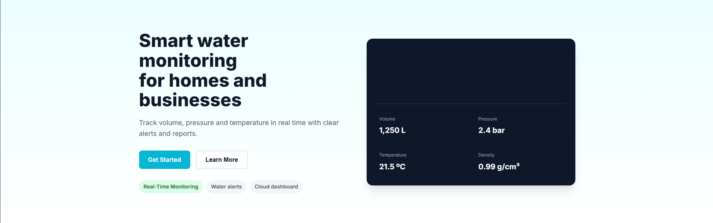

3. Seccion de visibilidad de liquidos: Monitorea tanques y tuberías de líquidos, midiendo volumen, presión y temperatura con paneles claros y alertas configurables.

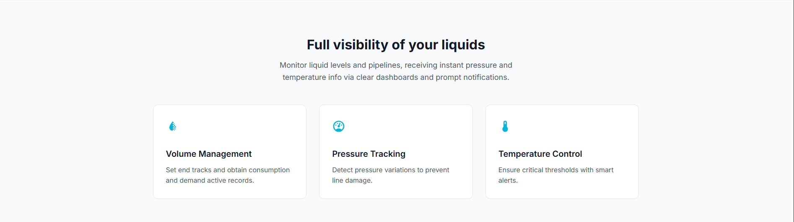

4. Seccion de Nosotros y Equipo de trabajo: Se visualiza el proposito del producto y presenta a los desarrolladores del grupo.

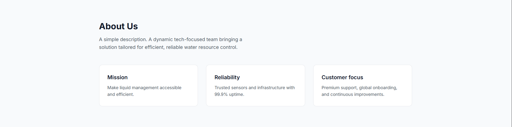
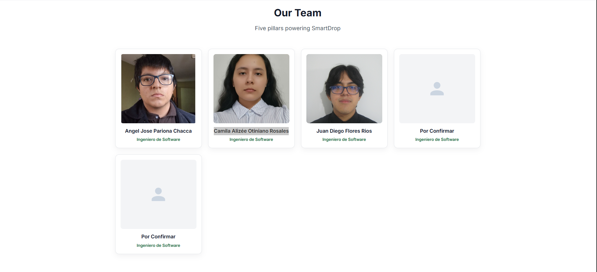

5. Seccion de soluciones: Mostramos las soluciones por cada segmento, en este caso residencias y negocios.

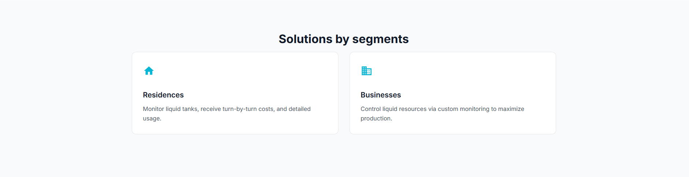

6. Seccion de liquid: Mostramos los liquidos a los que podemos que tenemos soporte.

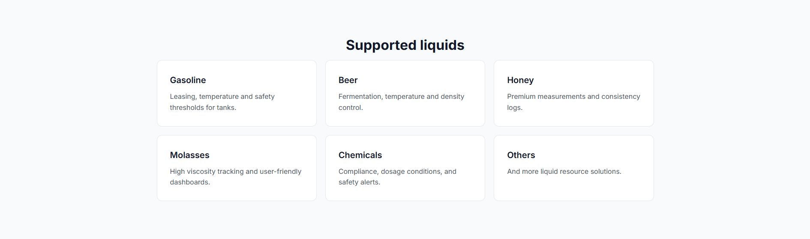

7. Seccion de funcionalidades: Descubre las interesantes funcionalidades de esta empresa.

8. Seccion de comentarios de clientes: Historias reales de equipos que usan Droplet para líquidos.

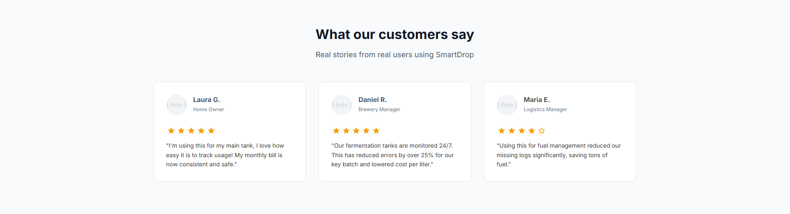

9. Seccion de subscripcion: Presentamos los planes de subscripcion del producto.

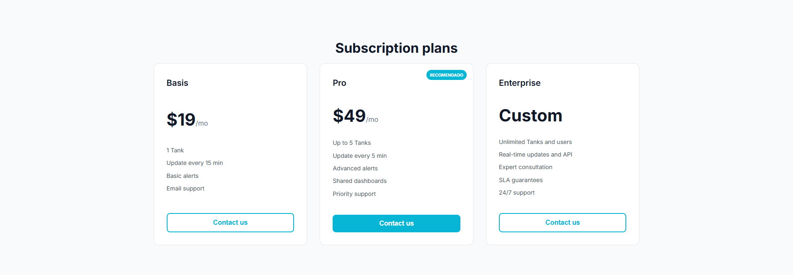

10. Seccion de preguntas frecuentes: Detallamos algunas dudas antes de que optes en utilizar el producto.

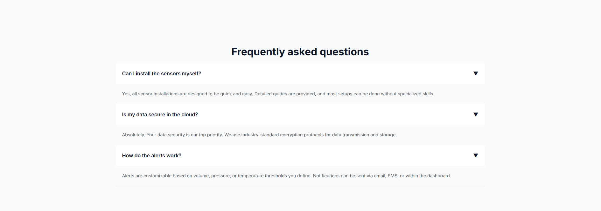

11. Seccion de contactar: Si necesitas ayuda, no dudes en dejar un mensaje.

12. Seccion footer: La parte final del sitio web.

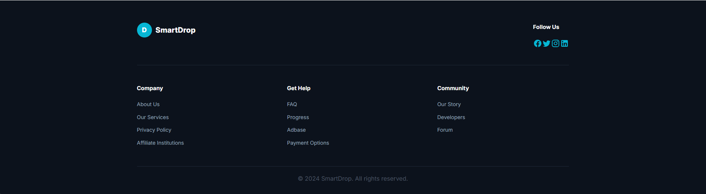
#### 5.2.1.6. Services Documentation Evidence for Sprint Review

**Esta sección no aplica para esta entrega.**
#### 5.2.1.7. Software Deployment Evidence for Sprint Review
Se desplegó la landing page usando el servicio de GitHub Pages. Se configuró para utilizar la rama main como base del proyecto a desplegar.

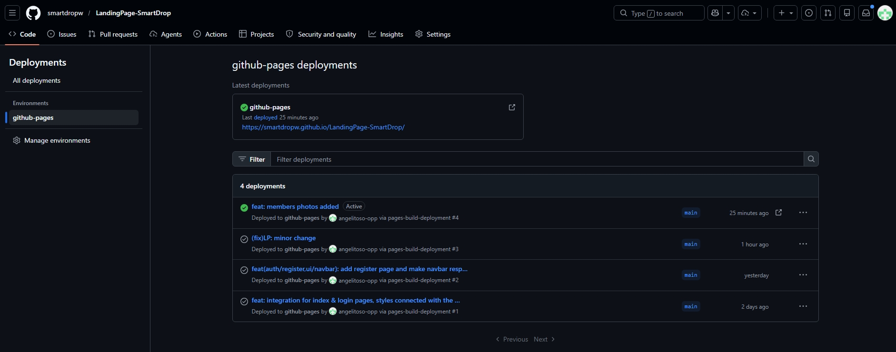

URL de Landing Page Desplegada: https://smartdropw.github.io/LandingPage-SmartDrop/

#### 5.2.1.8. Team Collaboration Insights during Sprint
La meta de este sprint fue la implementación de la Landing Page. Para llevar a
cabo este objetivo, hicimos uso de diversas herramientas como GitHub, Visual Studio
Code, HTML, CSS y JavaScript. Como evidencias del trabajo realizado tenemos los
diagramas de flujo que representan los commits realizados por cada miembro del equipo
SmartDrop.

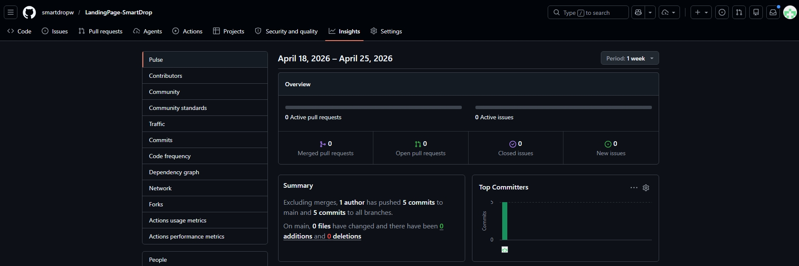

# Conclusiones
Durante el proceso de creación y desarrollo de este trabajo pudimos llegar a las siguientes conclusiones:

### 1. Trabajo en equipo y colaboración
El éxito de este proyecto demuestra la importancia del trabajo en equipo y la colaboración efectiva entre los miembros del grupo.
La sinergia, comunicación constante y distribución de roles permitieron integrar diferentes perspectivas y habilidades,
logrando un desarrollo más robusto y eficiente.

### 2. Planificación y organización en el desarrollo de software
Una adecuada planificación y organización fueron clave para el cumplimiento de los objetivos del proyecto.
La metodología empleada (como Agile o SCRUM) facilitó la gestión de tareas, la priorización de funcionalidades y la entrega
de resultados en los tiempos establecidos, asegurando un producto de calidad.

### 3. Tecnología y herramientas aplicadas a la realidad
El uso de tecnologías modernas y herramientas innovadoras permitió desarrollar una solución alineada con las necesidades
reales del sector. La integración de frameworks ágiles, bases de datos eficientes y sistemas en la nube garantizó un producto
escalable, seguro y adaptable al contexto peruano.

### 4. Solución rentable y sostenible contra el desperdicio alimentario
Este proyecto se consolida como una solución rentable y sostenible para reducir el desperdicio de alimentos en Perú,
especialmente en el sector restaurantero. Al conectar a establecimientos con consumidores, se optimiza el uso de excedentes,
generando un impacto económico, social y ambiental positivo.

# Bibliografía
Conne, M(2024). _The Markdown Guide_. MarkdownGuide. Recuperado de: https://www.markdownguide.org/

- Conventional Commits. (n.d.). *Conventional commits v1.0.0.* Retrieved from https://www.conventionalcommits.org/en/v1.0.0/

- BrowserStack. (n.d.). Responsive Web Design: A Complete Guide. Recuperado de https://www.browserstack.com/guide/responsive-web-design

- Spring Boot. (n.d.). Spring Boot Documentation. Retrieved from https://docs.spring.io/spring-boot/documentation.html#documentation.web

- Modyo. (n.d.). Domain-Driven Design (DDD) - Patrones de arquitectura. Retrieved from https://docs.modyo.com/es/architecture/patterns/ddd.html

- Pivotal Software (2024). Spring Boot Reference Documentation (v3.2.4). https://docs.spring.io/spring-boot/docs/current/reference/html/

- Evans, E. (2004). Domain-Driven Design: Tackling Complexity in the Heart of Software. Addison-Wesley. https://www.domainlanguage.com/ddd/

- Eser, A. (2025, 30 de mayo). *Marketing in the Water Industry Statistics*. ZipDo Education Reports. Recuperado de https://zipdo.co/marketing-in-the-water-industry-statistics/

- América Noticias. (2025). *Sunass: cierre de brechas en agua y saneamiento requiere cerca de 95 mil millones inversión*. América TV. Recuperado de https://www.americatv.com.pe/noticias/actualidad/sunass-cierre-brechas-agua-y-saneamiento-requiere-cerca-s-95-mil-millones-inversion-n468439

- Ministerio de Vivienda, Construcción y Saneamiento. (2024, 9 de agosto). *Más de 500 mil peruanos accederán a servicios de agua potable y saneamiento con obras que el Ministerio de Vivienda concluirá al 2025*. Gobierno del Perú. Recuperado de https://www.gob.pe/institucion/vivienda/noticias/1000795-mas-de-500-mil-peruanos-accederan-a-servicios-de-agua-potable-y-saneamiento-con-obras-que-el-ministerio-de-vivienda-concluira-al-2025

# Anexos
**GITHUB:**

| Título | Descripción | Enlace                                                                                                     |
| :---- | :---- |:-----------------------------------------------------------------------------------------------------------|
| Reporte | Enlace al repositorio del reporte | [https://github.com/smartdropw/project-report-smartdrop](https://github.com/smartdropw/project-report-smartdrop) |
| Landing Page | Enlace al repositorio del Landing Page | [https://github.com/smartdropw/LandingPage-SmartDrop](https://github.com/smartdropw/LandingPage-SmartDrop)                      |
| Landing Page Desplegada | Enlace de Landing Page Desplegada | [https://smartdropw.github.io/LandingPage-SmartDrop/](https://smartdropw.github.io/LandingPage-SmartDrop/)                      |