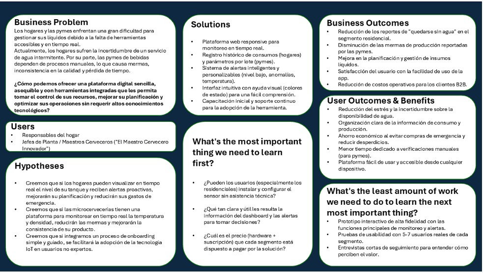

## Universidad Peruana de Ciencias Aplicadas

**Ingeniería de Software**

**Ciclo:** 2026-1

**Codigo del curso:** 1ASI0729

**Curso:** Desarrollo de Aplicaciones Open Source

**Sección:** 12010

**Profesor:** Ivan Robles Fernández

----

## Informe de Trabajo Final

**Startup:** SmartDrop

#### Relación de integrantes

| Nombre                       | Código     |
| ---------------------------- | ---------- |
|                              |            |
|                              |            |
|                              |            |
| Pariona Chacca, Angel Jose   | u202320613 |

 

### Marzo 2026
 

---
# Registro de Versiones

| Versión |   Fecha    |            Autor | Descripción de modificación |
| :---: |:----------:|:--------------:| ----- |
| tb1 |            |           |              |
|  |            |         |            |
|  |            |         |           |
|  |            |            |           |
| tp1 |      |                |            |
|  |         |            |             |
|  |         |            |             |
|  |             |              |             |
| tb2 |            |                |                |
|  |            |                |               |
|  |            |                |            |
|  |            |                |            |
| tf1 |            |                |            |
|  |            |                |             |
|  |            |                |             |
|  |            |                |               |

# Project Report Collaboration Insights

Repositorio del informe del proyecto  
El informe del proyecto se encuentra alojado en el siguiente repositorio de la organización de GitHub del equipo:

🔗 Enlace de la organización:  
🔗 Enlace de repositorios: 

A continuación, se detallan las actividades realizadas en cada entrega, la participación de los miembros del equipo, y las evidencias correspondientes.

TB1  
Para la primera entrega (TB1) se trabajó en la estructura inicial del informe, definiendo el índice y distribuyendo las secciones entre los miembros.

---
# Contenido
- [Registro de Versiones](#registro-de-versiones)
- [Project Report Collaboration Insights](#project-report-collaboration-insights)
- [Contenido](#contenido)
- [Student Outcome](#student-outcome)
- [Capitulo I: Introducción](#capitulo-I-introducción)
    - [1.1. Startup Profile](#11-startup-profile)
        - [1.1.1. Descripcion del Startup](#111-Descripcion-del-startup)
        - [1.1.2. Perfiles de Integrantes del equipo](#112-perfiles-de-integrantes-del-equipo)
    - [1.2. Solution Profile](#12-solution-profile)
        - [1.2.1. Antecedentes y problemática](#121-antecedentes-y-problemática)
        - [1.2.2. Lean UX Process](#122-lean-ux-process)
            - [1.2.2.1. Lean UX Problem Statements](#1221-lean-ux-problem-statements)
            - [1.2.2.2. Lean UX Assumptions](#1222-lean-ux-assumptions)
            - [1.2.2.3. Lean UX Hypothesis Statements](#1223-lean-ux-hypothesis-statements)
            - [1.2.2.4. Lean UX Canvas](#1224-lean-ux-canvas)
    - [1.3. Segmentos objetivos](#13-segmentos-objetivos)
- [Capitulo 2: Requirements Elicitation \& Analysis](#capitulo-2-requirements-elicitation--analysis)
    - [2.1. Competidores](#21-competidores)
        - [2.1.1. Analisis competitivo](#211-analisis-competitivo)
        - [2.1.2. Estrategias y tácticas frente a competidores](#212-estrategias-y-tácticas-frente-a-competidores)
    - [2.2. Entrevistas](#22-entrevistas)
        - [2.2.1. Diseño de entrevistas](#221-diseño-de-entrevistas)
        - [2.2.2. Registro de entrevistas](#222-registro-de-entrevistas)
        - [2.2.3. Análisis de entrevistas](#223-análisis-de-entrevistas)
    - [2.3. Needfinding](#23-needfinding)
        - [2.3.1. User Personas](#231-user-personas)
        - [2.3.2  User Task Matrix](#232--user-task-matrix)
        - [2.3.3. User Journey Mapping](#233-user-journey-mapping)
        - [2.3.4. Empathy Mapping](#234-empathy-mapping)
            - [2.3.5. As-is Scenario Mapping](#235-as-is-scenario-mapping)
    - [2.4. Ubiquitous Language](#24-ubiquitous-language)
- [Capitulo 3: Requirements Specification](#capitulo-3-requirements-specification)
    - [3.1. To-Be Scenario Mapping](#31-to-be-scenario-mapping)
    - [3.2. User Stories](##32-user-stories)
    - [3.3. Impact Mapping](#33-impact-mapping)
    - [3.4. Product Backlog](#34-product-backlog)
- [Capítulo 4: Product Design](#capítulo-4-product-design)
    - [4.1. Style Guidelines](#41-style-guidelines)
        - [4.1.1. General Style Guidelines](#411-general-style-guidelines)
        - [4.1.2. Web Style Guidelines](#412-web-style-guidelines)
    - [4.2. Information Architecture](#42-information-architecture)
        - [4.2.1. Organization Systems](#421-organization-systems)
        - [4.2.2. Labeling Systems](#422-labeling-systems)
        - [4.2.3. SEO Tags and Meta Tags](#423-seo-tags-and-meta-tags)
        - [4.2.4. Searching Systems](#424-searching-systems)
        - [4.2.5. Navigation Systems](#425-navigation-systems)
    - [4.3. Landing Page UI Design](#43-landing-page-ui-design)
        - [4.3.1. Landing Page Wireframe](#431-landing-page-wireframe)
        - [4.3.2. Landing Page Mock-up](#432-landing-page-mock-up)
    - [4.4. Web Applications UX/UI Design](#44-web-applications-uxui-design)
        - [4.4.1. Web Applications Wireframes](#441-web-applications-wireframes)
        - [4.4.2. Web Applications Wireflow Diagrams](#442-web-applications-wireflow-diagrams)
        - [4.4.3. Web Applications Mock-ups](#443-web-applications-mock-ups)
        - [4.4.4. Web Applications User Flow Diagrams](#444-web-applications-user-flow-diagrams)
    - [4.5. Web Applications Prototyping.](#45-web-applications-prototyping)
    - [4.6. Domain-Driven Software Architecture](#46-domain-driven-software-architecture)
        - [4.6.1. Software Architecture Context Diagram](#461-software-architecture-context-diagram)
        - [4.6.2. Software Architecture Container Diagrams](#462-software-architecture-container-diagrams)
        - [4.6.3. Software Architecture Components Diagrams](#463-software-architecture-components-diagrams)
    - [4.7. Software Object-Oriented Design](#47-software-object-oriented-design)
        - [4.7.1. Class Diagrams](#471-class-diagrams)
        - [4.7.2. Class Dictionary](#472-class-dictionary)
    - [4.8. Database Design](#48-database-design)
        - [4.8.1. Database Diagram](#481-database-diagram)
- [Capítulo 5: Product Implementation, Validation \& Deployment](#capítulo-5-product-implementation-validation--deployment)
    - [5.1. Software Configuration Management](#51-software-configuration-management)
        - [5.1.1. Software Development Environment Configuration](#511-software-development-environment-configuration)
        - [5.1.2. Source Code Management](#512-source-code-management)
        - [5.1.3. Source Code Style Guide \& Conventions](#513-source-code-style-guide--conventions)
        - [5.1.4. Software Deployment Configuration](#514-software-deployment-configuration)
    - [5.2. Landing Page, Services \& Applications Implementation](#52-landing-page-services--applications-implementation)
        - [5.2.1. Sprint 1](#521-sprint-1)
            - [5.2.1.1. Sprint Planning 1](#5211-sprint-planning-1)
            - [5.2.1.2. Aspect Leaders and Collaborators](#5212-aspect-leaders-and-collaborators)
            - [5.2.1.3. Sprint Backlog 1](#5213-sprint-backlog-1)
            - [5.2.1.4. Development Evidence for Sprint Review](#5214-development-evidence-for-sprint-review)
            - [5.2.1.5. Execution Evidence for Sprint Review](#5215-execution-evidence-for-sprint-review)
            - [5.2.1.6. Services Documentation Evidence for Sprint Review](#5216-services-documentation-evidence-for-sprint-review)
            - [5.2.1.7. Software Deployment Evidence for Sprint Review](#5217-software-deployment-evidence-for-sprint-review)
            - [5.2.1.8. Team Collaboration Insights during Sprint](#5218-team-collaboration-insights-during-sprint)
- [Conclusiones](#conclusiones)
- [Bibliografía](#bibliografía)
- [Anexos](#anexos)

# Student Outcome

El curso contribuye al cumplimiento del Student Outcome ABET:

**ABET – EAC \- Student Outcome 3**  
**Criterio: Capacidad de comunicarse efectivamente con un rango de audiencias.**

En el siguiente cuadro se describen las acciones realizadas y enunciados de  
conclusiones por parte del grupo, que permiten sustentar el haber alcanzado el logro  
del ABET – EAC \- Student Outcome 3\.

| Criterio Específico                                                   | Acciones Realizadas  | Conclusiones |
|-----------------------------------------------------------------------|----------------------|--------------|
| Comunica por escrito con efectividad a diferentes rangos de audiencia |                      |              |        
| Comunica oralmente con efectividad a diferentes rangos de audiencia |                        |              |
---

<!-- CHAPTER-1:START -->
# Capítulo I: Introducción

## 1.1. Startup Profile

### 1.1.1. Descripción de la Startup
SmartDrop es una startup tecnológica orientada al desarrollo de soluciones digitales que optimizan la gestión de líquidos para hogares y empresas en América Latina. Esta iniciativa surge como respuesta a dos problemáticas urgentes y cuantificables: por un lado, la profunda falta de fiabilidad en el suministro de agua potable que afecta a la mayoría de la población urbana, obligándola a depender de sistemas de almacenamiento privados ineficientes y riesgosos; y por otro, la marcada brecha de digitalización en pymes del sector de bebidas, como las microcervecerías, que limita su capacidad de garantizar la calidad, reducir mermas y escalar de manera competitiva. Para abordar directamente estos puntos de dolor, nuestro producto principal es SmartDrop, una plataforma de hardware y software diseñada para permitir a los usuarios llevar un control eficiente, centralizado y en tiempo real de sus líquidos críticos.

* **Misión:** Proporcionar a hogares y empresas una plataforma digital integral que facilite el control de sus recursos líquidos, contribuyendo a una gestión más segura, sostenible y rentable.

* **Visión:** Ser la plataforma líder en soluciones de gestión inteligente de líquidos en América Latina, transformando los hogares y la eficiencia operativa de las pymes a través de tecnología accesible y basada en datos.

### 1.1.2. Perfiles de integrantes del equipo

|                                                                 |                                                                                                        |
|:---------------------------------------------------------------:|:---------------------------------------------------------------------------------------------------------------------------------------------------------------------------------------------------------------------------------------------------------------------------------------------------------------------------------------------------------------------------------|
|                                                                 |                                                                                |
|        |   **Camila Alizée Otiniano Rosales \- u202419547** Mi nombre es Camila Otiniano, tengo 18 años y  actualmente estoy en el quinto ciclo de ingeniería de software, cuento con habilidades de liderazgo que me permiten fomentar la colaboración y organización en equipo. Me caracterizo por mi responsabilidad, compromiso y creatividad, siempre enfocada en alcanzar los objetivos del grupo.                                 |
|        | **Angel Jose Pariona Chacca \- u202314734**  Mi nombre es Angel Pariona, tengo 21 años y actualmente estoy en el quinto ciclo, soy una persona disciplinada y extrovertida, capaz de desempeñarme en grupos de trabajo. Cuento con conocimientos en c++, HTML y CSS                                                                                                              |

## 1.2. Solution Profile

### 1.2.1. Antecedentes y problemática
* **Who (¿Quiénes se ven afectados?)**

  Según el INEI (2024), el problema impacta al 67.8% de los habitantes urbanos en Perú, quienes, pese a pagar por el servicio, viven con la incertidumbre permanente de no saber si tendrán agua disponible. En el ámbito familiar, los más afectados son los jefes de hogar, que cargan con la responsabilidad de la economía y el bienestar de su familia.

  En el caso de las pymes, la situación golpea directamente a maestros cerveceros, jefes de planta y dueños de negocios, que enfrentan la presión de mantener la calidad y la rentabilidad de su producción, pero sin contar con herramientas adecuadas para lograrlo.

* **What (¿Qué ocurre?)**

  En Perú y en gran parte de América Latina, el manejo del agua y otros líquidos esenciales enfrenta serias ineficiencias. En el sector residencial, el problema no es tanto la ausencia de infraestructura, sino su baja calidad y precariedad. Aunque el 91% de los hogares peruanos cuenta con conexión a la red pública, según el Instituto Nacional de Estadística e Informática (INEI, 2024), un preocupante 73.7% no tiene acceso a "agua para consumo humano gestionada de manera segura". Esto significa que no reciben un suministro continuo (24/7) ni garantizado en calidad. Como consecuencia, muchas familias dependen de tanques y cisternas, lo que genera gastos adicionales por fugas y aumenta el riesgo de enfermedades debido a la contaminación del agua.

  En las PYMES, especialmente en las microcervecerías, la principal dificultad es la falta de digitalización. De acuerdo con el informe "Mercado de Cerveza Artesanal en Perú" de la consultora Informes de Expertos (2024), este mercado crecerá alrededor de un 4.90% anual hasta 2032\. Sin embargo, la mayoría sigue trabajando con procesos manuales. La ausencia de monitoreo en tiempo real de variables críticas como la temperatura y la densidad provoca pérdidas de producción por lotes defectuosos y variaciones en la calidad, lo que limita su competitividad.

* **Where (¿Dónde sucede?)**

  Paradójicamente, la intermitencia en el servicio de agua es más grave en las zonas urbanas. Según el INEI (2023), mientras que el 73.2% de la población rural conectada a la red recibe agua de manera continua (24/7), en las ciudades solo el 57% disfruta de ese nivel de servicio.

  En el caso de las pymes, el problema se concentra directamente en la planta de producción. Allí, la carencia de herramientas tecnológicas contrasta con la necesidad de mantener un control de calidad estricto, lo que incrementa los riesgos y las ineficiencias.

* **When (¿Desde cuándo y con qué frecuencia?)**

  El problema es constante. Según datos del INEI (2023), más del 40% de la población peruana sufre cortes y racionamientos de agua de manera regular, lo que convierte la gestión del agua almacenada en una preocupación diaria. Además, el riesgo de una fuga grave está presente las 24 horas del día, los 7 días de la semana.

  En el caso de las microcervecerías, la situación se vuelve aún más crítica durante etapas sensibles como la fermentación. Una desviación en las condiciones, si no se detecta a tiempo especialmente en horarios nocturnos o fines de semana, puede arruinar por completo un lote de producción.

* **Why (¿Por qué es un problema?)**
    * Por un lado, la deficiencia en el servicio de agua responde a factores estructurales, como el diseño inadecuado de políticas públicas y la interferencia en la gestión de las empresas prestadoras de servicios (EPS).

* Por otro lado, en pymes la adopción de IoT avanza pero con brechas. Según fuentes secundarias que citan a GSMA Intelligence (2022), \~47% de empresas en LATAM reportaban uso de IoT; al ser un dato de reporte con acceso restringido, se considera una estimación no verificable públicamente.

* **How (¿Cómo se manifiesta?)**

    * El problema de la gestión ineficiente de líquidos se manifiesta de formas distintas pero igualmente críticas en ambos segmentos:

    * En el entorno residencial: * El "Factor Sorpresa": Los usuarios descubren que se han quedado sin agua en el momento más inoportuno (durante una ducha o al lavar ropa), debido a que no existe una forma visual o remota de conocer el nivel de la cisterna o tanque elevado sin subir al techo o abrir tapas pesadas.

    * Desperdicio Invisible: Las fugas en válvulas de llenado o tuberías internas suelen ser silenciosas. El usuario solo se percata del problema semanas después, cuando llega un recibo de agua con montos exorbitantes o cuando nota humedad estructural en la vivienda.

    * Dependencia Reactiva: Ante la falta de datos, la compra de agua a camiones cisterna se realiza de forma reactiva y urgente, lo que impide al usuario negociar precios o planificar el gasto.

* En las PYMES (Microcervecerías):

  *  Monitoreo Analógico y Discontinuo: Los operarios dependen de densímetros de vidrio y termómetros manuales. Esto requiere abrir los tanques (exponiendo el producto a contaminación) y tomar muestras físicas, lo que genera errores de lectura y variabilidad entre lotes.

  * Puntos Ciegos Operativos: Al no haber monitoreo nocturno o de fin de semana, cualquier falla en el sistema de refrigeración o una fermentación vigorosa no controlada puede alterar el perfil de sabor o arruinar el lote completo sin que nadie pueda intervenir a tiempo.

  * Carga Administrativa: El registro de datos se hace en bitácoras de papel o excels manuales, lo que dificulta el análisis de tendencias históricas para mejorar las recetas o identificar ineficiencias en el uso de insumos.

* **How Much (¿Cuál es el impacto cuantitativo?)**
    * **Pérdidas financieras en los hogares:** Una fuga no detectada en una cisterna puede incrementar el recibo de agua hasta en S/ 4,391 en un solo mes. En el caso de un tanque elevado con fugas, el costo adicional puede alcanzar los S/ 3,626, según advierten SUNASS y SEDAPAL (2024).

* **Costos de emergencia:** Los hogares que dependen de camiones cisterna terminan pagando por el agua entre 5 y 6 veces más que quienes cuentan con una conexión domiciliaria, de acuerdo con la Superintendencia Nacional de Servicios de Saneamiento (SUNASS, 2023).

* **Mermas en la producción:** En una microcervecería, la pérdida de un solo lote de cerveza artesanal puede representar el 2.5% de su producción anual. Además, un estudio de la Revista Argentina de Microbiología (2024) encontró microorganismos no deseados en el 70% de las muestras de cerveza artesanal, lo que refleja un problema generalizado de control de calidad.

* **Ineficiencia operativa:** El uso de soluciones de monitoreo en la industria cervecera ha demostrado reducir hasta en un 90% las verificaciones manuales, liberando tiempo valioso del personal, según casos de estudio de la industria ([Plaato.io](http://Plaato.io)).

### 1.2.2. Lean UX Process

1. #### 1.2.2.1. Lean UX Problem Statements
    Nuestra plataforma ha sido diseñada para permitir que los hogares gestionen de manera inteligente el agua que almacenan en sus tanques y cisternas, un recurso vital para su día a día. A través de esta herramienta digital, buscamos devolverles la tranquilidad y el control. Hemos observado que una de las principales dificultades para las familias es la incertidumbre generada por un servicio público de agua poco fiable, lo que las obliga a depender de un almacenamiento que no pueden supervisar eficientemente. Esto genera estrés, desorganización y gastos de emergencia al tener que comprar agua a sobreprecio. ¿Cómo podemos mejorar la experiencia de los hogares en la gestión de su agua almacenada mediante una plataforma intuitiva y accesible que les brinde visibilidad en tiempo real y alertas proactivas?

    Nuestro sistema fue creado con el objetivo de optimizar los procesos de producción en pymes de bebidas, como las microcervecerías, para reducir mermas y asegurar la consistencia de su producto. Hemos identificado que muchos maestros cerveceros aún dependen de la verificación manual y esporádica de variables críticas como la temperatura y la densidad en sus tanques de fermentación. Esto no solo consume tiempo valioso, sino que también incrementa la posibilidad de que un lote entero se arruine por desviaciones no detectadas a tiempo. ¿Cómo podemos digitalizar y automatizar el monitoreo de líquidos críticos en las pymes de bebidas, garantizando que los operadores cuenten con una herramienta fácil de usar que les permita proteger la calidad de su producción 24/7?

    Además, hemos detectado que tanto los usuarios residenciales como las pequeñas empresas enfrentan barreras tecnológicas, ya sea por percibir las soluciones IoT como demasiado complejas o costosas. Esto puede llevar a que no aprovechen los beneficios de una solución digital que podría resolver sus problemas de gestión de líquidos. ¿Cómo podemos diseñar una solución IoT que sea tan simple de instalar y usar que elimine las barreras de entrada, permitiendo que tanto un jefe de hogar como el dueño de una pyme puedan adoptar y aprovechar fácilmente todas las funcionalidades del sistema sin requerir una curva de aprendizaje elevada?

#### 1.2.2.2. Lean UX Assumptions

* **Assumptions worksheet**
    * Creo que mis clientes (tanto hogares como pymes) necesitan una forma simple y automatizada de gestionar sus líquidos críticos para evitar sorpresas y costos inesperados.
    * Estas necesidades se pueden resolver con una solución IoT (sensores \+ app) fácil de instalar y entender, que brinde visibilidad en tiempo real, alertas y control.
    * Mis clientes iniciales son jefes de hogar preocupados por la economía y el bienestar de su familia, y dueños u operadores de microcervecerías que buscan profesionalizar su producción para ser más competitivos.
    * El valor \#1 que un cliente residencial quiere es tranquilidad y ahorro. El valor \#1 que un cliente B2B quiere es calidad consistente y eficiencia operativa.
    * Haré dinero a través de un modelo de suscripción mensual (SaaS) por cada sensor o tanque monitoreado, y posiblemente un costo único inicial por el hardware.
    * Mi competencia principal son los métodos manuales (revisión visual, hojas de cálculo) y las soluciones de telemetría industrial que son más complejas, costosas y no están diseñadas para estos segmentos.
    * Los venceremos por nuestra simplicidad, facilidad de instalación y un enfoque dual que atiende tanto al mercado residencial como a un nicho B2B desatendido con una solución asequible.
    * Mi mayor riesgo de producto es la barrera de entrada a la tecnología IoT para usuarios no técnicos y la percepción del costo inicial del hardware.
    * Resolveremos este riesgo a través de un proceso de onboarding guiado, plantillas de configuración predefinidas por caso de uso y alianzas estratégicas con instaladores técnicos.

* **¿Quién es el usuario?**

  Tenemos dos perfiles principales

    * **El Jefe de Hogar Planificador:** Persona responsable de la economía y el bienestar de su familia, que vive bajo la incertidumbre de un servicio de agua intermitente.
    * **El Maestro Cervecero Innovador:** Dueño o jefe de planta de una microcervecería, apasionado por la calidad de su producto y que busca herramientas para mejorar su proceso y eficiencia.

* **¿Dónde encaja nuestro producto en su trabajo o vida?**
    * **En el hogar:** Es una herramienta de prevención que se integra en la rutina familiar para gestionar un recurso básico, evitando el estrés de quedarse sin agua y los gastos imprevistos.
    * **En la cervecería:** Es una herramienta de control de calidad y optimización que se integra en el proceso de producción, permitiendo monitorear la fermentación y los insumos críticos sin supervisión constante.

* **¿Qué problemas tiene nuestro producto y cómo se puede resolver?**
    * **Precisión y calibración de los sensores:** Solución un proceso de calibración guiado y simple en la app y el uso de sensores de alta fiabilidad.
    * **Conectividad limitada en sótanos (cisternas) o plantas industriales:** Solución ofrecer gateways o repetidores de señal como parte de la solución para garantizar una conexión estable.
    * **Resistencia a la adopción de nueva tecnología:** Solución un diseño de interfaz extremadamente intuitivo, tutoriales claros y un soporte al cliente proactivo.

* **¿Cuándo y cómo es usado nuestro producto?**
    * **Hogar:** Para revisar el nivel de la cisterna por la mañana, recibir una alerta de fuga mientras se está en el trabajo o planificar la llamada al camión cisterna.
    * **Cervecería:** Para monitorear la curva de temperatura de la fermentación 24/7, recibir alertas si un parámetro se desvía o para verificar el nivel de los tanques de insumos de limpieza antes de un nuevo lote.

* **¿Qué características son importantes?**
    * **Fiabilidad de los datos:** Las mediciones deben ser precisas y consistentes.
    * **Alertas oportunas e inteligentes:** Notificaciones que lleguen a tiempo y que sean relevantes para evitar "fatiga de alertas".
    * **Interfaz visual e intuitiva:** Un dashboard que se entienda de un vistazo.
    * **Accesibilidad móvil:** Poder consultar el estado desde cualquier lugar a través del smartphone.
    * **Historial de datos:** Poder revisar consumos y tendencias pasadas.

* **¿Cómo debe verse nuestro producto y cómo debe comportarse?**
    * **Visualmente:** Un diseño limpio, con gráficos claros y colores que indiquen el estado (ej. verde, amarillo, rojo).
    * **Comportamiento:** Debe ser rápido, fiable y proactivo. La app debe sentirse como un asistente inteligente, no como una herramienta compleja que requiere esfuerzo para ser utilizada.

#### 1.2.2.3 Lean UX Hypothesis Statements

* Creemos que proporcionar a las microcervecerías un tablero en tiempo real con los parámetros de sus tanques liberará tiempo valioso de su personal, y lo sabremos porque el tiempo autorreportado en rondas de verificación manual se reducirá en un 30% en las primeras 6 semanas.

* Creemos que una funcionalidad de alertas por desviaciones de temperatura y densidad en los tanques de fermentación mejorará la consistencia del producto final, y lo sabremos porque el sistema registrará una disminución del 50% en lecturas fuera de rango durante dos ciclos de producción consecutivos.

* Creemos que un sistema de detección temprana de anomalías, como caídas bruscas de nivel, ayudará a los hogares a reducir el desperdicio de agua y los sobrecostos, y sabremos que hemos tenido éxito cuando el consumo promedio ajustado en nuestro piloto disminuya entre un 15% y un 25% en 3 meses.

* Creemos que un proceso de onboarding guiado y plantillas de configuración por caso de uso harán que SmartDrop sea fácil de adoptar, y sabremos que hemos tenido éxito cuando la tasa de activación de funcionalidades clave alcance el 60% en los primeros 14 días y la satisfacción promedio del usuario sea de 4.5/5.

#### 1.2.2.4 Lean UX Canvas

<!-- CHAPTER-1:END -->

<!-- CHAPTER-2:START -->
### 2.1.1. Análisis competitivo

### 2.1.2. Estrategias y tácticas frente a competidores

### 2.2.1 Diseño de entrevistas

### 2.2.2. Registro de entrevistas

### 2.2.3. Análisis de Entrevistas

## 2.3. Needfinding

### 2.3.1. User Personas

### 2.3.2. User Task Matrix

### 2.3.3. User Journey Mapping

### 2.3.4. Empathy Mapping

## 2.4. Big Picture Event Storming

## 2.5. Ubiquitous Language

<!-- CHAPTER-2:END -->

<!-- CHAPTER-3:START -->
# Capitulo 3: Requirements Specification
## 3.1. User Stories.

## 3.2. Impact Mapping

## 3.3. Product Backlog
<!-- CHAPTER-3:END -->

<!-- CHAPTER-4:START -->

# Capítulo IV: Product Design

## 4.1. Style Guidelines

### 4.1.1. General Style Guidelines

### 4.1.2. Web Style Guidelines

## 4.2. Information Architecture

### 4.2.1. Organization Systems

### 4.2.2. Labeling Systems

### 4.2.3. SEO Tags and Meta Tags

### 4.2.4. Searching Systems

### 4.2.5. Navigation Systems

## 4.3. Landing Page UI Design

### 4.3.1. Landing Page Wireframe

### 4.3.2. Landing Page Mock-up

## 4.4. Web Applications UX/UI Design

### 4.4.1. Web Applications Wireframes

### 4.4.2. Web Applications Wireflow Diagrams

### 4.4.2. Web Applications Mock-ups

### 4.4.3. Web Applications User Flow Diagrams

## 4.5. Web Applications Prototyping

## 4.6. Domain-Driven Software Architecture
### 4.6.1. Design-Level Event Storming
### 4.6.2. Software Architecture Context Diagram

### 4.6.1. Software Architecture Context Diagram

### 4.6.2. Software Architecture Container Diagrams

## 4.7. Software Object-Oriented Design

### 4.7.1. Class Diagrams

## 4.8. Database Design

### 4.8.1. Database Diagrams

# Capítulo V: Product Implementation, Validation & Deployment

## 5.1. Software Configuration Management
### 5.1.1. Software Development Environment Configuration
### 5.1.2. Source Code Management

### 5.1.3. Source Code Style Guide & Conventions

### 5.1.4. Software Deployment Configuration

## 5.2. Landing Page, Services & Applications Implementation

### 5.2.1. Sprint 1
#### 5.2.1.1. Sprint Planning 1

#### 5.2.1.2. Aspect Leaders and Collaborators

#### 5.2.1.3. Sprint Backlog 1

#### 5.2.1.4. Development Evidence for Sprint Review

#### 5.2.1.5. Execution Evidence for Sprint Review

#### 5.2.1.6. Services Documentation Evidence for Sprint Review

#### 5.2.1.7. Software Deployment Evidence for Sprint Review

#### 5.2.1.8. Team Collaboration Insights during Sprint

### 5.2.2. Sprint 2

#### 5.2.2.1. Sprint Planning 2\.

#### 5.2.2.2. Aspect Leaders and Collaborators.

#### 5.2.2.3. Sprint Backlog 2\.

#### 5.2.2.4. Development Evidence for Sprint Review.

#### 5.2.2.5. Execution Evidence for Sprint Review.

#### 5.2.2.6. Services Documentation Evidence for Sprint Review.

#### 5.2.2.7. Software Deployment Evidence for Sprint Review.

#### 5.2.2.8. Team Collaboration Insights during Sprint.

### 5.2.3. Sprint 3

#### 5.2.3.1. Sprint Planning 3

#### 5.2.3.2. Aspect Leaders and Collaborators

#### 5.2.3.3. Sprint Backlog 3

#### 5.2.3.4. Development Evidence for Sprint Review

#### 5.2.3.5. Execution Evidence for Sprint Review

#### 5.2.3.6. Services Documentation Evidence for Sprint Review

#### 5.2.3.7. Software Deployment Evidence for Sprint Review

#### 5.2.3.8. Team Collaboration Insights during Sprint

#### 5.3. Validation Interviews

#### 5.3.1. Diseño de Entrevistas

#### Preguntas para Segmento #1:

#### Preguntas para Segmento #2:

#### 5.3.2. Registro de Entrevistas

#### 5.3.3. Evaluaciones según heurísticas

              

#### 5.4. Video About-the-Product

# Conclusiones

# Bibliografía

# Anexos
